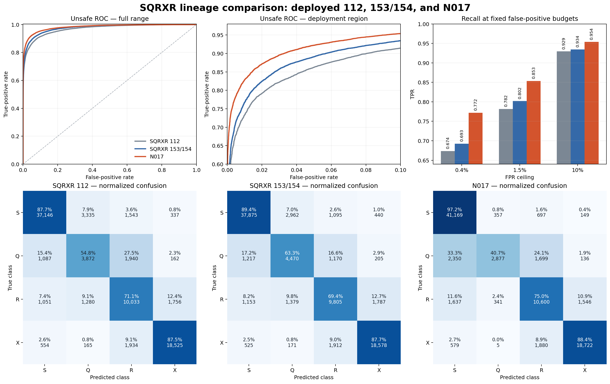

# N017 - Developer Notes
I've experimented for quite a long time with different new backbones following the EfficientNet-Lite0-based SQRX 112. More recently, I've been
leveraging Codex as a research assistant to help with some of the heavy lifting while still keeping stronger guidance on the training objectives
and goals. While Codex needs guidance to ensure intent, it's also been invaluable as an aid to ensure proper model conversions, writing small smoke
tests to make sure certain things are working, and provide much stronger rigor to experimental results.

To represent this shift in development method, I've moved from the "SQRXR" development line to the "N" development line for "next". The input/output
contract for N017 is basically the same so little adaptation is needed for the models at hand. However, it should be noted that this model is heavier
than SQRXR 112 by a significant bit; I feel it's appropriate for the current advances in models but it is not without consequence. I typically see
about 60ms per image in the actual deployment in Wingman Jr. on my machine with the WebGL backend and a RTX 2080 Super.

# N017 — MobileNetV4 Hybrid-M image-safety model

N017 is the selected **plain supervised MobileNetV4 Hybrid-M** candidate from
the Experiment 017 endpoint comparison. The name starts a new model series so
that it is not confused with the earlier EfficientNet-Lite0-based SQRXR line.

## Historical endpoint

The directly comparable 84,744-example historical endpoint uses Q, R, or X as
the positive “unsafe” class.

| Model | ROC AUC | standardized pAUC at FPR≤0.10 | accuracy | Brier | ECE20 | R→S | X→S |
|---|---:|---:|---:|---:|---:|---:|---:|
| SQRXR 153/154 | 0.977128 | 0.929327 | 0.834608 | 0.057350 | 0.008409 | 0.081634 | 0.024781 |
| **N017** | **0.982737** | **0.948576** | **0.865760** | **0.047835** | **0.008248** | 0.115902 | 0.027329 |

At fixed FPR ceilings, N017 reaches TPR 0.772090 at
0.4%, 0.853488 at 1.5%, and
0.953719 at 10%.

## Directional diagnostic

On the reused swimming directional slice, N017 reduced the perturbation-weighted
mode rate from 0.043388 to
0.016529, unsafe jitter from
0.031055 to
0.012813, and SQRX
L1 jitter from 0.101260 to
0.023705. This panel had
already been opened and is evidence about behavior, not a pristine selection set.

## Deployment contract

- Input: one `224×224` RGB image, padded to square with RGB `(128,128,128)`,
  scaled to `[0,1]`, then normalized by ImageNet mean `(0.485,0.456,0.406)`
  and standard deviation `(0.229,0.224,0.225)`.
- Tensor layout at the TensorFlow.js boundary: NHWC `[1,224,224,3]`.
- Outputs, in add-on order: unsafe probability `[1,1]`, followed by S/Q/R/X
  probabilities `[1,4]`.
- `tfjs/roc.js` contains the thinned ROC lookup and trusted, neutral, and
  untrusted policy points. The full archival curve is retained under `tfjs/roc/`.
- `tfjs/tfjs311_parity.json` records numerical parity against the exact
  TensorFlow.js 3.11 runtime used for the conversion check.

## Provenance chain

N017 is a fine-tuned timm model, not an official Google checkpoint. The chain
below distinguishes the architecture, the exact upstream weights, each
packaged model representation, and the software used to transform it.

| Stage | General source and exact file | What happened | Declared license or terms |
|---|---|---|---|
| MobileNetV4 architecture | [MobileNetV4 paper](https://arxiv.org/abs/2404.10518); [Google TF-Vision source](https://github.com/tensorflow/models/tree/master/official/vision) | Google introduced the MobileNetV4 Hybrid architecture. No official Google weights were used by N017. | TensorFlow Model Garden code and its checkpoints are identified as [Apache-2.0](https://github.com/tensorflow/models/blob/master/LICENSE); third-party dataset terms remain separate. |
| ImageNet-1k pretraining data | [ImageNet](https://www.image-net.org/) | Ross Wightman trained the upstream timm checkpoint on ImageNet-1k. | Recorded as training-data provenance and attribution. N017's serialized weights are licensed Apache-2.0 as stated below. |
| Exact upstream checkpoint | [timm model card](https://huggingface.co/timm/mobilenetv4_hybrid_medium.e500_r224_in1k/tree/1c009cc8df7c61fdf96c43b2fa60d8ccc4c5ec8f); [exact `model.safetensors`](https://huggingface.co/timm/mobilenetv4_hybrid_medium.e500_r224_in1k/blob/1c009cc8df7c61fdf96c43b2fa60d8ccc4c5ec8f/model.safetensors); [timm implementation](https://github.com/huggingface/pytorch-image-models/blob/v1.0.20/timm/models/mobilenetv3.py) | `mobilenetv4_hybrid_medium.e500_r224_in1k`, revision `1c009cc8…`, SHA-256 `af764c2012e6b1af7a6649b07516e8636fd40e8728e41c9c640f6fa19c03285f`, supplied the ImageNet initialization. | The Hugging Face model repository declares the upstream weights **Apache-2.0**. N017 retains that license for its fine-tuned weights. |
| Wingman supervised fine-tune | Internal training script `teacher_student_train.py`; [private-data description](https://github.com/wingman-jr-addon/model#dataset) | Experiment 011 added a `1280→64→16` shared MLP, one unsafe logit, and four S/Q/R/X logits. The selected `plain_mobilenetv4` arm used only supervised Wingman labels—no SigLIP2 distillation. After one head-only warmup epoch, the backbone was fine-tuned for five epochs while BatchNorm stayed frozen. | The Wingman dataset and training workspace are private and are not distributed. Project-authored training/export code and documentation retain the model repository's [CC0-1.0 dedication](https://github.com/wingman-jr-addon/model/blob/master/LICENSE); the resulting N017 weights are Apache-2.0. |
| Selected PyTorch checkpoint | Internal checkpoint `best.pt` and completion record `COMPLETE.json` (not distributed) | Fine-tune epoch 4 was selected lexicographically by standardized pAUC at FPR≤0.10, ROC AUC, then lower Brier score. SHA-256: `a82bb757ddac245388b45c2b757e73413ff97604b8917823f4f1822498a341ca`. | **Apache-2.0 model weights.** |
| ONNX deployment graph | [`n017.onnx`](n017.onnx); [export record](parity/expected.json) | The checkpoint was strictly loaded, wrapped with sigmoid and softmax outputs, and exported as static-batch ONNX opset 17. The export record captured SHA-256 `ac40b2f8…`; the packaged file after the onnx2tf stage is `e8059c40…`, as recorded in the [release manifest](release_manifest.json). | **Apache-2.0 model weights.** ONNX tooling is independently Apache-2.0. |
| TensorFlow SavedModel | [`saved_model.pb`](tfjs_saved_model/saved_model.pb) plus [`variables/`](tfjs_saved_model/variables/) | `onnx2tf` produced the SavedModel consumed by the TensorFlow.js converter. `saved_model.pb` SHA-256: `eda9dd13b86f1ce49e31bc5bad0fa9032065f669cc248b5708ab306dbd9fde24`. The generated TFLite files are retained as conversion side products, not used by Wingman Jr. | **Apache-2.0 model weights.** onnx2tf is independently MIT; TensorFlow is Apache-2.0. |
| Deployable TensorFlow.js graph | [`model.json`](tfjs/n017_graph_model/model.json), its ten weight shards, and [`conversion_summary.json`](tfjs/n017_graph_model/conversion_summary.json) | TensorFlow.js Converter 3.11.0 emitted a graph model generated by TensorFlow 2.17.1. `model.json` SHA-256: `ff39b9ba41547c15b1ba4f2ab6993031086140cee38f42c15cda3df2009ea6f5`; all shard hashes are in the [release manifest](release_manifest.json). | **Apache-2.0 model weights.** TensorFlow.js tooling is independently Apache-2.0. |

### Model weights license

All N017 serialized model weights and graph representations are released under
the **Apache License 2.0**. This includes the selected PyTorch checkpoint, ONNX
graph, TensorFlow SavedModel and TFLite representations, and the deployable
TensorFlow.js graph and weight shards. See the
[N017 weights license notice](N017_WEIGHTS_LICENSE.md).

Project-authored training/export scripts and documentation remain CC0-1.0
unless a file states otherwise. Third-party tools retain their own licenses.
ImageNet-1k is named above as the upstream pretraining source for attribution
and reproducibility.

## Conversion to TensorFlow.js

1. The internal `teacher_student_train.py` script loaded the pinned timm
   weights, trained the supervised dual-head model, and wrote the selected
   `best.pt` checkpoint.
2. The internal `export_n017_onnx.py` script reconstructed the architecture,
   strictly loaded every checkpoint tensor, added probability activations,
   exported static NCHW `[1,3,224,224]` ONNX opset 17, validated it with
   `onnx.checker`, and wrote a fixed NHWC parity input plus PyTorch outputs.
3. The internal `build_n017_package.ps1` script ran onnx2tf with `-osd -n`,
   producing a TensorFlow SavedModel with NHWC input. The conversion environment
   used an onnx2tf 1.22-era image, but its immutable image digest was not
   captured; this is the one toolchain gap in the record.
4. The internal `convert_tfjs311.py` script invoked TensorFlow.js Converter
   3.11.0 with `tf_saved_model → tfjs_graph_model`, the `serving_default`
   signature, `serve` tag, and debug-op stripping. It then enforced output order
   as unsafe `[1,1]` followed by S/Q/R/X `[1,4]`.
5. The internal `verify_n017_tfjs.js` script loaded the graph and shards through
   the exact bundled TensorFlow.js 3.11.0 runtime and compared both outputs with
   the fixed PyTorch reference. The recorded maximum absolute errors were
   `2.05e-8` for unsafe and `6.05e-9` for S/Q/R/X; see
   [`tfjs311_parity.json`](tfjs/tfjs311_parity.json).

Core tool licenses: [PyTorch 2.6/2.8, BSD-3-Clause](https://github.com/pytorch/pytorch/blob/v2.8.0/LICENSE);
[timm 1.0.20/1.0.9, Apache-2.0](https://github.com/huggingface/pytorch-image-models/blob/main/LICENSE);
[ONNX 1.16.0, Apache-2.0](https://github.com/onnx/onnx/blob/v1.16.0/LICENSE);
[onnx2tf 1.22-era, MIT](https://github.com/PINTO0309/onnx2tf/blob/1.22.0/LICENSE);
[TensorFlow 2.17.1, Apache-2.0](https://github.com/tensorflow/tensorflow/blob/v2.17.1/LICENSE);
and [TensorFlow.js 3.11.0, Apache-2.0](https://github.com/tensorflow/tfjs/blob/tfjs-v3.11.0/LICENSE).

## Limitations

The historical endpoint is in-domain and oversampled to the established
6:1:2:3 S/Q/R/X evaluation mixture. The directional panel is intentionally
small and diagnostic. Neither result establishes performance on every image
distribution found on the public internet.
