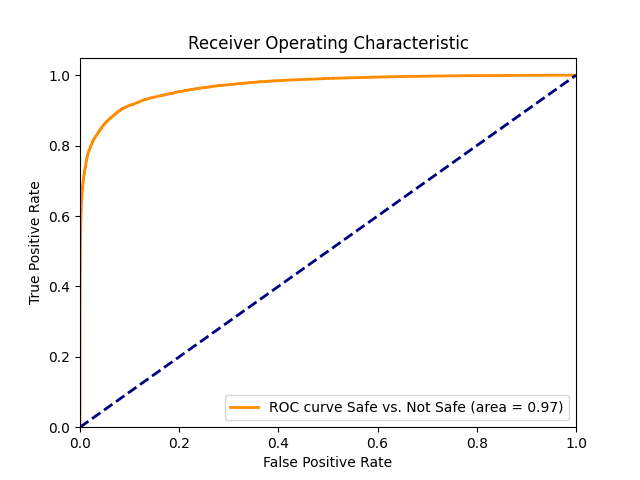
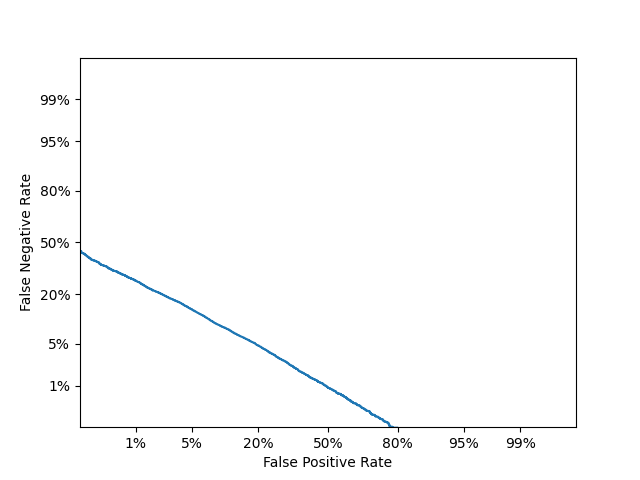

# The SQRX Family of Models
The SQRX models generally have a small backbone, such as MobileNetV2 or EfficientNet.
They all produce at a minimum a four class S/Q/R/X output.

# SQRX 112
This is version 112 of this family of models; it is based on a [Keras port](https://github.com/qubvel/efficientnet/issues/104) of EfficientNet Lite L0 which is ultimately a derivation of EfficientNet - see [the paper](https://arxiv.org/abs/1905.11946).
The deviation from a stock model is minimal:
```python
	model_mn = load_model('efficientnet-lite/L0.h5')
	#Piece it all together
	x = model_mn.layers[-4].output
	x = SpatialDropout2D(0.4)(x)
	a = GlobalAveragePooling2D()(x)
	embeddings = a
	embeddings = Flatten()(embeddings)
	x = Dense(128, name='fc_final', activation='relu')(a)
	x = Dropout(0.50, name='dropout')(x)
	x = Dense(NUM_CLASSES, name='classifier', activation='softmax')(x) 
	model = Model(inputs=[model_mn.input], outputs=[x,embeddings])
```

Additionally, a weighted categorical cross-entropy is used to penalize confusions of say, S and X more heavily than S and Q.
This first stage model is available as `sqrx_best.h5`.

# The SQRXR Second-Stage Model
The SQRXR model is short for "SQRX Regression" model; however, in actuality it is more of a binary S vs. QRX classifier. It feeds in the last convolutional features layer of the SQRX model labeled "embeddings" above and then optimizes using the handy [AUC ROC loss function](https://github.com/tensorflow/models/tree/archive/research/global_objectives).

The second stage model is quite small.
```python
    input = Input((1280,))
    node = Dense(50, activation='sigmoid')(input)
    node = Dropout(0.4)(node)
    node = Dense(10, activation='sigmoid')(node)
    node = Dense(1, activation='sigmoid')(node)
    post_model = Model(inputs=input,outputs=node)

    post_model.compile(
        optimizer=Adam(lr=0.0001),
        loss=roc_auc_loss,
        metrics=['accuracy']
        )
```

This smaller second stage of the model is available as `sqrx_regression.h5`. It outputs a threshold value.

# Final Fused Model
The final model fuses the two together and is available as `sqrxr_plus_best.h5`; both the classifier and the threshold are available as outputs.

The fusing code is a bit like this:
```python
	sqrx_model = load_model('sqrx_best.h5', compile=False)
	post_model = load_model('sqrx_regression.h5', compile=False)
    combined_link = post_model(sqrx_model.outputs[1])
    combined_model = Model(inputs=sqrx_model.inputs[0], outputs=[combined_link, sqrx_model.outputs[0]], name='sqrxr_model')
    combined_model.save('sqrxr_plus_best.h5')

```

# Tensorflow.js Conversion and Usage
The final model was converted using `tensorflowjs_converter --input_format keras --output_format tfjs_graph_model sqrxr_plus_best.h5 sqrxr_112_graphopt`.
The folder `sqrxr_112_graphopt` represents this graph-optimized version suitable for web use.

I use roughly the following logic:
```javascript
let inferenceCanvas = document.createElement('canvas');
inferenceCanvas.width = IMAGE_SIZE;
inferenceCanvas.height = IMAGE_SIZE;
let inferenceCtx = inferenceCanvas.getContext('2d', { alpha: false});
inferenceCtx.imageSmoothingEnabled = true;

function predict(imgElement) {
  inferenceCtx.drawImage(imgElement, 0, 0, imgElement.width, imgElement.height, 0, 0, IMAGE_SIZE,IMAGE_SIZE);
  const rightSizeImageData = inferenceCtx.getImageData(0, 0, IMAGE_SIZE, IMAGE_SIZE);

  const logits = tf.tidy(() => {
    const rightSizeImageDataTF = tf.browser.fromPixels(rightSizeImageData);
    const floatImg = rightSizeImageDataTF.toFloat();
    const scaled = floatImg.div(tf.scalar(127.5));
    const normalized = scaled.sub(tf.scalar(1));
    // Reshape to a single-element batch so we can pass it to predict.
    const batched = tf.stack([normalized]);
    const result = wingman.predict(batched, {batchSize: 1});

    return result;
  });
  
  let syncedResult = [logits[0].dataSync(),logits[1].dataSync()]; //Note you may prefer the async calls instead
  return syncedResult; //or "sqrxr score"
}

//Viewing
function scoreToStr(sqrxrScore) {
    return sqrxrScore[1][0].toFixed(5) + ' ('+
        sqrxrScore[0][0].toFixed(2)+', '+
        sqrxrScore[0][1].toFixed(2)+', '+
        sqrxrScore[0][2].toFixed(2)+', '+
        sqrxrScore[0][3].toFixed(2)+')';
}

//Thresholding
function isSafe(sqrxrScore) {
    return sqrxrScore[1][0] < YOUR_THRESHOLD;
}
```


# Performance and Threshold Cutoff Selection
Because the dataset is not public and is constantly growing, I find it a bit unhelpful to focus on absolute accuracy as a metric that is useful for those wishing to integrate the model, as your distribution of images is likely quite different from what is being used to train the model.

However, I do think it is may be helpful to show the ROC and DET so one can understand the general level of non-linearity in the steps as well as to pick appropriate cutoff points.




In order to find the appropriate tradeoff of false positives vs. true positives, one may wish to consult roc.txt containing the thresholds corresponding to the rates in the graph above. Additionally, a thinned out version that may be useful for deployment is present in roc.json.

If unsure of what threshold to select, it may be useful to consider what Wingman Jr. initially plans to deploy with for its trusted, neutral, and untrusted zones. Here trust refers to "images are likely to be safe so prefer not triggering false positives, but catch quite a few unsafe images as well".
Trusted:   FPR=0.0039473, TPR=0.6621345029239766, Threshold=0.96820706
Neutral:   FPR=0.0148026, TPR=0.7705043859649123, Threshold=0.9569147
Untrusted: FPR=0.0996710, TPR=0.9141447368421053, Threshold=0.2653399
