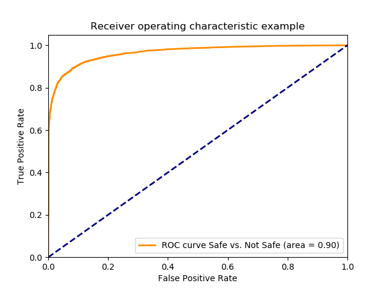

# The SQRX Family of Models
The SQRX models generally have a small backbone, such as MobileNetV2 or EfficientNet.
They all produce at a minimum a four class S/Q/R/X output.

# SQRX 62
This is the 62nd iteration of this family of models; it is MobileNetV2-based.
The deviation from a stock model is minimal:
```python
    x = model_mn.output #MobileNetV2 output
    x = SpatialDropout2D(0.1)(x)
    a = GlobalAveragePooling2D()(x)
    x = Dense(128, name='fc_final', activation='relu')(a)
    x = Dropout(0.25, name='dropout')(x)
    x = Dense(NUM_CLASSES, name='classifier', activation='softmax')(x)
    model = Model(inputs=[model_mn.input], outputs=[x])
```

Additionally, a weighted categorical cross-entropy is used to penalize confusions of say, S and X more heavily than S and Q.
This model is available as `sqrx_best.h5`.

# The SQRXR Second-Stage Model
The SQRXR model is short for "SQRX Regression" model; however, in actuality it is more of a binary S vs. QRX classifier. It feeds in the output of the SQRX model and then optimizes using the handy [AUC ROC loss function](https://github.com/tensorflow/models/tree/archive/research/global_objectives).

The second stage model is quite small:
```python
    input = Input((4,)) # Feed in SQRX softmax output
    node = Dense(50)(input)
    node = Dropout(0.2)(node)
    node = Dense(10, activation='sigmoid')(node)
    node = Dense(1, activation='sigmoid')(node)
    post_model = Model(inputs=input,outputs=node)

    post_model.compile(
        optimizer=Adam(lr=0.0001),
        loss=roc_auc_loss,
        metrics=['accuracy']
        )
```

# SQRXR 62
Because the dataset is not public and is constantly growing, I find it a bit unhelpful to focus on absolute accuracy as a metric that is useful for those wishing to integrate the model, as the distribution of my browser search images and your browser search images are likely quite different.

However, I do think it is may be helpful to show the ROC so one can understand the general level of non-linearity in the steps.


The second-stage-only model is available as `sqrx_regression.h5`.
The final model that fuses the two together (via Keras model function composition) is available as `sqrxr_best.h5`.

In order to find the appropriate tradeoff of false positives vs. true positives, one may wish to consult the appendix below containing the thresholds corresponding to the rates in the graph above.

# Tensorflow.js Conversion and Usage
The final model was converted using tensorflowjs-converter.
The folder `sqrxr_62_graphopt` represents this graph-optimized version suitable for web use.

I use roughly the following logic:
```javascript
let inferenceCanvas = document.createElement('canvas');
inferenceCanvas.width = IMAGE_SIZE;
inferenceCanvas.height = IMAGE_SIZE;
let inferenceCtx = inferenceCanvas.getContext('2d', { alpha: false});
inferenceCtx.imageSmoothingEnabled = true;

function predict(imgElement) {
  inferenceCtx.drawImage(imgElement, 0, 0, imgElement.width, imgElement.height, 0, 0, IMAGE_SIZE,IMAGE_SIZE);
  const rightSizeImageData = inferenceCtx.getImageData(0, 0, IMAGE_SIZE, IMAGE_SIZE);

  const logits = tf.tidy(() => {
    const rightSizeImageDataTF = tf.browser.fromPixels(rightSizeImageData);
    const floatImg = rightSizeImageDataTF.toFloat();
    //MobileNet V2
    const scaled = floatImg.div(tf.scalar(127.5));
    const normalized = scaled.sub(tf.scalar(1));
    // Reshape to a single-element batch so we can pass it to predict.
    const batched = tf.stack([normalized]);
    const result = wingman.predict(batched, {batchSize: 1});

    return result;
  });
  
  console.log('Prediction: '+syncedResult[0]);
  return syncedResult;
}
```

The prediction can then be viewed as a lookup for the desired TPR/FPR tradeoff. A balanced starting point is to see if the prediction is less than 0.9977756.

# Appendix: ROC Threshold Table
Below is the table in the format ((FPR,TPR),Threshold) corresponding to the ROC listed above. Here "Positive" means "unsafe" (Q/R/X).
```
((0.0, 0.00013113034356150013), 0.9989846)
((0.0, 0.0005245213742460005), 0.9989845)
((0.0, 0.003147128245476003), 0.99898446)
((0.0, 0.004327301337529505), 0.9989844)
((0.0, 0.007867820613690008), 0.99898434)
((0.0, 0.008916863362182009), 0.9989843)
((0.0, 0.011801730920535013), 0.9989842)
((0.0, 0.012063991607658012), 0.99898416)
((0.0, 0.014817728822449515), 0.9989841)
((0.0, 0.015342250196695516), 0.99898404)
((0.0, 0.016391292945187517), 0.998984)
((0.0, 0.017178075006556517), 0.9989839)
((0.0, 0.01980068187778652), 0.99898386)
((0.0, 0.020456333595594022), 0.9989838)
((0.0, 0.022423288749016522), 0.99898374)
((0.0, 0.022947810123262524), 0.9989837)
((0.0, 0.024521374246000524), 0.9989836)
((0.0, 0.025308156307369524), 0.99898356)
((0.0, 0.02779963283503803), 0.9989835)
((0.0, 0.028061893522161027), 0.99898344)
((0.0, 0.02989771833202203), 0.9989834)
((0.0, 0.03134015211119853), 0.99898326)
((0.0, 0.03173354314188303), 0.9989832)
((0.0, 0.03317597692105953), 0.99898314)
((0.0, 0.03383162863886703), 0.9989831)
((0.0, 0.035011801730920535), 0.998983)
((0.0, 0.03553632310516654), 0.99898297)
((0.0, 0.03671649619722004), 0.9989829)
((0.0, 0.03684762654078154), 0.99898285)
((0.0, 0.03842119066351954), 0.9989828)
((0.0, 0.03881458169420404), 0.9989827)
((0.0, 0.03986362444269604), 0.99898267)
((0.0, 0.04104379753474954), 0.9989826)
((0.0, 0.04209284028324154), 0.99898255)
((0.0, 0.042355100970364545), 0.9989825)
((0.0, 0.043797534749541046), 0.9989824)
((0.0, 0.04419092578022554), 0.99898237)
((0.0, 0.04523996852871755), 0.9989823)
((0.0, 0.04576448990296354), 0.99898225)
((0.0, 0.04733805402570155), 0.9989822)
((0.0, 0.04812483608707055), 0.998982)
((0.0, 0.04917387883556255), 0.99898195)
((0.0, 0.04982953055337005), 0.9989819)
((0.0, 0.050747442958300554), 0.99898183)
((0.0, 0.05100970364542355), 0.9989818)
((0.0, 0.052189876737477055), 0.9989817)
((0.0, 0.052976658798846055), 0.99898165)
((0.0, 0.05402570154733805), 0.9989816)
((0.0, 0.05428796223446106), 0.99898154)
((0.0, 0.05494361395226856), 0.9989815)
((0.0, 0.055205874639391556), 0.9989814)
((0.0, 0.05625491738788355), 0.99898136)
((0.0, 0.05664830841856806), 0.9989813)
((0.0, 0.056779438762129555), 0.99898124)
((0.0, 0.05730396013637556), 0.9989812)
((0.0, 0.05809074219774456), 0.99898106)
((0.0, 0.06084447941253606), 0.9989809)
((0.0, 0.06110674009965906), 0.9989808)
((0.0, 0.061893522161028065), 0.99898076)
((0.0, 0.062024652504589564), 0.99898064)
((0.0, 0.06228691319171256), 0.9989806)
((0.0, 0.06268030422239707), 0.9989805)
((0.0, 0.06320482559664306), 0.9989804)
((0.0, 0.06333595594020457), 0.99898034)
((0.0, 0.06399160765801207), 0.9989803)
((0.0, 0.06412273800157356), 0.9989802)
((0.0, 0.06517178075006556), 0.99898016)
((0.0, 0.06530291109362707), 0.9989801)
((0.0, 0.06569630212431156), 0.99898005)
((0.0, 0.06622082349855757), 0.99897987)
((0.0, 0.06726986624704957), 0.9989797)
((0.0, 0.06766325727773406), 0.99897957)
((0.0, 0.06792551796485707), 0.9989795)
((0.0, 0.06845003933910307), 0.99897945)
((0.0, 0.06858116968266458), 0.9989794)
((0.0, 0.06910569105691057), 0.99897933)
((0.0, 0.06976134277471807), 0.9989792)
((0.0, 0.07028586414896407), 0.99897915)
((0.0, 0.07041699449252557), 0.9989791)
((0.0, 0.07094151586677157), 0.998979)
((0.0, 0.07146603724101758), 0.99897885)
((0.0, 0.07225281930238657), 0.99897873)
((0.0, 0.07264621033307107), 0.9989787)
((0.0, 0.07277734067663258), 0.9989786)
((0.0, 0.07303960136375558), 0.9989785)
((0.0, 0.07317073170731707), 0.99897844)
((0.0, 0.07408864411224757), 0.9989784)
((0.0, 0.07435090479937058), 0.99897814)
((0.0, 0.07618672960923158), 0.9989779)
((0.0, 0.07631785995279308), 0.99897784)
((0.0, 0.07762916338840808), 0.99897766)
((0.0, 0.07815368476265408), 0.9989774)
((0.0, 0.07920272751114608), 0.9989773)
((0.0, 0.07933385785470758), 0.99897724)
((0.0, 0.07959611854183057), 0.9989771)
((0.0, 0.08012063991607658), 0.99897707)
((0.0, 0.08051403094676109), 0.998977)
((0.0, 0.08103855232100708), 0.99897695)
((0.0, 0.08130081300813008), 0.9989769)
((0.0, 0.08169420403881458), 0.99897677)
((0.0, 0.08195646472593758), 0.99897665)
((0.0, 0.08221872541306058), 0.9989766)
((0.0, 0.08300550747442959), 0.99897647)
((0.0, 0.08353002884867558), 0.99897635)
((0.0, 0.08366115919223709), 0.99897623)
((0.0, 0.08392341987936008), 0.9989762)
((0.0, 0.08431681091004459), 0.99897605)
((0.0, 0.08536585365853659), 0.99897593)
((0.0, 0.08615263571990558), 0.9989758)
((0.0, 0.08667715709415158), 0.99897575)
((0.0, 0.08720167846839759), 0.99897563)
((0.0, 0.08733280881195908), 0.9989756)
((0.0, 0.08759506949908209), 0.9989755)
((0.0, 0.08772619984264358), 0.99897546)
((0.0, 0.0882507212168896), 0.9989754)
((0.0, 0.08838185156045109), 0.99897534)
((0.0, 0.0889063729346971), 0.9989753)
((0.0, 0.08903750327825859), 0.9989752)
((0.0, 0.0895620246525046), 0.99897516)
((0.0, 0.0898242853396276), 0.99897504)
((0.0, 0.09008654602675059), 0.9989749)
((0.0, 0.0904799370574351), 0.99897486)
((0.0, 0.09100445843168109), 0.9989748)
((0.0, 0.09126671911880409), 0.99897474)
((0.0, 0.0917912404930501), 0.99897456)
((0.0, 0.0920535011801731), 0.9989745)
((0.0, 0.09231576186729609), 0.9989744)
((0.0, 0.09257802255441909), 0.9989743)
((0.0, 0.0927091528979806), 0.9989742)
((0.0, 0.0929714135851036), 0.99897414)
((0.0, 0.0940204563335956), 0.99897397)
((0.0, 0.0944138473642801), 0.99897385)
((0.0, 0.0952006294256491), 0.9989736)
((0.0, 0.0953317597692106), 0.99897337)
((0.0, 0.0955940204563336), 0.99897325)
((0.0, 0.0959874114870181), 0.99897313)
((0.0, 0.09611854183057959), 0.9989731)
((0.0, 0.09638080251770259), 0.9989729)
((0.0, 0.0965119328612641), 0.99897283)
((0.0, 0.0969053238919486), 0.9989728)
((0.0, 0.0971675845790716), 0.9989727)
((0.0, 0.0979543666404406), 0.99897254)
((0.0, 0.0982166273275636), 0.9989724)
((0.0, 0.0983477576711251), 0.99897236)
((0.0, 0.0988722790453711), 0.9989723)
((0.0, 0.0991345397324941), 0.9989722)
((0.0, 0.09926567007605559), 0.99897206)
((0.0, 0.0995279307631786), 0.99897194)
((0.0, 0.1000524521374246), 0.99897164)
((0.0, 0.1005769735116706), 0.9989716)
((0.0, 0.1007081038552321), 0.9989715)
((0.0, 0.1012326252294781), 0.9989714)
((0.0, 0.10149488591660111), 0.9989712)
((0.0, 0.1018882769472856), 0.9989711)
((0.0, 0.1024127983215316), 0.998971)
((0.0, 0.1029373196957776), 0.9989708)
((0.0, 0.10306845003933911), 0.9989707)
((0.0, 0.1035929714135851), 0.9989706)
((0.0, 0.1038552321007081), 0.99897045)
((0.0, 0.10437975347495411), 0.9989702)
((0.0, 0.1051665355363231), 0.99897003)
((0.0, 0.1055599265670076), 0.9989698)
((0.0, 0.10595331759769211), 0.99896973)
((0.0, 0.10621557828481511), 0.9989697)
((0.0, 0.10660896931549961), 0.99896955)
((0.0, 0.10687123000262261), 0.99896944)
((0.0, 0.1073957513768686), 0.9989693)
((0.0, 0.10752688172043011), 0.9989692)
((0.0, 0.10792027275111461), 0.9989691)
((0.0, 0.10844479412536061), 0.9989688)
((0.0, 0.1087070548124836), 0.9989687)
((0.0, 0.10949383687385261), 0.99896854)
((0.0, 0.10975609756097561), 0.9989685)
((0.0, 0.10988722790453712), 0.9989684)
((0.0, 0.1102806189352216), 0.99896836)
((0.0, 0.11106740099659061), 0.99896777)
((0.0, 0.11146079202727512), 0.99896765)
((0.0, 0.11159192237083661), 0.9989676)
((0.0, 0.11198531340152111), 0.9989675)
((0.0, 0.11224757408864411), 0.9989674)
((0.0, 0.11264096511932861), 0.9989673)
((0.0, 0.11316548649357461), 0.9989671)
((0.0, 0.11329661683713611), 0.998967)
((0.0, 0.11369000786782062), 0.99896693)
((0.0, 0.11421452924206661), 0.9989665)
((0.0, 0.11473905061631262), 0.99896646)
((0.0, 0.11513244164699711), 0.9989664)
((0.0, 0.11591922370836612), 0.99896574)
((0.0, 0.11618148439548912), 0.9989654)
((0.0, 0.11644374508261211), 0.99896526)
((0.0, 0.11670600576973511), 0.99896497)
((0.0, 0.11696826645685812), 0.9989649)
((0.0, 0.11709939680041961), 0.99896485)
((0.0, 0.11762391817466562), 0.99896467)
((0.0, 0.11814843954891162), 0.99896455)
((0.0, 0.11867296092315761), 0.99896413)
((0.0, 0.11906635195384212), 0.9989641)
((0.0, 0.12011539470233412), 0.99896336)
((0.0, 0.12024652504589561), 0.9989633)
((0.0, 0.12063991607658012), 0.9989631)
((0.0, 0.12090217676370311), 0.99896306)
((0.0, 0.12129556779438762), 0.9989626)
((0.0, 0.12208234985575663), 0.99896234)
((0.0, 0.12221348019931812), 0.9989621)
((0.0, 0.12260687123000262), 0.99896204)
((0.0, 0.12326252294781012), 0.9989617)
((0.0, 0.12352478363493312), 0.9989612)
((0.0, 0.12365591397849462), 0.9989611)
((0.0, 0.12391817466561762), 0.998961)
((0.0, 0.12404930500917913), 0.99896073)
((0.0, 0.12457382638342512), 0.99896044)
((0.0, 0.12496721741410963), 0.99896026)
((0.0, 0.12522947810123264), 0.99896)
((0.0, 0.12549173878835562), 0.9989597)
((0.0, 0.12575399947547863), 0.9989596)
((0.0, 0.12601626016260162), 0.9989592)
((0.0, 0.1265407815368476), 0.998959)
((0.0, 0.12667191188040913), 0.9989589)
((0.0, 0.12693417256753212), 0.9989588)
((0.0, 0.12719643325465513), 0.9989581)
((0.0, 0.12772095462890112), 0.998958)
((0.0, 0.12798321531602413), 0.9989578)
((0.0, 0.12837660634670864), 0.99895775)
((0.0, 0.12863886703383162), 0.9989574)
((0.0, 0.12890112772095463), 0.9989573)
((0.0, 0.12929451875163914), 0.9989572)
((0.0, 0.12955677943876212), 0.998957)
((0.0, 0.12995017046944662), 0.9989569)
((0.0, 0.13008130081300814), 0.9989567)
((0.0, 0.13034356150013113), 0.99895656)
((0.0, 0.13073695253081563), 0.9989564)
((0.0, 0.13113034356150013), 0.9989563)
((0.0, 0.13139260424862312), 0.9989559)
((0.0, 0.13191712562286914), 0.9989557)
((0.0, 0.13231051665355364), 0.9989556)
((0.0, 0.13257277734067663), 0.9989555)
((0.0, 0.13283503802779964), 0.99895525)
((0.0, 0.13296616837136113), 0.99895513)
((0.0, 0.13335955940204564), 0.998955)
((0.0, 0.13362182008916865), 0.9989549)
((0.0, 0.13375295043273014), 0.9989548)
((0.0, 0.13414634146341464), 0.99895465)
((0.0, 0.13453973249409915), 0.99895406)
((0.0, 0.13493312352478362), 0.9989538)
((0.0, 0.13558877524259114), 0.99895316)
((0.0, 0.13585103592971415), 0.9989531)
((0.0, 0.13598216627327564), 0.99895304)
((0.0, 0.13624442696039862), 0.998953)
((0.0, 0.13650668764752164), 0.9989528)
((0.0, 0.13729346970889064), 0.99895275)
((0.0, 0.13768686073957515), 0.9989526)
((0.0, 0.13808025177025965), 0.9989522)
((0.0, 0.13847364280094415), 0.99895215)
((0.0, 0.13899816417519015), 0.9989509)
((0.0, 0.13926042486231313), 0.99895084)
((0.0, 0.13939155520587465), 0.99895036)
((0.0, 0.13991607658012065), 0.99895024)
((0.0, 0.14057172829792813), 0.99894965)
((0.0, 0.14083398898505115), 0.9989495)
((0.0, 0.14096511932861264), 0.99894917)
((0.0, 0.14122738001573565), 0.9989491)
((0.0, 0.14148964070285863), 0.99894893)
((0.0, 0.14175190138998164), 0.9989488)
((0.0, 0.14201416207710466), 0.9989487)
((0.0, 0.14280094413847363), 0.99894786)
((0.0, 0.14306320482559665), 0.9989474)
((0.0, 0.14424337791765016), 0.998947)
((0.0, 0.14450563860477314), 0.9989469)
((0.0, 0.14463676894833463), 0.9989468)
((0.0, 0.14489902963545764), 0.9989467)
((0.0, 0.14503015997901914), 0.9989464)
((0.0, 0.14529242066614215), 0.99894637)
((0.0, 0.14555468135326516), 0.9989461)
((0.0, 0.14594807238394963), 0.99894583)
((0.0, 0.14660372410175715), 0.99894553)
((0.0, 0.14686598478888016), 0.9989455)
((0.0, 0.14725937581956464), 0.99894536)
((0.0, 0.14765276685024914), 0.99894446)
((0.0, 0.14791502753737215), 0.9989442)
((0.0, 0.14817728822449514), 0.9989441)
((0.00013561160835367508, 0.14857067925517964), 0.9989438)
((0.00013561160835367508, 0.14935746131654865), 0.99894285)
((0.00013561160835367508, 0.14961972200367166), 0.9989426)
((0.00013561160835367508, 0.15001311303435616), 0.9989425)
((0.00013561160835367508, 0.15053763440860216), 0.9989414)
((0.00013561160835367508, 0.15093102543928666), 0.9989413)
((0.00013561160835367508, 0.15106215578284815), 0.9989412)
((0.00013561160835367508, 0.15132441646997116), 0.99894106)
((0.00013561160835367508, 0.15171780750065564), 0.9989405)
((0.00013561160835367508, 0.15224232887490166), 0.99894047)
((0.00013561160835367508, 0.15237345921846315), 0.9989403)
((0.00013561160835367508, 0.15263571990558616), 0.99894)
((0.00013561160835367508, 0.15276685024914766), 0.9989399)
((0.00013561160835367508, 0.15316024127983216), 0.99893963)
((0.00013561160835367508, 0.15342250196695514), 0.9989395)
((0.00013561160835367508, 0.15368476265407816), 0.99893934)
((0.00013561160835367508, 0.15407815368476266), 0.99893916)
((0.00013561160835367508, 0.15434041437188564), 0.99893904)
((0.00013561160835367508, 0.15460267505900865), 0.998939)
((0.00013561160835367508, 0.15499606608969316), 0.9989389)
((0.00013561160835367508, 0.15512719643325465), 0.99893886)
((0.00013561160835367508, 0.15538945712037766), 0.9989388)
((0.00013561160835367508, 0.15565171780750064), 0.9989387)
((0.00013561160835367508, 0.15591397849462366), 0.99893856)
((0.00013561160835367508, 0.15630736952530816), 0.99893844)
((0.00013561160835367508, 0.15656963021243114), 0.9989383)
((0.00013561160835367508, 0.15670076055599266), 0.9989382)
((0.00013561160835367508, 0.15696302124311565), 0.99893796)
((0.00013561160835367508, 0.15735641227380015), 0.99893755)
((0.00013561160835367508, 0.15774980330448465), 0.99893737)
((0.00013561160835367508, 0.15788093364804615), 0.99893725)
((0.00013561160835367508, 0.15840545502229217), 0.99893713)
((0.00013561160835367508, 0.15866771570941515), 0.9989371)
((0.00013561160835367508, 0.15879884605297667), 0.998937)
((0.00013561160835367508, 0.15906110674009966), 0.99893695)
((0.00027122321670735016, 0.15919223708366115), 0.9989368)
((0.00027122321670735016, 0.15945449777078416), 0.99893665)
((0.00027122321670735016, 0.15958562811434565), 0.9989364)
((0.00027122321670735016, 0.16011014948859165), 0.99893606)
((0.00027122321670735016, 0.16037241017571466), 0.9989359)
((0.00027122321670735016, 0.16089693154996065), 0.9989357)
((0.00027122321670735016, 0.16129032258064516), 0.99893534)
((0.00027122321670735016, 0.16155258326776817), 0.9989352)
((0.00027122321670735016, 0.16181484395489115), 0.9989347)
((0.00027122321670735016, 0.16207710464201416), 0.9989345)
((0.00027122321670735016, 0.16273275635982165), 0.9989337)
((0.00027122321670735016, 0.16325727773406767), 0.99893355)
((0.00027122321670735016, 0.16338840807762917), 0.99893343)
((0.00027122321670735016, 0.16365066876475218), 0.9989333)
((0.00027122321670735016, 0.16404405979543665), 0.9989328)
((0.00027122321670735016, 0.16456858116968268), 0.9989325)
((0.00027122321670735016, 0.16496197220036715), 0.9989321)
((0.00027122321670735016, 0.16535536323105166), 0.998932)
((0.00027122321670735016, 0.16548649357461317), 0.9989318)
((0.00027122321670735016, 0.16601101494885917), 0.99893147)
((0.00027122321670735016, 0.16614214529242066), 0.9989314)
((0.00027122321670735016, 0.16653553632310517), 0.9989312)
((0.00027122321670735016, 0.16679779701022818), 0.9989309)
((0.00027122321670735016, 0.16758457907159716), 0.99893045)
((0.00027122321670735016, 0.16771570941515868), 0.99893016)
((0.00027122321670735016, 0.16797797010228166), 0.9989301)
((0.00027122321670735016, 0.16810910044584318), 0.99893004)
((0.00027122321670735016, 0.16837136113296616), 0.99892974)
((0.00027122321670735016, 0.16889588250721216), 0.99892896)
((0.00027122321670735016, 0.16928927353789666), 0.9989289)
((0.00027122321670735016, 0.16942040388145818), 0.9989288)
((0.00027122321670735016, 0.16968266456858117), 0.99892867)
((0.00027122321670735016, 0.16994492525570418), 0.99892837)
((0.00027122321670735016, 0.17020718594282716), 0.9989283)
((0.00027122321670735016, 0.17060057697351166), 0.998928)
((0.0004068348250610252, 0.17073170731707318), 0.99892795)
((0.0004068348250610252, 0.17086283766063468), 0.9989278)
((0.0004068348250610252, 0.17125622869131918), 0.9989277)
((0.0004068348250610252, 0.17138735903488067), 0.9989276)
((0.0004068348250610252, 0.17178075006556517), 0.99892735)
((0.0004068348250610252, 0.17230527143981117), 0.9989266)
((0.0004068348250610252, 0.17256753212693418), 0.9989263)
((0.0004068348250610252, 0.17309205350118018), 0.9989251)
((0.0004068348250610252, 0.17348544453186468), 0.99892485)
((0.0004068348250610252, 0.17374770521898766), 0.99892414)
((0.0004068348250610252, 0.17400996590611068), 0.998924)
((0.0004068348250610252, 0.17453448728035667), 0.9989234)
((0.0004068348250610252, 0.17505900865460267), 0.99892247)
((0.0004068348250610252, 0.1765014424337792), 0.99892086)
((0.0004068348250610252, 0.17676370312090217), 0.9989208)
((0.0004068348250610252, 0.17689483346446366), 0.9989207)
((0.0004068348250610252, 0.17728822449514817), 0.9989203)
((0.0004068348250610252, 0.1774193548387097), 0.9989201)
((0.0004068348250610252, 0.17794387621295568), 0.9989196)
((0.0004068348250610252, 0.17807500655651717), 0.9989195)
((0.0004068348250610252, 0.17859952793076317), 0.99891865)
((0.0004068348250610252, 0.17899291896144767), 0.99891824)
((0.0004068348250610252, 0.17938630999213218), 0.9989182)
((0.0004068348250610252, 0.1796485706792552), 0.998918)
((0.0004068348250610252, 0.17991083136637817), 0.9989171)
((0.0004068348250610252, 0.1800419617099397), 0.99891686)
((0.0004068348250610252, 0.18030422239706267), 0.9989166)
((0.0004068348250610252, 0.18069761342774718), 0.99891603)
((0.0004068348250610252, 0.18109100445843168), 0.9989158)
((0.0004068348250610252, 0.18122213480199317), 0.9989157)
((0.0004068348250610252, 0.18148439548911618), 0.99891543)
((0.0004068348250610252, 0.18200891686336218), 0.9989152)
((0.0004068348250610252, 0.18214004720692367), 0.9989151)
((0.0004068348250610252, 0.18253343823760818), 0.99891496)
((0.0004068348250610252, 0.18292682926829268), 0.9989146)
((0.0005424464334147003, 0.18305795961185417), 0.99891436)
((0.0005424464334147003, 0.1835824809861002), 0.9989135)
((0.0005424464334147003, 0.18384474167322318), 0.9989134)
((0.0005424464334147003, 0.1839758720167847), 0.99891335)
((0.0005424464334147003, 0.1845003933910307), 0.99891317)
((0.0005424464334147003, 0.1850249147652767), 0.9989122)
((0.0005424464334147003, 0.18528717545239967), 0.9989121)
((0.0005424464334147003, 0.18554943613952268), 0.9989119)
((0.0005424464334147003, 0.1858116968266457), 0.9989118)
((0.0005424464334147003, 0.1862050878573302), 0.9989116)
((0.0005424464334147003, 0.1863362182008917), 0.9989115)
((0.0005424464334147003, 0.1867296092315762), 0.9989114)
((0.0005424464334147003, 0.18699186991869918), 0.9989112)
((0.0005424464334147003, 0.1872541306058222), 0.9989109)
((0.0005424464334147003, 0.18777865198006818), 0.99891084)
((0.0006780580417683754, 0.18777865198006818), 0.9989108)
((0.0006780580417683754, 0.1881720430107527), 0.99891067)
((0.0006780580417683754, 0.1888276947285602), 0.9989097)
((0.0006780580417683754, 0.1890899554156832), 0.9989095)
((0.0006780580417683754, 0.1893522161028062), 0.9989093)
((0.0006780580417683754, 0.18961447678992918), 0.99890924)
((0.0006780580417683754, 0.1897456071334907), 0.9989091)
((0.0006780580417683754, 0.1904012588512982), 0.99890876)
((0.0006780580417683754, 0.1907946498819827), 0.9989085)
((0.0006780580417683754, 0.1910569105691057), 0.99890846)
((0.0006780580417683754, 0.1915814319433517), 0.9989083)
((0.0006780580417683754, 0.19184369263047468), 0.9989081)
((0.0006780580417683754, 0.1921059533175977), 0.9989079)
((0.0006780580417683754, 0.19223708366115919), 0.99890786)
((0.0006780580417683754, 0.1924993443482822), 0.9989076)
((0.0006780580417683754, 0.1930238657225282), 0.9989066)
((0.0006780580417683754, 0.1932861264096512), 0.99890655)
((0.0006780580417683754, 0.1935483870967742), 0.99890614)
((0.0006780580417683754, 0.1938106477838972), 0.9989059)
((0.0006780580417683754, 0.1943351691581432), 0.99890524)
((0.0008136696501220504, 0.1943351691581432), 0.99890506)
((0.0008136696501220504, 0.1945974298452662), 0.9989048)
((0.0008136696501220504, 0.19538421190663519), 0.99890435)
((0.0008136696501220504, 0.1955153422501967), 0.9989042)
((0.0008136696501220504, 0.19630212431156568), 0.9989041)
((0.0008136696501220504, 0.1965643849986887), 0.9989039)
((0.0008136696501220504, 0.1969577760293732), 0.9989037)
((0.0008136696501220504, 0.1970889063729347), 0.9989035)
((0.0008136696501220504, 0.1978756884343037), 0.99890316)
((0.0008136696501220504, 0.1980068187778652), 0.998903)
((0.0008136696501220504, 0.1987936008392342), 0.99890244)
((0.0008136696501220504, 0.1991869918699187), 0.99890214)
((0.0008136696501220504, 0.1999737739312877), 0.9989017)
((0.0008136696501220504, 0.2002360346184107), 0.99890167)
((0.0008136696501220504, 0.2004982953055337), 0.99890125)
((0.0008136696501220504, 0.20076055599265671), 0.9989011)
((0.0008136696501220504, 0.2010228166797797), 0.99890095)
((0.0008136696501220504, 0.2012850773669027), 0.9989009)
((0.0009492812584757255, 0.2015473380540257), 0.9989004)
((0.0009492812584757255, 0.2018095987411487), 0.9989003)
((0.0009492812584757255, 0.2020718594282717), 0.9988999)
((0.0009492812584757255, 0.2023341201153947), 0.9988998)
((0.0009492812584757255, 0.2027275111460792), 0.99889946)
((0.0009492812584757255, 0.20298977183320221), 0.9988994)
((0.0009492812584757255, 0.2045633359559402), 0.998899)
((0.0009492812584757255, 0.2048255966430632), 0.99889857)
((0.0009492812584757255, 0.20521898767374772), 0.9988985)
((0.0009492812584757255, 0.2054812483608707), 0.9988983)
((0.0009492812584757255, 0.2057435090479937), 0.9988982)
((0.0009492812584757255, 0.20613690007867821), 0.99889815)
((0.0010848928668294006, 0.20613690007867821), 0.998898)
((0.0010848928668294006, 0.2062680304222397), 0.99889797)
((0.0010848928668294006, 0.2067925517964857), 0.9988979)
((0.0010848928668294006, 0.20784159454497772), 0.99889755)
((0.0012205044751830757, 0.20784159454497772), 0.9988975)
((0.0012205044751830757, 0.2079727248885392), 0.99889743)
((0.0012205044751830757, 0.2082349855756622), 0.9988973)
((0.0012205044751830757, 0.2094151586677157), 0.99889696)
((0.0013561160835367507, 0.2098085496984002), 0.9988967)
((0.0013561160835367507, 0.2099396800419617), 0.99889666)
((0.0013561160835367507, 0.2107264621033307), 0.99889636)
((0.0013561160835367507, 0.2108575924468922), 0.99889624)
((0.0013561160835367507, 0.2111198531340152), 0.9988961)
((0.0013561160835367507, 0.21190663519538422), 0.99889606)
((0.0013561160835367507, 0.2130868082874377), 0.998896)
((0.0013561160835367507, 0.21321793863099922), 0.99889594)
((0.0013561160835367507, 0.21374246000524522), 0.9988959)
((0.0013561160835367507, 0.21413585103592972), 0.99889576)
((0.0013561160835367507, 0.2142669813794912), 0.99889565)
((0.0013561160835367507, 0.21466037241017571), 0.9988956)
((0.0013561160835367507, 0.2153160241279832), 0.9988955)
((0.0013561160835367507, 0.2157094151586677), 0.99889547)
((0.0013561160835367507, 0.21584054550222923), 0.9988954)
((0.0013561160835367507, 0.2161028061893522), 0.99889535)
((0.0013561160835367507, 0.21688958825072122), 0.99889505)
((0.0013561160835367507, 0.2170207185942827), 0.998895)
((0.0013561160835367507, 0.21754523996852873), 0.9988949)
((0.0013561160835367507, 0.21859428271702072), 0.99889475)
((0.0013561160835367507, 0.21911880409126672), 0.99889463)
((0.0013561160835367507, 0.21938106477838973), 0.9988944)
((0.0013561160835367507, 0.21977445580907423), 0.99889433)
((0.0013561160835367507, 0.21990558615263572), 0.9988943)
((0.0013561160835367507, 0.22069236821400473), 0.99889416)
((0.0013561160835367507, 0.22095462890112771), 0.9988941)
((0.0013561160835367507, 0.2218725413060582), 0.998894)
((0.0013561160835367507, 0.22239706268030424), 0.99889386)
((0.0013561160835367507, 0.22305271439811172), 0.9988938)
((0.0013561160835367507, 0.22344610542879623), 0.99889374)
((0.0013561160835367507, 0.2237083661159192), 0.9988936)
((0.0013561160835367507, 0.22462627852084974), 0.9988935)
((0.0013561160835367507, 0.22475740886441123), 0.99889344)
((0.0013561160835367507, 0.22633097298714921), 0.9988934)
((0.0013561160835367507, 0.2272488853920797), 0.99889326)
((0.0013561160835367507, 0.22751114607920273), 0.9988932)
((0.0013561160835367507, 0.22803566745344872), 0.99889314)
((0.0013561160835367507, 0.22816679779701024), 0.9988931)
((0.0013561160835367507, 0.22869131917125624), 0.998893)
((0.0013561160835367507, 0.23052714398111723), 0.9988929)
((0.0013561160835367507, 0.23065827432467872), 0.99889284)
((0.0013561160835367507, 0.23170731707317074), 0.9988928)
((0.0013561160835367507, 0.23223183844741674), 0.9988927)
((0.0013561160835367507, 0.23459218463152373), 0.99889266)
((0.0013561160835367507, 0.23590348806713873), 0.9988926)
((0.0013561160835367507, 0.23865722528193023), 0.99889255)
((0.0013561160835367507, 0.24009965906110675), 0.9988925)
((0.0013561160835367507, 0.24259113558877524), 0.9988924)
((0.0013561160835367507, 0.24416469971151325), 0.99889237)
((0.0013561160835367507, 0.24914765276685025), 0.9988923)
((0.0013561160835367507, 0.25006556517178075), 0.99889225)
((0.0013561160835367507, 0.25701547338054026), 0.9988922)
((0.0013561160835367507, 0.26278520849724624), 0.9988921)
((0.0013561160835367507, 0.3234985575662208), 0.99889207)
((0.0013561160835367507, 0.3987673747705219), 0.998892)
((0.0013561160835367507, 0.44715447154471544), 0.99889195)
((0.0013561160835367507, 0.45148177288224495), 0.9988919)
((0.0013561160835367507, 0.47023341201153945), 0.99889183)
((0.0013561160835367507, 0.477970102281668), 0.9988918)
((0.0013561160835367507, 0.488985051140834), 0.9988917)
((0.0013561160835367507, 0.4899029635457645), 0.99889165)
((0.0013561160835367507, 0.496590611067401), 0.9988916)
((0.0013561160835367507, 0.497639653815893), 0.99889153)
((0.0013561160835367507, 0.50524521374246), 0.9988915)
((0.0013561160835367507, 0.506556517178075), 0.9988914)
((0.0013561160835367507, 0.514424337791765), 0.99889135)
((0.0013561160835367507, 0.5156045108838185), 0.9988913)
((0.0013561160835367507, 0.520194072908471), 0.99889123)
((0.0014917276918904258, 0.522029897718332), 0.9988912)
((0.0014917276918904258, 0.527275111460792), 0.9988911)
((0.0014917276918904258, 0.5276685024914766), 0.99889106)
((0.0014917276918904258, 0.5300288486755835), 0.998891)
((0.0014917276918904258, 0.5308156307369525), 0.99889094)
((0.0014917276918904258, 0.5329137162339366), 0.9988909)
((0.0014917276918904258, 0.53409388932599), 0.9988908)
((0.0014917276918904258, 0.536191974822974), 0.99889076)
((0.0014917276918904258, 0.5367164961972201), 0.9988907)
((0.0014917276918904258, 0.5394702334120115), 0.99889064)
((0.0016273393002441008, 0.5405192761605035), 0.9988906)
((0.0016273393002441008, 0.542748492001049), 0.9988905)
((0.0016273393002441008, 0.5435352740624181), 0.99889046)
((0.0016273393002441008, 0.5451088381851561), 0.9988904)
((0.0016273393002441008, 0.546157880933648), 0.99889034)
((0.0016273393002441008, 0.5470757933385786), 0.9988903)
((0.0016273393002441008, 0.5476003147128246), 0.9988902)
((0.0016273393002441008, 0.5503540519276161), 0.99889016)
((0.0016273393002441008, 0.5506163126147391), 0.9988901)
((0.0016273393002441008, 0.551665355363231), 0.99889004)
((0.0016273393002441008, 0.553238919485969), 0.9988899)
((0.0016273393002441008, 0.5541568318908996), 0.99888986)
((0.0016273393002441008, 0.5549436139522685), 0.9988898)
((0.0016273393002441008, 0.5554681353265145), 0.99888974)
((0.0016273393002441008, 0.5563860477314451), 0.9988897)
((0.0016273393002441008, 0.5578284815106216), 0.99888957)
((0.0016273393002441008, 0.5583530028848676), 0.9988895)
((0.0016273393002441008, 0.5599265670076056), 0.99888945)
((0.0016273393002441008, 0.5609756097560976), 0.9988894)
((0.0016273393002441008, 0.5628114345659586), 0.9988893)
((0.0016273393002441008, 0.5630736952530816), 0.99888927)
((0.0016273393002441008, 0.5646472593758196), 0.9988892)
((0.0016273393002441008, 0.5649095200629426), 0.99888915)
((0.0016273393002441008, 0.56556517178075), 0.9988891)
((0.0016273393002441008, 0.5656963021243115), 0.998889)
((0.0016273393002441008, 0.5667453448728036), 0.9988889)
((0.0016273393002441008, 0.5680566483084186), 0.99888885)
((0.0016273393002441008, 0.5683189089955416), 0.9988888)
((0.0016273393002441008, 0.5689745607133491), 0.99888873)
((0.0016273393002441008, 0.5691056910569106), 0.9988887)
((0.0016273393002441008, 0.5700236034618411), 0.9988886)
((0.0016273393002441008, 0.5705481248360871), 0.9988885)
((0.0016273393002441008, 0.5706792551796486), 0.99888843)
((0.0016273393002441008, 0.5717282979281406), 0.9988884)
((0.0016273393002441008, 0.5718594282717021), 0.9988883)
((0.0016273393002441008, 0.5726462103330711), 0.9988882)
((0.0016273393002441008, 0.5733018620508785), 0.99888813)
((0.0016273393002441008, 0.5735641227380016), 0.9988881)
((0.0016273393002441008, 0.5738263834251246), 0.99888796)
((0.0016273393002441008, 0.574744295830055), 0.9988879)
((0.0016273393002441008, 0.5752688172043011), 0.9988878)
((0.0016273393002441008, 0.5759244689221086), 0.99888766)
((0.0016273393002441008, 0.5760555992656701), 0.9988876)
((0.0016273393002441008, 0.5764489902963545), 0.99888754)
((0.0016273393002441008, 0.576580120639916), 0.9988875)
((0.0016273393002441008, 0.5769735116706006), 0.9988874)
((0.0016273393002441008, 0.5778914240755311), 0.99888736)
((0.0016273393002441008, 0.5780225544190926), 0.9988873)
((0.0016273393002441008, 0.5788093364804616), 0.9988872)
((0.0016273393002441008, 0.5795961185418306), 0.998887)
((0.0016273393002441008, 0.5801206399160765), 0.99888694)
((0.0016273393002441008, 0.580251770259638), 0.9988869)
((0.0016273393002441008, 0.5806451612903226), 0.9988868)
((0.0016273393002441008, 0.5811696826645686), 0.99888664)
((0.0016273393002441008, 0.5813008130081301), 0.9988866)
((0.0016273393002441008, 0.5815630736952531), 0.9988865)
((0.0016273393002441008, 0.582087595069499), 0.99888647)
((0.0016273393002441008, 0.5822187254130606), 0.99888635)
((0.0016273393002441008, 0.5830055074744296), 0.9988862)
((0.0016273393002441008, 0.583661159192237), 0.9988861)
((0.0016273393002441008, 0.5844479412536061), 0.998886)
((0.0016273393002441008, 0.5845790715971676), 0.99888587)
((0.0016273393002441008, 0.5849724626278521), 0.99888575)
((0.0016273393002441008, 0.5852347233149751), 0.9988857)
((0.001762950908597776, 0.5858903750327826), 0.99888563)
((0.001762950908597776, 0.5862837660634671), 0.9988856)
((0.001762950908597776, 0.587332808811959), 0.9988855)
((0.001762950908597776, 0.5877261998426436), 0.9988854)
((0.001762950908597776, 0.5879884605297666), 0.99888533)
((0.001762950908597776, 0.5883818515604511), 0.9988853)
((0.001762950908597776, 0.58916863362182), 0.99888504)
((0.001762950908597776, 0.5892997639653816), 0.998885)
((0.001762950908597776, 0.5898242853396276), 0.9988849)
((0.001762950908597776, 0.5900865460267506), 0.9988846)
((0.001762950908597776, 0.5906110674009966), 0.99888456)
((0.001762950908597776, 0.5913978494623656), 0.9988843)
((0.001762950908597776, 0.5917912404930501), 0.9988841)
((0.001762950908597776, 0.5921846315237346), 0.998884)
((0.001762950908597776, 0.5924468922108576), 0.99888396)
((0.001762950908597776, 0.592578022554419), 0.9988839)
((0.001762950908597776, 0.5931025439286651), 0.9988837)
((0.001762950908597776, 0.5932336742722266), 0.9988836)
((0.001898562516951451, 0.5937581956464726), 0.99888337)
((0.001898562516951451, 0.5940204563335956), 0.9988833)
((0.0020341741253051262, 0.5942827170207186), 0.99888325)
((0.0020341741253051262, 0.5950694990820876), 0.998883)
((0.0020341741253051262, 0.5953317597692106), 0.9988829)
((0.0020341741253051262, 0.5957251507998951), 0.9988828)
((0.0020341741253051262, 0.5959874114870181), 0.99888265)
((0.0020341741253051262, 0.596249672174141), 0.99888253)
((0.0020341741253051262, 0.5963808025177026), 0.9988825)
((0.0020341741253051262, 0.5966430632048256), 0.9988824)
((0.0020341741253051262, 0.5967741935483871), 0.99888235)
((0.0020341741253051262, 0.5975609756097561), 0.9988822)
((0.0021697857336588013, 0.5979543666404405), 0.9988821)
((0.0021697857336588013, 0.5980854969840022), 0.99888206)
((0.0021697857336588013, 0.5983477576711251), 0.99888194)
((0.0021697857336588013, 0.5984788880146866), 0.9988818)
((0.0021697857336588013, 0.5987411487018096), 0.9988817)
((0.0021697857336588013, 0.5990034093889326), 0.9988815)
((0.0021697857336588013, 0.5993968004196171), 0.99888146)
((0.0021697857336588013, 0.59965906110674), 0.99888134)
((0.0021697857336588013, 0.5999213217938631), 0.9988812)
((0.0021697857336588013, 0.6003147128245476), 0.9988811)
((0.0021697857336588013, 0.6005769735116706), 0.99888086)
((0.0021697857336588013, 0.6007081038552321), 0.9988808)
((0.0021697857336588013, 0.6012326252294781), 0.9988807)
((0.0021697857336588013, 0.6017571466037241), 0.9988806)
((0.0021697857336588013, 0.6020194072908471), 0.9988804)
((0.0021697857336588013, 0.6024127983215316), 0.9988803)
((0.0021697857336588013, 0.6026750590086546), 0.99888027)
((0.0021697857336588013, 0.6028061893522161), 0.99888015)
((0.0021697857336588013, 0.6031995803829006), 0.9988799)
((0.0021697857336588013, 0.6035929714135851), 0.99887973)
((0.0021697857336588013, 0.6039863624442696), 0.9988797)
((0.0021697857336588013, 0.6042486231313926), 0.99887955)
((0.0021697857336588013, 0.6046420141620771), 0.99887943)
((0.0021697857336588013, 0.6051665355363232), 0.9988793)
((0.0021697857336588013, 0.6054287962234461), 0.99887925)
((0.0021697857336588013, 0.6055599265670076), 0.99887884)
((0.0021697857336588013, 0.6060844479412536), 0.9988785)
((0.0021697857336588013, 0.6064778389719381), 0.99887836)
((0.0021697857336588013, 0.6066089693154996), 0.9988783)
((0.0021697857336588013, 0.6068712300026226), 0.99887824)
((0.0021697857336588013, 0.6071334906897456), 0.99887776)
((0.0021697857336588013, 0.6079202727511146), 0.99887764)
((0.0021697857336588013, 0.6080514030946761), 0.9988775)
((0.0021697857336588013, 0.6084447941253606), 0.9988774)
((0.0021697857336588013, 0.6091004458431681), 0.998877)
((0.0021697857336588013, 0.6093627065302911), 0.9988769)
((0.0021697857336588013, 0.6100183582480986), 0.9988766)
((0.0021697857336588013, 0.6102806189352216), 0.9988764)
((0.0021697857336588013, 0.6104117492787831), 0.9988763)
((0.0021697857336588013, 0.6106740099659062), 0.9988761)
((0.0021697857336588013, 0.6109362706530291), 0.998876)
((0.0021697857336588013, 0.6114607920272751), 0.99887586)
((0.0021697857336588013, 0.6118541830579596), 0.99887526)
((0.0023053973420124763, 0.6118541830579596), 0.99887496)
((0.0023053973420124763, 0.6123787044322057), 0.99887466)
((0.0023053973420124763, 0.6127720954628901), 0.9988746)
((0.0023053973420124763, 0.6135588775242591), 0.99887455)
((0.0023053973420124763, 0.6138211382113821), 0.9988744)
((0.0023053973420124763, 0.6140833988985052), 0.9988742)
((0.0023053973420124763, 0.6143456595856281), 0.99887395)
((0.0023053973420124763, 0.6148701809598741), 0.99887323)
((0.0023053973420124763, 0.6153947023341201), 0.9988731)
((0.0023053973420124763, 0.6157880933648047), 0.998873)
((0.0023053973420124763, 0.6161814843954891), 0.99887234)
((0.0023053973420124763, 0.6165748754261736), 0.9988723)
((0.0023053973420124763, 0.6168371361132966), 0.9988721)
((0.0023053973420124763, 0.6169682664568581), 0.9988719)
((0.0023053973420124763, 0.6172305271439811), 0.9988718)
((0.0023053973420124763, 0.6176239181746657), 0.9988716)
((0.0023053973420124763, 0.6178861788617886), 0.99887156)
((0.0024410089503661514, 0.6180173092053501), 0.9988715)
((0.0024410089503661514, 0.6181484395489116), 0.99887145)
((0.0024410089503661514, 0.6185418305795961), 0.99887085)
((0.0024410089503661514, 0.6186729609231576), 0.99887073)
((0.0024410089503661514, 0.6190663519538421), 0.9988707)
((0.0024410089503661514, 0.6197220036716496), 0.9988702)
((0.0024410089503661514, 0.6199842643587726), 0.99887013)
((0.0025766205587198264, 0.6199842643587726), 0.99887)
((0.0025766205587198264, 0.6201153947023341), 0.99886954)
((0.0025766205587198264, 0.6203776553894571), 0.9988694)
((0.0025766205587198264, 0.6205087857330186), 0.99886906)
((0.0025766205587198264, 0.6212955677943877), 0.9988687)
((0.0025766205587198264, 0.6214266981379492), 0.99886847)
((0.0025766205587198264, 0.6219512195121951), 0.99886775)
((0.0025766205587198264, 0.6220823498557566), 0.99886763)
((0.0025766205587198264, 0.6223446105428796), 0.9988675)
((0.0025766205587198264, 0.6233936532913716), 0.9988664)
((0.0027122321670735015, 0.6233936532913716), 0.9988663)
((0.0027122321670735015, 0.6239181746656176), 0.99886614)
((0.0027122321670735015, 0.6240493050091791), 0.9988659)
((0.0027122321670735015, 0.6243115656963021), 0.99886584)
((0.0027122321670735015, 0.6250983477576711), 0.9988652)
((0.0027122321670735015, 0.6253606084447941), 0.9988651)
((0.0027122321670735015, 0.6258851298190401), 0.9988647)
((0.0027122321670735015, 0.6261473905061631), 0.99886465)
((0.0027122321670735015, 0.6268030422239707), 0.99886286)
((0.0027122321670735015, 0.6271964332546551), 0.9988625)
((0.0027122321670735015, 0.6273275635982166), 0.99886197)
((0.0027122321670735015, 0.6275898242853396), 0.9988619)
((0.0028478437754271765, 0.6275898242853396), 0.9988616)
((0.0028478437754271765, 0.6283766063467087), 0.99886036)
((0.0028478437754271765, 0.6286388670338316), 0.99886)
((0.0028478437754271765, 0.6291633884080776), 0.9988599)
((0.0028478437754271765, 0.6295567794387621), 0.99885917)
((0.0028478437754271765, 0.6298190401258851), 0.99885905)
((0.0028478437754271765, 0.6299501704694467), 0.9988589)
((0.0028478437754271765, 0.6304746918436926), 0.9988588)
((0.0028478437754271765, 0.6309992132179386), 0.9988577)
((0.0028478437754271765, 0.6312614739050616), 0.9988576)
((0.0028478437754271765, 0.6313926042486231), 0.9988575)
((0.0029834553837808516, 0.6313926042486231), 0.99885714)
((0.0029834553837808516, 0.6319171256228692), 0.99885595)
((0.0029834553837808516, 0.6324416469971151), 0.9988551)
((0.0029834553837808516, 0.6327039076842381), 0.9988549)
((0.0029834553837808516, 0.6333595594020456), 0.9988544)
((0.0029834553837808516, 0.6338840807762917), 0.99885416)
((0.0029834553837808516, 0.6341463414634146), 0.9988537)
((0.0031190669921345266, 0.6341463414634146), 0.9988529)
((0.0031190669921345266, 0.6344086021505376), 0.9988524)
((0.0031190669921345266, 0.6349331235247836), 0.99885166)
((0.0031190669921345266, 0.6351953842119067), 0.9988512)
((0.0031190669921345266, 0.6354576448990297), 0.99885076)
((0.0031190669921345266, 0.6355887752425912), 0.9988502)
((0.0031190669921345266, 0.6358510359297141), 0.9988501)
((0.0031190669921345266, 0.6359821662732756), 0.99885005)
((0.0031190669921345266, 0.6362444269603986), 0.99884975)
((0.0031190669921345266, 0.6366378179910831), 0.9988473)
((0.0031190669921345266, 0.6369000786782061), 0.99884725)
((0.0031190669921345266, 0.6370312090217677), 0.9988465)
((0.0031190669921345266, 0.6378179910831366), 0.99884605)
((0.0031190669921345266, 0.6382113821138211), 0.99884576)
((0.0031190669921345266, 0.6399160765801206), 0.99884355)
((0.0032546786004882017, 0.6400472069236821), 0.99884343)
((0.0032546786004882017, 0.6404405979543666), 0.9988427)
((0.0032546786004882017, 0.6407028586414897), 0.9988425)
((0.0032546786004882017, 0.6412273800157356), 0.9988416)
((0.0032546786004882017, 0.6414896407028586), 0.9988414)
((0.0032546786004882017, 0.6416207710464201), 0.99884087)
((0.0033902902088418767, 0.6416207710464201), 0.9988408)
((0.0033902902088418767, 0.6417519013899816), 0.9988406)
((0.0033902902088418767, 0.6420141620771046), 0.99884033)
((0.0033902902088418767, 0.6425386834513507), 0.9988389)
((0.0033902902088418767, 0.6428009441384737), 0.9988384)
((0.0033902902088418767, 0.6441122475740887), 0.9988347)
((0.003525901817195552, 0.6442433779176502), 0.99883425)
((0.003661513425549227, 0.6442433779176502), 0.99883366)
((0.003661513425549227, 0.6447678992918962), 0.9988333)
((0.003661513425549227, 0.6450301599790191), 0.99883235)
((0.003661513425549227, 0.6452924206661421), 0.9988323)
((0.003661513425549227, 0.6454235510097036), 0.9988322)
((0.003661513425549227, 0.6462103330710727), 0.99883175)
((0.003661513425549227, 0.6463414634146342), 0.99883103)
((0.003661513425549227, 0.6466037241017571), 0.99883056)
((0.003661513425549227, 0.6481772882244952), 0.9988282)
((0.003661513425549227, 0.6484395489116181), 0.9988269)
((0.003797125033902902, 0.6484395489116181), 0.9988264)
((0.003797125033902902, 0.6487018095987411), 0.9988263)
((0.003932736642256577, 0.6487018095987411), 0.99882627)
((0.003932736642256577, 0.6498819826907947), 0.9988229)
((0.003932736642256577, 0.6504065040650406), 0.99882215)
((0.003932736642256577, 0.6507998950957251), 0.998822)
((0.003932736642256577, 0.6510621557828482), 0.9988213)
((0.0040683482506102524, 0.6510621557828482), 0.99882096)
((0.0040683482506102524, 0.6511932861264097), 0.9988203)
((0.0040683482506102524, 0.6514555468135327), 0.99881995)
((0.0040683482506102524, 0.6518489378442172), 0.99881935)
((0.004203959858963927, 0.6518489378442172), 0.99881923)
((0.004203959858963927, 0.6521111985313401), 0.9988191)
((0.004203959858963927, 0.6525045895620246), 0.9988184)
((0.0043395714673176026, 0.6525045895620246), 0.99881804)
((0.0043395714673176026, 0.6527668502491476), 0.9988174)
((0.0043395714673176026, 0.6530291109362707), 0.998817)
((0.0043395714673176026, 0.6532913716233937), 0.9988167)
((0.0043395714673176026, 0.6538158929976396), 0.9988149)
((0.004475183075671277, 0.6538158929976396), 0.9988146)
((0.004475183075671277, 0.6542092840283241), 0.9988135)
((0.004475183075671277, 0.6549960660896932), 0.9988129)
((0.004475183075671277, 0.6552583267768162), 0.99881256)
((0.004475183075671277, 0.6553894571203777), 0.9988125)
((0.004610794684024953, 0.6555205874639392), 0.9988121)
((0.004610794684024953, 0.6556517178075006), 0.99881154)
((0.004610794684024953, 0.6559139784946236), 0.9988105)
((0.004610794684024953, 0.6568318908995542), 0.9988083)
((0.004746406292378627, 0.6568318908995542), 0.9988078)
((0.004746406292378627, 0.6570941515866772), 0.99880755)
((0.004746406292378627, 0.6576186729609231), 0.99880683)
((0.004746406292378627, 0.6578809336480461), 0.9988059)
((0.004882017900732303, 0.6578809336480461), 0.99880564)
((0.004882017900732303, 0.6580120639916076), 0.9988055)
((0.004882017900732303, 0.6582743246787307), 0.9988054)
((0.005017629509085977, 0.6582743246787307), 0.998805)
((0.005017629509085977, 0.6587988460529767), 0.99880373)
((0.005153241117439653, 0.6587988460529767), 0.99880326)
((0.005153241117439653, 0.6590611067400997), 0.99880284)
((0.005153241117439653, 0.6594544977707841), 0.99880266)
((0.005153241117439653, 0.6595856281143456), 0.9988015)
((0.005153241117439653, 0.6598478888014686), 0.9988011)
((0.005153241117439653, 0.6599790191450302), 0.998801)
((0.005153241117439653, 0.6602412798321532), 0.99880046)
((0.005153241117439653, 0.6612903225806451), 0.99879575)
((0.005153241117439653, 0.6615525832677681), 0.9987952)
((0.005153241117439653, 0.6619459742984527), 0.9987949)
((0.005153241117439653, 0.6622082349855757), 0.99879485)
((0.005153241117439653, 0.6626016260162602), 0.9987924)
((0.005153241117439653, 0.6628638867033831), 0.99879205)
((0.005153241117439653, 0.6643063204825597), 0.9987862)
((0.0052888527257933275, 0.6643063204825597), 0.9987856)
((0.0052888527257933275, 0.6645685811696826), 0.99878526)
((0.0052888527257933275, 0.6649619722003671), 0.9987848)
((0.0052888527257933275, 0.6656176239181747), 0.99878293)
((0.0052888527257933275, 0.6661421452924207), 0.99878275)
((0.0052888527257933275, 0.6662732756359822), 0.9987813)
((0.0052888527257933275, 0.6665355363231051), 0.99877954)
((0.0052888527257933275, 0.6666666666666666), 0.99877936)
((0.0052888527257933275, 0.6669289273537896), 0.9987792)
((0.0052888527257933275, 0.6670600576973512), 0.9987781)
((0.0052888527257933275, 0.6673223183844742), 0.998778)
((0.0052888527257933275, 0.6675845790715972), 0.9987773)
((0.0052888527257933275, 0.6678468397587202), 0.9987761)
((0.0052888527257933275, 0.6685024914765276), 0.9987732)
((0.0052888527257933275, 0.6687647521636507), 0.9987731)
((0.0052888527257933275, 0.6698137949121427), 0.9987687)
((0.0052888527257933275, 0.6700760555992656), 0.9987684)
((0.0052888527257933275, 0.6706005769735117), 0.9987669)
((0.0052888527257933275, 0.6708628376606347), 0.99876475)
((0.0052888527257933275, 0.6711250983477577), 0.9987643)
((0.0052888527257933275, 0.6713873590348807), 0.99876374)
((0.0052888527257933275, 0.6715184893784422), 0.9987637)
((0.0052888527257933275, 0.6717807500655651), 0.99876326)
((0.0052888527257933275, 0.6720430107526881), 0.9987618)
((0.0052888527257933275, 0.6723052714398112), 0.99876165)
((0.0052888527257933275, 0.6729609231576187), 0.9987577)
((0.0052888527257933275, 0.6733543141883032), 0.9987575)
((0.0052888527257933275, 0.6738788355625491), 0.9987564)
((0.0052888527257933275, 0.6742722265932337), 0.998754)
((0.005424464334147003, 0.6742722265932337), 0.9987536)
((0.005424464334147003, 0.6754523996852871), 0.9987515)
((0.005424464334147003, 0.6758457907159717), 0.99875104)
((0.005424464334147003, 0.6759769210595332), 0.99875045)
((0.005424464334147003, 0.6762391817466562), 0.99875015)
((0.005424464334147003, 0.6763703120902177), 0.9987498)
((0.005424464334147003, 0.6768948334644637), 0.9987469)
((0.005424464334147003, 0.6770259638080252), 0.99874574)
((0.005424464334147003, 0.6772882244951481), 0.9987452)
((0.005424464334147003, 0.6778127458693942), 0.9987426)
((0.005424464334147003, 0.6780750065565172), 0.9987415)
((0.005424464334147003, 0.6782061369000787), 0.99874103)
((0.005424464334147003, 0.6785995279307632), 0.9987409)
((0.005424464334147003, 0.6787306582743247), 0.99874043)
((0.005424464334147003, 0.6789929189614476), 0.9987396)
((0.005424464334147003, 0.6791240493050091), 0.998739)
((0.0055600759425006785, 0.6791240493050091), 0.9987383)
((0.0055600759425006785, 0.6795174403356937), 0.9987352)
((0.0055600759425006785, 0.6797797010228167), 0.9987341)
((0.0055600759425006785, 0.6804353527406242), 0.9987322)
((0.005695687550854353, 0.6804353527406242), 0.99873096)
((0.005695687550854353, 0.6805664830841857), 0.99873006)
((0.005695687550854353, 0.6810910044584316), 0.99872863)
((0.005695687550854353, 0.6817466561762392), 0.9987234)
((0.005695687550854353, 0.6822711775504852), 0.99872273)
((0.0058312991592080286, 0.6822711775504852), 0.99872124)
((0.0058312991592080286, 0.6825334382376081), 0.9987199)
((0.0058312991592080286, 0.6829268292682927), 0.9987151)
((0.0058312991592080286, 0.6834513506425387), 0.9987118)
((0.0058312991592080286, 0.6835824809861002), 0.99871147)
((0.005966910767561703, 0.6837136113296617), 0.998711)
((0.005966910767561703, 0.6846315237345922), 0.9987054)
((0.006102522375915379, 0.6846315237345922), 0.9987049)
((0.006238133984269053, 0.6847626540781537), 0.99870443)
((0.006238133984269053, 0.6850249147652767), 0.9987043)
((0.006238133984269053, 0.6862050878573301), 0.9987005)
((0.006373745592622729, 0.6862050878573301), 0.9986992)
((0.006373745592622729, 0.6865984788880147), 0.998696)
((0.006509357200976403, 0.6865984788880147), 0.99869514)
((0.006509357200976403, 0.6868607395751377), 0.9986947)
((0.006509357200976403, 0.6869918699186992), 0.99869454)
((0.006509357200976403, 0.6875163912929452), 0.99869394)
((0.006509357200976403, 0.6877786519800682), 0.9986932)
((0.006509357200976403, 0.6883031733543142), 0.99869204)
((0.006509357200976403, 0.6897456071334906), 0.99868643)
((0.006644968809330079, 0.6897456071334906), 0.9986856)
((0.006644968809330079, 0.6898767374770521), 0.99868375)
((0.006644968809330079, 0.6901389981641752), 0.9986836)
((0.006644968809330079, 0.6902701285077367), 0.9986827)
((0.0067805804176837535, 0.6905323891948597), 0.99868155)
((0.0067805804176837535, 0.6910569105691057), 0.9986807)
((0.006916192026037429, 0.6910569105691057), 0.9986805)
((0.006916192026037429, 0.6913191712562287), 0.9986799)
((0.006916192026037429, 0.6917125622869132), 0.9986758)
((0.007051803634391104, 0.6917125622869132), 0.9986752)
((0.007051803634391104, 0.6923682140047207), 0.9986696)
((0.007051803634391104, 0.6926304746918437), 0.99866843)
((0.007187415242744779, 0.6926304746918437), 0.99866766)
((0.007187415242744779, 0.6927616050354052), 0.9986665)
((0.007187415242744779, 0.6930238657225282), 0.99866617)
((0.007323026851098454, 0.6930238657225282), 0.99866533)
((0.007323026851098454, 0.6936795174403357), 0.99866104)
((0.007458638459452129, 0.6936795174403357), 0.9986606)
((0.007458638459452129, 0.6939417781274587), 0.99865973)
((0.007458638459452129, 0.6942040388145817), 0.9986588)
((0.007458638459452129, 0.6948596905323892), 0.9986534)
((0.007458638459452129, 0.6951219512195121), 0.9986526)
((0.007594250067805804, 0.6951219512195121), 0.99865174)
((0.007594250067805804, 0.6953842119066352), 0.99865043)
((0.007594250067805804, 0.6955153422501967), 0.9986497)
((0.007594250067805804, 0.6957776029373197), 0.9986491)
((0.007594250067805804, 0.6959087332808812), 0.9986486)
((0.007594250067805804, 0.6961709939680042), 0.9986479)
((0.007594250067805804, 0.6963021243115657), 0.99864733)
((0.007729861676159479, 0.6963021243115657), 0.99864686)
((0.007729861676159479, 0.6964332546551272), 0.99864566)
((0.007729861676159479, 0.6966955153422502), 0.9986444)
((0.007729861676159479, 0.6973511670600577), 0.99864054)
((0.007729861676159479, 0.6976134277471807), 0.9986402)
((0.007865473284513154, 0.6976134277471807), 0.99863887)
((0.007865473284513154, 0.6989247311827957), 0.9986278)
((0.00800108489286683, 0.6989247311827957), 0.9986265)
((0.00800108489286683, 0.6991869918699187), 0.99862355)
((0.00800108489286683, 0.6997115132441647), 0.99862325)
((0.00800108489286683, 0.6999737739312877), 0.99862266)
((0.008136696501220505, 0.6999737739312877), 0.99862254)
((0.008136696501220505, 0.7008916863362182), 0.99861693)
((0.008136696501220505, 0.7011539470233412), 0.9986125)
((0.00827230810957418, 0.7011539470233412), 0.9986118)
((0.00827230810957418, 0.7012850773669027), 0.99861026)
((0.00827230810957418, 0.7015473380540257), 0.9986088)
((0.00827230810957418, 0.7016784683975872), 0.9986086)
((0.008407919717927854, 0.7016784683975872), 0.9986062)
((0.008407919717927854, 0.7018095987411487), 0.99860597)
((0.00854353132628153, 0.7018095987411487), 0.9986055)
((0.00854353132628153, 0.7020718594282717), 0.998605)
((0.00854353132628153, 0.7023341201153948), 0.99860424)
((0.00854353132628153, 0.7032520325203252), 0.9985934)
((0.00854353132628153, 0.7035142932074482), 0.99859214)
((0.00854353132628153, 0.7036454235510097), 0.9985907)
((0.008950366151342554, 0.7036454235510097), 0.9985875)
((0.008950366151342554, 0.7039076842381327), 0.9985874)
((0.008950366151342554, 0.7054812483608707), 0.9985727)
((0.008950366151342554, 0.7060057697351168), 0.998572)
((0.008950366151342554, 0.7062680304222397), 0.9985707)
((0.008950366151342554, 0.7070548124836087), 0.9985676)
((0.008950366151342554, 0.7073170731707317), 0.9985667)
((0.00908597775969623, 0.7073170731707317), 0.9985665)
((0.00908597775969623, 0.7079727248885392), 0.9985591)
((0.00908597775969623, 0.7082349855756622), 0.99855876)
((0.00908597775969623, 0.7086283766063467), 0.9985565)
((0.00908597775969623, 0.7088906372934697), 0.9985562)
((0.00908597775969623, 0.7098085496984002), 0.99853814)
((0.00908597775969623, 0.7100708103855232), 0.9985356)
((0.00908597775969623, 0.7111198531340152), 0.99852246)
((0.009221589368049905, 0.7111198531340152), 0.9985199)
((0.009221589368049905, 0.7119066351953842), 0.998513)
((0.009221589368049905, 0.7121688958825072), 0.99850774)
((0.009221589368049905, 0.7130868082874378), 0.99848986)
((0.00935720097640358, 0.7130868082874378), 0.99848926)
((0.00935720097640358, 0.7133490689745607), 0.9984859)
((0.00935720097640358, 0.7145292420666142), 0.99846995)
((0.009492812584757255, 0.7145292420666142), 0.9984695)
((0.009492812584757255, 0.7147915027537373), 0.99846476)
((0.00962842419311093, 0.7147915027537373), 0.99846333)
((0.00962842419311093, 0.7155782848151062), 0.9984538)
((0.00962842419311093, 0.7158405455022292), 0.9984509)
((0.00962842419311093, 0.7159716758457907), 0.9984507)
((0.00962842419311093, 0.7162339365329137), 0.99845016)
((0.009764035801464606, 0.7162339365329137), 0.99844944)
((0.009764035801464606, 0.7164961972200368), 0.9984445)
((0.009764035801464606, 0.7178075006556517), 0.9984404)
((0.009764035801464606, 0.7189876737477052), 0.9984188)
((0.009764035801464606, 0.7193810647783897), 0.99841845)
((0.009764035801464606, 0.7196433254655127), 0.9984144)
((0.009764035801464606, 0.7201678468397588), 0.9984123)
((0.009764035801464606, 0.7204301075268817), 0.998412)
((0.009764035801464606, 0.7210857592446892), 0.99840295)
((0.009764035801464606, 0.7213480199318122), 0.99840254)
((0.01017087062652563, 0.7213480199318122), 0.9984001)
((0.01017087062652563, 0.7220036716496198), 0.9983909)
((0.010306482234879306, 0.7220036716496198), 0.9983904)
((0.010306482234879306, 0.7221348019931813), 0.9983884)
((0.010306482234879306, 0.7223970626803042), 0.9983866)
((0.010306482234879306, 0.7234461054287962), 0.9983748)
((0.010306482234879306, 0.7237083661159193), 0.9983743)
((0.010306482234879306, 0.7239706268030422), 0.9983697)
((0.010442093843232981, 0.7239706268030422), 0.998368)
((0.010442093843232981, 0.7242328874901652), 0.99836767)
((0.010442093843232981, 0.7248885392079727), 0.99836195)
((0.010442093843232981, 0.7251507998950957), 0.99836105)
((0.010442093843232981, 0.7255441909257803), 0.99835753)
((0.010442093843232981, 0.7258064516129032), 0.99835515)
((0.010577705451586655, 0.7258064516129032), 0.9983442)
((0.010577705451586655, 0.7260687123000262), 0.9983408)
((0.010577705451586655, 0.7263309729871492), 0.9983341)
((0.010577705451586655, 0.7265932336742722), 0.99833083)
((0.010577705451586655, 0.7271177550485183), 0.9983196)
((0.010577705451586655, 0.7273800157356413), 0.9983155)
((0.010577705451586655, 0.7277734067663257), 0.99831414)
((0.010577705451586655, 0.7281667977970102), 0.99831307)
((0.010577705451586655, 0.7284290584841332), 0.9983126)
((0.010577705451586655, 0.7285601888276947), 0.9983121)
((0.01071331705994033, 0.7285601888276947), 0.9983072)
((0.01071331705994033, 0.7288224495148178), 0.9982992)
((0.010848928668294006, 0.7288224495148178), 0.9982983)
((0.010848928668294006, 0.7289535798583793), 0.9982966)
((0.010848928668294006, 0.7292158405455023), 0.99829113)
((0.010848928668294006, 0.7294781012326252), 0.9982834)
((0.010984540276647681, 0.7294781012326252), 0.9982778)
((0.010984540276647681, 0.7307894046682403), 0.998255)
((0.011120151885001357, 0.7307894046682403), 0.9982546)
((0.011120151885001357, 0.7313139260424862), 0.99823976)
((0.01125576349335503, 0.7313139260424862), 0.9982387)
((0.01125576349335503, 0.7314450563860477), 0.99823785)
((0.011391375101708706, 0.7314450563860477), 0.99823654)
((0.011391375101708706, 0.7321007081038552), 0.9982201)
((0.011526986710062382, 0.7321007081038552), 0.99821985)
((0.011526986710062382, 0.7323629687909783), 0.9982195)
((0.011526986710062382, 0.7326252294781013), 0.99820817)
((0.011662598318416057, 0.7326252294781013), 0.9982066)
((0.011662598318416057, 0.7327563598216628), 0.9982023)
((0.011662598318416057, 0.7332808811959087), 0.99819845)
((0.011662598318416057, 0.7335431418830317), 0.99819225)
((0.011662598318416057, 0.7340676632572777), 0.9981868)
((0.011933821535123406, 0.7340676632572777), 0.99818075)
((0.011933821535123406, 0.7341987936008393), 0.9981793)
((0.011933821535123406, 0.7344610542879623), 0.9981744)
((0.011933821535123406, 0.7347233149750853), 0.99816763)
((0.012069433143477082, 0.7347233149750853), 0.99816436)
((0.012069433143477082, 0.7356412273800157), 0.9981302)
((0.012340656360184431, 0.7356412273800157), 0.9981214)
((0.012340656360184431, 0.7359034880671388), 0.99811566)
((0.012476267968538107, 0.7359034880671388), 0.9981116)
((0.012476267968538107, 0.7361657487542618), 0.99809444)
((0.012476267968538107, 0.7364280094413848), 0.99809176)
((0.012476267968538107, 0.7372147915027537), 0.9980674)
((0.012611879576891782, 0.7372147915027537), 0.9980673)
((0.012611879576891782, 0.7381327039076843), 0.99805677)
((0.012747491185245458, 0.7381327039076843), 0.99805474)
((0.012747491185245458, 0.7390506163126147), 0.9980347)
((0.012883102793599131, 0.7390506163126147), 0.9980251)
((0.012883102793599131, 0.7418043535274063), 0.9979226)
((0.013018714401952807, 0.7418043535274063), 0.9979185)
((0.013018714401952807, 0.7421977445580907), 0.9979117)
((0.013018714401952807, 0.7428533962758982), 0.99787015)
((0.013018714401952807, 0.7431156569630213), 0.9978547)
((0.013154326010306482, 0.7432467873065828), 0.9978523)
((0.013154326010306482, 0.7433779176501443), 0.9978423)
((0.013154326010306482, 0.7439024390243902), 0.99784136)
((0.013289937618660158, 0.7439024390243902), 0.9978396)
((0.013289937618660158, 0.7446892210857592), 0.9978124)
((0.013425549227013833, 0.7446892210857592), 0.9978081)
((0.013425549227013833, 0.7449514817728823), 0.99780655)
((0.013425549227013833, 0.7450826121164438), 0.9977943)
((0.013425549227013833, 0.7453448728035668), 0.99779165)
((0.013425549227013833, 0.7457382638342512), 0.99777746)
((0.013561160835367507, 0.7457382638342512), 0.99776495)
((0.013561160835367507, 0.7458693941778127), 0.9977606)
((0.013696772443721182, 0.7458693941778127), 0.99775624)
((0.013696772443721182, 0.7460005245213742), 0.9977544)
((0.013696772443721182, 0.7462627852084972), 0.99774885)
((0.013696772443721182, 0.7467873065827433), 0.99773157)
((0.013696772443721182, 0.7471806976134278), 0.9977264)
((0.013696772443721182, 0.7474429583005507), 0.99771553)
((0.013696772443721182, 0.7477052189876737), 0.9977091)
((0.013696772443721182, 0.7483608707054813), 0.99768186)
((0.013696772443721182, 0.7486231313926043), 0.99767804)
((0.013696772443721182, 0.7487542617361658), 0.9976771)
((0.013832384052074858, 0.7487542617361658), 0.9976747)
((0.013832384052074858, 0.7491476527668502), 0.99766815)
((0.013832384052074858, 0.7494099134539732), 0.9976529)
((0.014103607268782207, 0.7494099134539732), 0.99763095)
((0.014103607268782207, 0.7496721741410962), 0.99763036)
((0.014103607268782207, 0.7501966955153423), 0.9975761)
((0.014103607268782207, 0.7504589562024653), 0.9975748)
((0.014103607268782207, 0.7505900865460268), 0.99757457)
((0.014374830485489558, 0.7505900865460268), 0.99755925)
((0.014374830485489558, 0.7508523472331498), 0.9975555)
((0.014646053702196907, 0.7508523472331498), 0.99755144)
((0.014646053702196907, 0.7511146079202727), 0.9975361)
((0.014781665310550583, 0.7511146079202727), 0.9975341)
((0.014781665310550583, 0.7517702596380803), 0.9975203)
((0.015052888527257934, 0.7517702596380803), 0.99748886)
((0.015052888527257934, 0.7525570416994493), 0.99743015)
((0.015188500135611608, 0.7525570416994493), 0.99742866)
((0.015188500135611608, 0.7526881720430108), 0.99742734)
((0.015188500135611608, 0.7529504327301337), 0.9974256)
((0.015188500135611608, 0.7530815630736952), 0.9974228)
((0.015324111743965283, 0.7530815630736952), 0.9974057)
((0.015324111743965283, 0.7534749541043797), 0.99738055)
((0.015595334960672634, 0.7534749541043797), 0.99737895)
((0.015595334960672634, 0.7538683451350643), 0.99736387)
((0.015595334960672634, 0.7541306058221873), 0.9973619)
((0.015595334960672634, 0.7543928665093103), 0.9973272)
((0.015595334960672634, 0.7546551271964332), 0.99731725)
((0.015595334960672634, 0.7547862575399947), 0.99731505)
((0.015595334960672634, 0.7550485182271177), 0.99731064)
((0.015730946569026308, 0.7550485182271177), 0.9973059)
((0.015730946569026308, 0.7555730396013638), 0.9972961)
((0.015866558177379985, 0.7555730396013638), 0.9972898)
((0.015866558177379985, 0.7557041699449253), 0.99728805)
((0.01600216978573366, 0.7557041699449253), 0.99727595)
((0.01600216978573366, 0.7558353002884868), 0.997272)
((0.01600216978573366, 0.7560975609756098), 0.99726474)
((0.01600216978573366, 0.7563598216627327), 0.997263)
((0.016137781394087333, 0.7563598216627327), 0.99724627)
((0.016137781394087333, 0.7564909520062942), 0.9972211)
((0.01627339300244101, 0.7564909520062942), 0.9972114)
((0.01627339300244101, 0.7567532126934172), 0.9972075)
((0.01627339300244101, 0.7571466037241018), 0.9972073)
((0.01627339300244101, 0.7579333857854708), 0.99718565)
((0.01627339300244101, 0.7581956464725937), 0.99713814)
((0.01627339300244101, 0.7592446892210858), 0.9970908)
((0.016409004610794684, 0.7592446892210858), 0.99709076)
((0.016409004610794684, 0.7595069499082088), 0.9970808)
((0.016409004610794684, 0.7596380802517703), 0.99707496)
((0.016409004610794684, 0.7599003409388932), 0.9970582)
((0.016409004610794684, 0.7608182533438238), 0.9969901)
((0.01654461621914836, 0.7608182533438238), 0.99699)
((0.01654461621914836, 0.7609493836873853), 0.99698794)
((0.01654461621914836, 0.7612116443745083), 0.99695444)
((0.01654461621914836, 0.7618672960923157), 0.9969102)
((0.016680227827502035, 0.7618672960923157), 0.99690056)
((0.016680227827502035, 0.7623918174665618), 0.99684787)
((0.016951451044209385, 0.7623918174665618), 0.9967968)
((0.016951451044209385, 0.7626540781536848), 0.9967645)
((0.016951451044209385, 0.7634408602150538), 0.996732)
((0.016951451044209385, 0.7635719905586152), 0.99671197)
((0.016951451044209385, 0.7638342512457382), 0.99669737)
((0.016951451044209385, 0.7643587726199843), 0.9966742)
((0.016951451044209385, 0.7646210333071073), 0.9966724)
((0.016951451044209385, 0.7647521636506688), 0.9966657)
((0.01708706265256306, 0.7647521636506688), 0.9966607)
((0.01708706265256306, 0.7648832939942303), 0.99665964)
((0.01735828586927041, 0.7648832939942303), 0.996652)
((0.01735828586927041, 0.7654078153684762), 0.99662095)
((0.01762950908597776, 0.7654078153684762), 0.996613)
((0.01762950908597776, 0.7655389457120377), 0.99658346)
((0.017765120694331435, 0.7655389457120377), 0.9965832)
((0.017765120694331435, 0.7656700760555992), 0.9965522)
((0.01790073230268511, 0.7656700760555992), 0.9965451)
((0.01790073230268511, 0.7658012063991607), 0.99653053)
((0.01790073230268511, 0.7661945974298453), 0.996526)
((0.01790073230268511, 0.7667191188040913), 0.99647266)
((0.01790073230268511, 0.7669813794912143), 0.9964677)
((0.01790073230268511, 0.7675059008654602), 0.9964291)
((0.018578790344453484, 0.7675059008654602), 0.99639565)
((0.018578790344453484, 0.7678992918961448), 0.99636805)
((0.01871440195280716, 0.7678992918961448), 0.99635863)
((0.01871440195280716, 0.7682926829268293), 0.99632466)
((0.01871440195280716, 0.7688172043010753), 0.99630255)
((0.01871440195280716, 0.7702596380802518), 0.9961869)
((0.018850013561160835, 0.7702596380802518), 0.99617225)
((0.018850013561160835, 0.7705218987673748), 0.99614036)
((0.018850013561160835, 0.7707841594544977), 0.9961319)
((0.018850013561160835, 0.7709152897980592), 0.9961213)
((0.01898562516951451, 0.7709152897980592), 0.99609905)
((0.01898562516951451, 0.7711775504851822), 0.9960981)
((0.01898562516951451, 0.7714398111723053), 0.9960897)
((0.019121236777868186, 0.7714398111723053), 0.996088)
((0.019121236777868186, 0.7717020718594283), 0.9960825)
((0.019121236777868186, 0.7720954628901128), 0.99607927)
((0.01925684838622186, 0.7720954628901128), 0.9960685)
((0.01925684838622186, 0.7723577235772358), 0.9960499)
((0.019392459994575537, 0.7723577235772358), 0.99604845)
((0.019392459994575537, 0.7727511146079202), 0.9960408)
((0.01952807160292921, 0.7727511146079202), 0.99603164)
((0.01952807160292921, 0.7730133752950433), 0.995999)
((0.019663683211282885, 0.7730133752950433), 0.9959953)
((0.019663683211282885, 0.7734067663257278), 0.99596053)
((0.019799294819636562, 0.7734067663257278), 0.9959475)
((0.019799294819636562, 0.7740624180435353), 0.99579465)
((0.019799294819636562, 0.7743246787306582), 0.99578834)
((0.019799294819636562, 0.7745869394177812), 0.99577147)
((0.019799294819636562, 0.7748492001049043), 0.9957671)
((0.019934906427990236, 0.7748492001049043), 0.99572235)
((0.019934906427990236, 0.7753737214791503), 0.995698)
((0.02007051803634391, 0.7753737214791503), 0.99565566)
((0.02007051803634391, 0.7756359821662733), 0.99564594)
((0.020206129644697587, 0.7756359821662733), 0.9956132)
((0.020206129644697587, 0.7758982428533963), 0.99559414)
((0.020206129644697587, 0.7762916338840807), 0.9955872)
((0.02034174125305126, 0.7762916338840807), 0.99558675)
((0.02034174125305126, 0.7769472856018883), 0.9955393)
((0.020477352861404938, 0.7769472856018883), 0.9955381)
((0.020477352861404938, 0.7774718069761343), 0.99545723)
((0.020748576078112285, 0.7774718069761343), 0.9954463)
((0.020748576078112285, 0.7782585890375032), 0.9953041)
((0.020748576078112285, 0.7785208497246263), 0.9952838)
((0.020884187686465962, 0.7785208497246263), 0.99527127)
((0.020884187686465962, 0.7787831104117493), 0.99522936)
((0.021019799294819636, 0.7787831104117493), 0.9952244)
((0.021019799294819636, 0.7791765014424338), 0.9951869)
((0.021019799294819636, 0.7794387621295568), 0.9951639)
((0.021019799294819636, 0.7800944138473643), 0.99510264)
((0.02115541090317331, 0.7800944138473643), 0.99507236)
((0.02115541090317331, 0.7804878048780488), 0.99501115)
((0.02115541090317331, 0.7807500655651718), 0.99499905)
((0.02115541090317331, 0.7808811959087333), 0.99493456)
((0.021291022511526987, 0.7808811959087333), 0.9949281)
((0.021291022511526987, 0.7810123262522948), 0.99490905)
((0.02142663411988066, 0.7810123262522948), 0.9948746)
((0.02142663411988066, 0.7812745869394178), 0.9948584)
((0.021562245728234338, 0.7812745869394178), 0.9948369)
((0.021562245728234338, 0.7820613690007868), 0.9947406)
((0.021562245728234338, 0.7823236296879098), 0.9947214)
((0.021562245728234338, 0.7824547600314713), 0.99471474)
((0.021562245728234338, 0.7827170207185943), 0.99469423)
((0.021562245728234338, 0.7828481510621558), 0.9946896)
((0.021697857336588012, 0.7828481510621558), 0.99468875)
((0.021697857336588012, 0.7831104117492788), 0.99463844)
((0.021697857336588012, 0.7833726724364017), 0.99461603)
((0.021833468944941686, 0.7833726724364017), 0.9946145)
((0.021833468944941686, 0.7846839758720168), 0.99446976)
((0.021969080553295363, 0.7846839758720168), 0.99444616)
((0.021969080553295363, 0.7849462365591398), 0.99441767)
((0.022104692161649037, 0.7849462365591398), 0.9944041)
((0.022104692161649037, 0.7859952793076318), 0.99422514)
((0.022104692161649037, 0.7862575399947548), 0.9942204)
((0.022104692161649037, 0.7865198006818778), 0.9942037)
((0.022104692161649037, 0.7867820613690008), 0.994184)
((0.022104692161649037, 0.7869131917125622), 0.99417174)
((0.022104692161649037, 0.7873065827432468), 0.9941634)
((0.022104692161649037, 0.7876999737739313), 0.994079)
((0.022240303770002714, 0.7876999737739313), 0.9940759)
((0.022240303770002714, 0.7886178861788617), 0.99389106)
((0.022375915378356388, 0.7886178861788617), 0.9938663)
((0.022375915378356388, 0.7888801468659848), 0.9937812)
((0.022375915378356388, 0.7892735378966693), 0.9937519)
((0.022375915378356388, 0.7895357985837923), 0.99371743)
((0.02264713859506374, 0.7895357985837923), 0.99369186)
((0.02264713859506374, 0.7896669289273538), 0.99368113)
((0.02264713859506374, 0.7899291896144768), 0.99364895)
((0.022782750203417412, 0.7899291896144768), 0.99363494)
((0.022782750203417412, 0.7903225806451613), 0.9935364)
((0.022782750203417412, 0.7909782323629688), 0.9934238)
((0.022918361811771086, 0.7909782323629688), 0.99342203)
((0.022918361811771086, 0.7912404930500918), 0.99337816)
((0.023053973420124763, 0.7912404930500918), 0.99337494)
((0.023053973420124763, 0.7913716233936533), 0.9933542)
((0.023325196636832114, 0.7913716233936533), 0.99334097)
((0.023325196636832114, 0.7916338840807763), 0.99329484)
((0.023325196636832114, 0.7920272751114608), 0.9932763)
((0.023325196636832114, 0.7925517964857068), 0.99325705)
((0.023325196636832114, 0.7928140571728298), 0.99316406)
((0.023325196636832114, 0.7930763178599528), 0.99305093)
((0.023596419853539462, 0.7930763178599528), 0.9930109)
((0.023596419853539462, 0.7932074482035143), 0.993001)
((0.024003254678600486, 0.7932074482035143), 0.99288917)
((0.024003254678600486, 0.7934697088906373), 0.9927895)
((0.024138866286954164, 0.7934697088906373), 0.9927263)
((0.024138866286954164, 0.7937319695777603), 0.9926424)
((0.024274477895307837, 0.7937319695777603), 0.9926226)
((0.024274477895307837, 0.7941253606084447), 0.99258924)
((0.024410089503661515, 0.7941253606084447), 0.9925137)
((0.024410089503661515, 0.7943876212955678), 0.99239236)
((0.024410089503661515, 0.7947810123262523), 0.9923384)
((0.024681312720368862, 0.7947810123262523), 0.99230176)
((0.024681312720368862, 0.7950432730133753), 0.9922632)
((0.024681312720368862, 0.7953055337004983), 0.99221414)
((0.02481692432872254, 0.7953055337004983), 0.9921974)
((0.02481692432872254, 0.7956989247311828), 0.99212015)
((0.02508814754542989, 0.7956989247311828), 0.9920597)
((0.02508814754542989, 0.7959611854183058), 0.9920385)
((0.025223759153783564, 0.7959611854183058), 0.99201775)
((0.025223759153783564, 0.7960923157618673), 0.99198747)
((0.025223759153783564, 0.7963545764489903), 0.9919588)
((0.025223759153783564, 0.7964857067925518), 0.99195254)
((0.025359370762137238, 0.7964857067925518), 0.9919454)
((0.025359370762137238, 0.7970102281667978), 0.99177146)
((0.025494982370490915, 0.7970102281667978), 0.99172497)
((0.025494982370490915, 0.7981904012588513), 0.99108195)
((0.02563059397884459, 0.7981904012588513), 0.99100584)
((0.02563059397884459, 0.7984526619459743), 0.990988)
((0.02563059397884459, 0.7985837922895358), 0.9909798)
((0.02590181719555194, 0.7985837922895358), 0.9908446)
((0.02590181719555194, 0.7988460529766588), 0.9907626)
((0.02590181719555194, 0.7989771833202203), 0.99073255)
((0.026037428803905614, 0.7989771833202203), 0.9906846)
((0.026037428803905614, 0.7992394440073433), 0.99063355)
((0.026037428803905614, 0.7993705743509048), 0.99056375)
((0.02617304041225929, 0.7993705743509048), 0.9905213)
((0.02617304041225929, 0.7996328350380278), 0.99047065)
((0.02617304041225929, 0.7998950957251508), 0.990451)
((0.026308652020612965, 0.7998950957251508), 0.9903758)
((0.026308652020612965, 0.8000262260687123), 0.9903306)
((0.02644426362896664, 0.8000262260687123), 0.9903125)
((0.02644426362896664, 0.8004196170993968), 0.9901637)
((0.02644426362896664, 0.8006818777865198), 0.99015844)
((0.02644426362896664, 0.8008130081300813), 0.99011564)
((0.026579875237320316, 0.8008130081300813), 0.9901134)
((0.026579875237320316, 0.8013375295043274), 0.98989505)
((0.02671548684567399, 0.8013375295043274), 0.98984885)
((0.02671548684567399, 0.8018620508785733), 0.9898311)
((0.02671548684567399, 0.8019931812221348), 0.9898007)
((0.02671548684567399, 0.8022554419092578), 0.9897181)
((0.02671548684567399, 0.8023865722528193), 0.9896494)
((0.026851098454027666, 0.8023865722528193), 0.9895849)
((0.026851098454027666, 0.8025177025963808), 0.9895671)
((0.026851098454027666, 0.8029110936270653), 0.9895357)
((0.026851098454027666, 0.8033044846577498), 0.98942685)
((0.027122321670735014, 0.8033044846577498), 0.98923457)
((0.027122321670735014, 0.8034356150013113), 0.9891219)
((0.027122321670735014, 0.8036978756884343), 0.98905253)
((0.02725793327908869, 0.8036978756884343), 0.98901254)
((0.02725793327908869, 0.8038290060319958), 0.98897815)
((0.027393544887442365, 0.8038290060319958), 0.98891425)
((0.027393544887442365, 0.8052714398111723), 0.9883567)
((0.02752915649579604, 0.8052714398111723), 0.9881681)
((0.02752915649579604, 0.8057959611854183), 0.988065)
((0.02752915649579604, 0.8060582218725413), 0.9877906)
((0.027664768104149716, 0.8060582218725413), 0.9877862)
((0.027664768104149716, 0.8063204825596643), 0.9876812)
((0.02780037971250339, 0.8063204825596643), 0.9876673)
((0.02780037971250339, 0.8064516129032258), 0.98762745)
((0.02780037971250339, 0.8067138735903489), 0.9875514)
((0.02780037971250339, 0.8068450039339103), 0.98741007)
((0.02807160292921074, 0.8068450039339103), 0.9872254)
((0.02807160292921074, 0.8071072646210333), 0.9871937)
((0.02807160292921074, 0.8076317859952793), 0.9871793)
((0.02807160292921074, 0.8077629163388408), 0.9871558)
((0.02807160292921074, 0.8080251770259638), 0.9871411)
((0.02807160292921074, 0.8081563073695253), 0.9870856)
((0.02807160292921074, 0.8085496984002098), 0.98706543)
((0.028207214537564414, 0.8085496984002098), 0.98705447)
((0.028207214537564414, 0.8088119590873328), 0.9868312)
((0.028207214537564414, 0.8090742197744558), 0.9867277)
((0.028207214537564414, 0.8095987411487018), 0.9864787)
((0.028207214537564414, 0.8098610018358248), 0.9864698)
((0.02834282614591809, 0.8098610018358248), 0.9864156)
((0.02834282614591809, 0.8101232625229479), 0.98636156)
((0.02834282614591809, 0.8102543928665094), 0.9863167)
((0.028478437754271765, 0.8102543928665094), 0.9861778)
((0.028478437754271765, 0.8107789142407553), 0.9859681)
((0.02861404936262544, 0.8107789142407553), 0.98577726)
((0.02861404936262544, 0.8120902176763704), 0.9847646)
((0.028749660970979116, 0.8120902176763704), 0.98462033)
((0.028749660970979116, 0.8128769997377393), 0.98427874)
((0.029020884187686467, 0.8128769997377393), 0.9842005)
((0.029020884187686467, 0.8131392604248623), 0.9841695)
((0.029020884187686467, 0.8134015211119853), 0.9840365)
((0.02915649579604014, 0.8134015211119853), 0.9839939)
((0.02915649579604014, 0.8137949121426699), 0.98360765)
((0.02915649579604014, 0.8140571728297928), 0.98358417)
((0.02915649579604014, 0.8143194335169158), 0.98344547)
((0.02915649579604014, 0.8145816942040388), 0.98344064)
((0.02915649579604014, 0.8147128245476003), 0.9834273)
((0.02915649579604014, 0.8151062155782848), 0.9834186)
((0.02915649579604014, 0.8152373459218463), 0.9833133)
((0.029292107404393815, 0.8152373459218463), 0.9832323)
((0.029292107404393815, 0.8158929976396538), 0.9827856)
((0.029563330621101166, 0.8158929976396538), 0.98244596)
((0.029563330621101166, 0.8161552583267768), 0.98198473)
((0.02997016544616219, 0.8161552583267768), 0.9818635)
((0.02997016544616219, 0.8166797797010228), 0.9808289)
((0.02997016544616219, 0.8172043010752689), 0.98078996)
((0.02997016544616219, 0.8173354314188304), 0.98077023)
((0.03024138866286954, 0.8173354314188304), 0.9805907)
((0.03024138866286954, 0.8174665617623919), 0.98049736)
((0.030377000271223215, 0.8174665617623919), 0.98044217)
((0.030377000271223215, 0.8178599527930763), 0.98026794)
((0.030512611879576892, 0.8178599527930763), 0.97993684)
((0.030512611879576892, 0.8179910831366378), 0.97990006)
((0.030648223487930566, 0.8179910831366378), 0.9798429)
((0.030648223487930566, 0.8185156045108838), 0.97923887)
((0.030648223487930566, 0.8187778651980068), 0.97917736)
((0.030648223487930566, 0.8189089955415684), 0.97897243)
((0.030648223487930566, 0.8191712562286914), 0.97886354)
((0.030648223487930566, 0.8194335169158143), 0.97878504)
((0.030919446704637917, 0.8194335169158143), 0.97859097)
((0.030919446704637917, 0.8196957776029373), 0.9785904)
((0.030919446704637917, 0.8210070810385524), 0.977146)
((0.03105505831299159, 0.8210070810385524), 0.9770962)
((0.03105505831299159, 0.8214004720692368), 0.9768367)
((0.03132628152969894, 0.8214004720692368), 0.9767122)
((0.03132628152969894, 0.8215316024127983), 0.97637916)
((0.03159750474640629, 0.8215316024127983), 0.9761124)
((0.03159750474640629, 0.8219249934434828), 0.97605765)
((0.03159750474640629, 0.8224495148177289), 0.97571373)
((0.03173311635475997, 0.8224495148177289), 0.9756985)
((0.03173311635475997, 0.8225806451612904), 0.97563744)
((0.031868727963113644, 0.8225806451612904), 0.9754617)
((0.031868727963113644, 0.8227117755048519), 0.975313)
((0.03200433957146732, 0.8227117755048519), 0.97517717)
((0.03200433957146732, 0.8229740361919748), 0.97503555)
((0.03213995117982099, 0.8229740361919748), 0.9748986)
((0.03213995117982099, 0.8233674272226593), 0.97456074)
((0.032275562788174665, 0.8233674272226593), 0.9743302)
((0.032275562788174665, 0.8234985575662208), 0.9742564)
((0.032411174396528346, 0.8234985575662208), 0.97417045)
((0.032411174396528346, 0.8237608182533438), 0.97391015)
((0.03254678600488202, 0.8237608182533438), 0.9738535)
((0.03254678600488202, 0.8238919485969053), 0.9737928)
((0.03281800922158937, 0.8238919485969053), 0.97357076)
((0.03281800922158937, 0.8240230789404668), 0.97351)
((0.03295362082994304, 0.8240230789404668), 0.9733219)
((0.03295362082994304, 0.8242853396275899), 0.97314644)
((0.03308923243829672, 0.8242853396275899), 0.9731083)
((0.03308923243829672, 0.8245476003147129), 0.97241914)
((0.033224844046650395, 0.8245476003147129), 0.97227323)
((0.033224844046650395, 0.8248098610018358), 0.9721221)
((0.03336045565500407, 0.8248098610018358), 0.9720103)
((0.03336045565500407, 0.8249409913453973), 0.9719365)
((0.03349606726335774, 0.8249409913453973), 0.9717692)
((0.03349606726335774, 0.8252032520325203), 0.97128403)
((0.033631678871711417, 0.8252032520325203), 0.9712796)
((0.033631678871711417, 0.8254655127196433), 0.9712738)
((0.033631678871711417, 0.8263834251245739), 0.97025025)
((0.033631678871711417, 0.8266456858116968), 0.97005165)
((0.033631678871711417, 0.8269079464988198), 0.9698958)
((0.033631678871711417, 0.8271702071859428), 0.9697578)
((0.033631678871711417, 0.8273013375295043), 0.9694525)
((0.03390290208841877, 0.8273013375295043), 0.9693458)
((0.03390290208841877, 0.8278258589037504), 0.9684932)
((0.034038513696772445, 0.8278258589037504), 0.96828264)
((0.034038513696772445, 0.8279569892473119), 0.9681761)
((0.03458096013018715, 0.8279569892473119), 0.967741)
((0.03458096013018715, 0.8283503802779963), 0.96749926)
((0.03471657173854082, 0.8283503802779963), 0.9670559)
((0.03471657173854082, 0.8284815106215578), 0.96681726)
((0.034852183346894494, 0.8284815106215578), 0.9666597)
((0.034852183346894494, 0.8286126409651193), 0.96651936)
((0.03498779495524817, 0.8286126409651193), 0.9663493)
((0.03498779495524817, 0.8291371623393653), 0.96581256)
((0.03525901817195552, 0.8291371623393653), 0.965757)
((0.03525901817195552, 0.8293994230264883), 0.9654135)
((0.03553024138866287, 0.8293994230264883), 0.96497226)
((0.03553024138866287, 0.8295305533700499), 0.9649131)
((0.035665852997016544, 0.8295305533700499), 0.9647999)
((0.035665852997016544, 0.8296616837136114), 0.9647931)
((0.035665852997016544, 0.8299239444007344), 0.96471703)
((0.035665852997016544, 0.8300550747442959), 0.9645754)
((0.035665852997016544, 0.8303173354314188), 0.96447927)
((0.035665852997016544, 0.8304484657749803), 0.96447074)
((0.0359370762137239, 0.8304484657749803), 0.9641708)
((0.0359370762137239, 0.8307107264621033), 0.964029)
((0.0359370762137239, 0.8308418568056648), 0.9640005)
((0.03607268782207757, 0.8308418568056648), 0.9639597)
((0.03607268782207757, 0.8311041174927878), 0.96387744)
((0.03607268782207757, 0.8313663781799109), 0.9633254)
((0.03607268782207757, 0.8316286388670339), 0.9631971)
((0.03661513425549227, 0.8316286388670339), 0.9631195)
((0.03661513425549227, 0.8318908995541568), 0.96283746)
((0.03675074586384595, 0.8318908995541568), 0.96281064)
((0.03675074586384595, 0.8324154209284028), 0.9624115)
((0.03729319229726064, 0.8324154209284028), 0.96198404)
((0.03729319229726064, 0.8328088119590873), 0.96158797)
((0.03729319229726064, 0.8330710726462104), 0.96140325)
((0.03742880390561432, 0.8330710726462104), 0.96136534)
((0.03742880390561432, 0.8333333333333334), 0.9611016)
((0.037835638730675344, 0.8333333333333334), 0.960743)
((0.037835638730675344, 0.8334644636768949), 0.960732)
((0.037835638730675344, 0.8337267243640178), 0.96069336)
((0.03797125033902902, 0.8337267243640178), 0.9605842)
((0.03797125033902902, 0.8338578547075793), 0.96053505)
((0.0381068619473827, 0.8338578547075793), 0.960413)
((0.0381068619473827, 0.8342512457382638), 0.96009123)
((0.03824247355573637, 0.8342512457382638), 0.9600214)
((0.03824247355573637, 0.8345135064253868), 0.959878)
((0.03851369677244372, 0.8345135064253868), 0.9597925)
((0.03851369677244372, 0.8346446367689483), 0.95975804)
((0.038649308380797394, 0.8346446367689483), 0.9597146)
((0.038649308380797394, 0.8347757671125098), 0.9596735)
((0.038784919989151075, 0.8347757671125098), 0.9596611)
((0.038784919989151075, 0.8350380277996329), 0.9595642)
((0.038784919989151075, 0.8354314188303174), 0.95933545)
((0.03905614320585842, 0.8354314188303174), 0.95929265)
((0.03905614320585842, 0.8356936795174403), 0.95919216)
((0.039191754814212096, 0.8356936795174403), 0.95859915)
((0.039191754814212096, 0.8358248098610018), 0.9584018)
((0.03932736642256577, 0.8358248098610018), 0.95822144)
((0.03932736642256577, 0.8362182008916863), 0.9578992)
((0.03946297803091944, 0.8362182008916863), 0.95784354)
((0.03946297803091944, 0.8366115919223709), 0.9577652)
((0.039598589639273124, 0.8366115919223709), 0.95773244)
((0.039598589639273124, 0.8368738526094939), 0.9574896)
((0.0397342012476268, 0.8368738526094939), 0.95735836)
((0.0397342012476268, 0.8370049829530554), 0.95712745)
((0.03986981285598047, 0.8370049829530554), 0.9568925)
((0.03986981285598047, 0.8373983739837398), 0.956697)
((0.040005424464334145, 0.8373983739837398), 0.9566479)
((0.040005424464334145, 0.8375295043273013), 0.956542)
((0.040005424464334145, 0.8377917650144243), 0.956537)
((0.040005424464334145, 0.8381851560451088), 0.95619667)
((0.04014103607268782, 0.8381851560451088), 0.95596606)
((0.04014103607268782, 0.8384474167322319), 0.9557687)
((0.0402766476810415, 0.8384474167322319), 0.95574117)
((0.0402766476810415, 0.8387096774193549), 0.95556617)
((0.040412259289395173, 0.8387096774193549), 0.9554788)
((0.040412259289395173, 0.8391030684500393), 0.95529807)
((0.04054787089774885, 0.8391030684500393), 0.9549596)
((0.04054787089774885, 0.8393653291371623), 0.95488256)
((0.04054787089774885, 0.8396275898242853), 0.9545866)
((0.04054787089774885, 0.8398898505114083), 0.9544071)
((0.04054787089774885, 0.8401521111985314), 0.9543582)
((0.04068348250610252, 0.8401521111985314), 0.9542403)
((0.04068348250610252, 0.8402832415420929), 0.9541638)
((0.040954705722809875, 0.8402832415420929), 0.9540235)
((0.040954705722809875, 0.8404143718856544), 0.9538389)
((0.04109031733116355, 0.8404143718856544), 0.9537311)
((0.04109031733116355, 0.8410700236034618), 0.95312583)
((0.04149715215622457, 0.8410700236034618), 0.95279413)
((0.04149715215622457, 0.8415945449777078), 0.95203245)
((0.04163276376457825, 0.8415945449777078), 0.9519236)
((0.04163276376457825, 0.8418568056648308), 0.95175683)
((0.04163276376457825, 0.8423813270390769), 0.95147884)
((0.0419039869812856, 0.8423813270390769), 0.9514003)
((0.04203959858963927, 0.8423813270390769), 0.9512694)
((0.04203959858963927, 0.8426435877261998), 0.95081455)
((0.042175210197992946, 0.8426435877261998), 0.95078504)
((0.042175210197992946, 0.8427747180697613), 0.95063204)
((0.042175210197992946, 0.8430369787568843), 0.95060724)
((0.042175210197992946, 0.8431681091004458), 0.95059824)
((0.04231082180634662, 0.8431681091004458), 0.9505633)
((0.04231082180634662, 0.8434303697875688), 0.9500204)
((0.0424464334147003, 0.8434303697875688), 0.9499209)
((0.0424464334147003, 0.8435615001311303), 0.9497324)
((0.042582045023053974, 0.8435615001311303), 0.9496631)
((0.042582045023053974, 0.8436926304746919), 0.9495187)
((0.042582045023053974, 0.8439548911618149), 0.9494384)
((0.042582045023053974, 0.8442171518489379), 0.9487525)
((0.042582045023053974, 0.8444794125360608), 0.9485529)
((0.042582045023053974, 0.8447416732231838), 0.94850755)
((0.04271765663140765, 0.8447416732231838), 0.9485044)
((0.04271765663140765, 0.8451350642538683), 0.94810325)
((0.043124491456468676, 0.8451350642538683), 0.94772315)
((0.043124491456468676, 0.8455284552845529), 0.9477113)
((0.043124491456468676, 0.8459218463152374), 0.9476202)
((0.043395714673176024, 0.8459218463152374), 0.9469884)
((0.043395714673176024, 0.8461841070023604), 0.9464693)
((0.043395714673176024, 0.8464463676894833), 0.94634956)
((0.0435313262815297, 0.8464463676894833), 0.9462098)
((0.0435313262815297, 0.8468397587201678), 0.94614035)
((0.04366693788988337, 0.8468397587201678), 0.94571203)
((0.04366693788988337, 0.8471020194072908), 0.94550645)
((0.04366693788988337, 0.8472331497508524), 0.94527924)
((0.04380254949823705, 0.8472331497508524), 0.94516146)
((0.04380254949823705, 0.8480199318122214), 0.9447006)
((0.043938161106590726, 0.8480199318122214), 0.94450283)
((0.043938161106590726, 0.8485444531864673), 0.9444034)
((0.04420938432329807, 0.8485444531864673), 0.9440377)
((0.04420938432329807, 0.8489378442171518), 0.94386375)
((0.04434499593165175, 0.8489378442171518), 0.94382966)
((0.04434499593165175, 0.8493312352478364), 0.94361603)
((0.04488744236506645, 0.8493312352478364), 0.94195294)
((0.04488744236506645, 0.8497246262785209), 0.94142926)
((0.04488744236506645, 0.8502491476527668), 0.9401961)
((0.04488744236506645, 0.8505114083398898), 0.9399606)
((0.04488744236506645, 0.8507736690270129), 0.9399016)
((0.04488744236506645, 0.8510359297141359), 0.93985367)
((0.04488744236506645, 0.8511670600576974), 0.9394653)
((0.04502305397342012, 0.8511670600576974), 0.9394441)
((0.04502305397342012, 0.8514293207448204), 0.9389099)
((0.04502305397342012, 0.8516915814319433), 0.9385201)
((0.045565500406834825, 0.8516915814319433), 0.93762404)
((0.045565500406834825, 0.8519538421190663), 0.9374089)
((0.0457011120151885, 0.8519538421190663), 0.93729067)
((0.0457011120151885, 0.8520849724626278), 0.936851)
((0.04583672362354217, 0.8520849724626278), 0.9368311)
((0.04583672362354217, 0.8523472331497508), 0.93651223)
((0.04597233523189585, 0.8523472331497508), 0.93643343)
((0.04597233523189585, 0.8526094938368739), 0.9350815)
((0.046921616490371576, 0.8526094938368739), 0.9345299)
((0.046921616490371576, 0.8527406241804354), 0.9344833)
((0.04705722809872525, 0.8527406241804354), 0.9335051)
((0.04705722809872525, 0.8530028848675584), 0.9333178)
((0.04705722809872525, 0.8531340152111199), 0.9328433)
((0.047328451315432604, 0.8531340152111199), 0.9326626)
((0.047328451315432604, 0.8533962758982429), 0.93263006)
((0.04746406292378628, 0.8533962758982429), 0.932583)
((0.04746406292378628, 0.8537896669289273), 0.93247056)
((0.04746406292378628, 0.8540519276160503), 0.9318936)
((0.047735286140493625, 0.8540519276160503), 0.9316899)
((0.047735286140493625, 0.8541830579596118), 0.9315284)
((0.04827773257390833, 0.8541830579596118), 0.9311629)
((0.04827773257390833, 0.8545764489902964), 0.9307049)
((0.04882017900732303, 0.8545764489902964), 0.93018436)
((0.04882017900732303, 0.8547075793338579), 0.9297122)
((0.049905071874152426, 0.8547075793338579), 0.92707324)
((0.049905071874152426, 0.8549698400209809), 0.927029)
((0.049905071874152426, 0.8553632310516653), 0.92638886)
((0.049905071874152426, 0.8556254917387883), 0.9263295)
((0.049905071874152426, 0.8564122738001574), 0.9256453)
((0.05017629509085978, 0.8564122738001574), 0.924723)
((0.05017629509085978, 0.8565434041437189), 0.9246656)
((0.050311906699213454, 0.8565434041437189), 0.92447686)
((0.050311906699213454, 0.8568056648308419), 0.92404103)
((0.0505831299159208, 0.8568056648308419), 0.92341304)
((0.0505831299159208, 0.8570679255179648), 0.92278624)
((0.050718741524274476, 0.8570679255179648), 0.9223597)
((0.050718741524274476, 0.8573301862050878), 0.9223108)
((0.050718741524274476, 0.8575924468922108), 0.9218643)
((0.050718741524274476, 0.8578547075793339), 0.921777)
((0.050854353132628156, 0.8578547075793339), 0.92145383)
((0.050854353132628156, 0.8582480986100184), 0.92095256)
((0.051125576349335504, 0.8582480986100184), 0.9194049)
((0.051125576349335504, 0.8583792289535799), 0.9192377)
((0.05126118795768918, 0.8583792289535799), 0.91873413)
((0.05126118795768918, 0.8585103592971414), 0.91825294)
((0.05139679956604285, 0.8585103592971414), 0.9180088)
((0.05139679956604285, 0.8586414896407029), 0.9178304)
((0.051668022782750206, 0.8586414896407029), 0.91751975)
((0.051668022782750206, 0.8589037503278258), 0.91664946)
((0.05193924599945755, 0.8589037503278258), 0.91585827)
((0.05193924599945755, 0.8590348806713873), 0.9157791)
((0.052481692432872255, 0.8590348806713873), 0.9140793)
((0.052481692432872255, 0.8592971413585103), 0.91338384)
((0.0527529156495796, 0.8592971413585103), 0.9126952)
((0.0527529156495796, 0.8596905323891949), 0.9115802)
((0.05315975047464063, 0.8596905323891949), 0.91106224)
((0.05315975047464063, 0.8598216627327564), 0.91061175)
((0.05315975047464063, 0.8600839234198794), 0.91046834)
((0.05315975047464063, 0.8602150537634409), 0.91010106)
((0.05383780851640901, 0.8602150537634409), 0.90897155)
((0.05383780851640901, 0.8606084447941253), 0.9087995)
((0.05383780851640901, 0.8607395751376868), 0.9070861)
((0.05424464334147003, 0.8607395751376868), 0.9065175)
((0.05424464334147003, 0.8608707054812483), 0.9063273)
((0.05451586655817738, 0.8608707054812483), 0.9059348)
((0.05451586655817738, 0.8611329661683713), 0.90539813)
((0.05505831299159208, 0.8611329661683713), 0.9041313)
((0.05505831299159208, 0.8613952268554944), 0.9038024)
((0.05532953620829943, 0.8613952268554944), 0.90339696)
((0.05532953620829943, 0.8616574875426174), 0.90253067)
((0.05532953620829943, 0.8619197482297404), 0.90233564)
((0.05532953620829943, 0.8620508785733019), 0.90170187)
((0.05560075942500678, 0.8620508785733019), 0.90095615)
((0.05560075942500678, 0.8623131392604249), 0.90076655)
((0.05573637103336045, 0.8623131392604249), 0.900717)
((0.05573637103336045, 0.8624442696039863), 0.9001467)
((0.055871982641714134, 0.8624442696039863), 0.8999711)
((0.055871982641714134, 0.8625753999475478), 0.8997867)
((0.05600759425006781, 0.8625753999475478), 0.89923906)
((0.05600759425006781, 0.8628376606346708), 0.8992181)
((0.05600759425006781, 0.8629687909782323), 0.8991203)
((0.05614320585842148, 0.8629687909782323), 0.89859414)
((0.05614320585842148, 0.8630999213217939), 0.8985537)
((0.05614320585842148, 0.8633621820089169), 0.89751613)
((0.056278817466775155, 0.8633621820089169), 0.8964602)
((0.056278817466775155, 0.8636244426960399), 0.8962989)
((0.05641442907512883, 0.8636244426960399), 0.8950031)
((0.05641442907512883, 0.8637555730396014), 0.89490044)
((0.05655004068348251, 0.8637555730396014), 0.89461625)
((0.05655004068348251, 0.8640178337267244), 0.894441)
((0.05668565229183618, 0.8640178337267244), 0.89423764)
((0.05668565229183618, 0.8641489640702859), 0.8941324)
((0.05668565229183618, 0.8644112247574088), 0.8938066)
((0.05668565229183618, 0.8646734854445318), 0.8923702)
((0.057092487116897205, 0.8646734854445318), 0.8914137)
((0.057092487116897205, 0.8649357461316549), 0.8911706)
((0.05722809872525088, 0.8649357461316549), 0.8909416)
((0.05722809872525088, 0.8650668764752164), 0.89089894)
((0.057906156767019254, 0.8650668764752164), 0.8881461)
((0.057906156767019254, 0.8651980068187779), 0.8879905)
((0.058041768375372935, 0.8651980068187779), 0.887311)
((0.058041768375372935, 0.8654602675059009), 0.88675094)
((0.05817737998372661, 0.8654602675059009), 0.8866825)
((0.05817737998372661, 0.8655913978494624), 0.88609195)
((0.05831299159208028, 0.8655913978494624), 0.885201)
((0.05831299159208028, 0.8658536585365854), 0.8851998)
((0.058448603200433956, 0.8658536585365854), 0.88460505)
((0.058448603200433956, 0.8659847888801468), 0.8826747)
((0.058855438025494984, 0.8659847888801468), 0.8799208)
((0.058855438025494984, 0.8661159192237083), 0.879638)
((0.059397884458909686, 0.8661159192237083), 0.87872064)
((0.059397884458909686, 0.8663781799108313), 0.8781396)
((0.059397884458909686, 0.8665093102543928), 0.8771064)
((0.05980471928397071, 0.8665093102543928), 0.8752868)
((0.05980471928397071, 0.8666404405979544), 0.8750106)
((0.05994033089232438, 0.8666404405979544), 0.87484014)
((0.05994033089232438, 0.8674272226593234), 0.8709557)
((0.06088961215080011, 0.8674272226593234), 0.8624549)
((0.06088961215080011, 0.8675583530028849), 0.8603314)
((0.06156767019256849, 0.8675583530028849), 0.85625017)
((0.06156767019256849, 0.8676894833464464), 0.8558481)
((0.06170328180092216, 0.8676894833464464), 0.85581535)
((0.06170328180092216, 0.8678206136900078), 0.85522604)
((0.06197450501762951, 0.8678206136900078), 0.8529937)
((0.06197450501762951, 0.8679517440335693), 0.8527867)
((0.06224572823433686, 0.8679517440335693), 0.8503186)
((0.06224572823433686, 0.8680828743771308), 0.8502289)
((0.06278817466775156, 0.8680828743771308), 0.8467431)
((0.06278817466775156, 0.8683451350642538), 0.8462949)
((0.06278817466775156, 0.8684762654078154), 0.84558964)
((0.06292378627610523, 0.8684762654078154), 0.8444294)
((0.06292378627610523, 0.8687385260949384), 0.8411244)
((0.06319500949281258, 0.8687385260949384), 0.83717597)
((0.06319500949281258, 0.8690007867820614), 0.83702624)
((0.06333062110116626, 0.8690007867820614), 0.83663774)
((0.06333062110116626, 0.8692630474691844), 0.83574533)
((0.06360184431787361, 0.8692630474691844), 0.834441)
((0.06360184431787361, 0.8695253081563074), 0.8328743)
((0.06373745592622729, 0.8695253081563074), 0.83287376)
((0.06373745592622729, 0.8697875688434303), 0.83251905)
((0.06400867914293464, 0.8697875688434303), 0.82979786)
((0.06400867914293464, 0.8700498295305533), 0.8285245)
((0.06427990235964198, 0.8700498295305533), 0.82628536)
((0.06427990235964198, 0.8705743509047994), 0.824663)
((0.06455112557634933, 0.8705743509047994), 0.82341516)
((0.06455112557634933, 0.8707054812483609), 0.82248235)
((0.06468673718470301, 0.8707054812483609), 0.82167387)
((0.06468673718470301, 0.8708366115919224), 0.8215089)
((0.06482234879305669, 0.8708366115919224), 0.8211771)
((0.06482234879305669, 0.8710988722790454), 0.8203521)
((0.06509357200976404, 0.8710988722790454), 0.8198135)
((0.06509357200976404, 0.8713611329661684), 0.8151423)
((0.06550040683482507, 0.8713611329661684), 0.8131128)
((0.06550040683482507, 0.8714922633097298), 0.8127539)
((0.06577163005153241, 0.8714922633097298), 0.811809)
((0.06577163005153241, 0.8717545239968528), 0.80972064)
((0.06577163005153241, 0.8720167846839759), 0.80603755)
((0.06590724165988608, 0.8720167846839759), 0.8058508)
((0.06590724165988608, 0.8722790453710989), 0.8052971)
((0.06590724165988608, 0.8724101757146604), 0.8034946)
((0.06604285326823976, 0.8724101757146604), 0.8034277)
((0.06604285326823976, 0.8726724364017834), 0.8012951)
((0.06604285326823976, 0.8728035667453449), 0.8007273)
((0.06631407648494711, 0.8728035667453449), 0.7978137)
((0.06631407648494711, 0.8733280881195908), 0.79458135)
((0.06644968809330079, 0.8733280881195908), 0.7943126)
((0.06644968809330079, 0.8737214791502754), 0.7941702)
((0.06644968809330079, 0.8738526094938369), 0.79274094)
((0.06644968809330079, 0.8742460005245214), 0.7923361)
((0.06658529970165446, 0.8742460005245214), 0.79208803)
((0.06658529970165446, 0.8743771308680829), 0.7920439)
((0.06658529970165446, 0.8746393915552059), 0.79013145)
((0.06658529970165446, 0.8747705218987674), 0.7886039)
((0.06739896935177651, 0.8747705218987674), 0.78136504)
((0.06739896935177651, 0.8749016522423289), 0.78130186)
((0.06794141578519121, 0.8749016522423289), 0.7772161)
((0.06794141578519121, 0.8751639129294518), 0.7770155)
((0.06929753186872796, 0.8751639129294518), 0.76927984)
((0.06929753186872796, 0.8754261736165748), 0.7681726)
((0.06929753186872796, 0.8755573039601364), 0.7675606)
((0.06943314347708164, 0.8755573039601364), 0.7645222)
((0.06943314347708164, 0.8756884343036979), 0.7638529)
((0.06970436669378899, 0.8756884343036979), 0.7626515)
((0.06970436669378899, 0.8758195646472594), 0.7607565)
((0.07024681312720368, 0.8758195646472594), 0.7577039)
((0.07024681312720368, 0.8760818253343824), 0.7553805)
((0.07038242473555736, 0.8760818253343824), 0.7553408)
((0.07038242473555736, 0.8762129556779439), 0.75386274)
((0.07065364795226471, 0.8762129556779439), 0.7513751)
((0.07065364795226471, 0.8764752163650669), 0.74986595)
((0.07106048277732574, 0.8764752163650669), 0.73713386)
((0.07106048277732574, 0.8773931287699974), 0.72486573)
((0.07119609438567942, 0.8773931287699974), 0.7208595)
((0.07119609438567942, 0.8775242591135589), 0.7205175)
((0.07133170599403309, 0.8775242591135589), 0.72045743)
((0.07133170599403309, 0.8777865198006819), 0.71920216)
((0.07146731760238677, 0.8777865198006819), 0.71882105)
((0.07146731760238677, 0.8780487804878049), 0.7173802)
((0.07200976403580146, 0.8780487804878049), 0.7131932)
((0.07200976403580146, 0.8783110411749279), 0.707667)
((0.07255221046921617, 0.8783110411749279), 0.7046462)
((0.07255221046921617, 0.8784421715184894), 0.70419437)
((0.07255221046921617, 0.8787044322056123), 0.70060176)
((0.07323026851098453, 0.8787044322056123), 0.6954661)
((0.07323026851098453, 0.8788355625491738), 0.69464105)
((0.07336588011933821, 0.8788355625491738), 0.69178057)
((0.07336588011933821, 0.8790978232362969), 0.6887429)
((0.0735014917276919, 0.8790978232362969), 0.6867089)
((0.0735014917276919, 0.8792289535798584), 0.6866277)
((0.07390832655275291, 0.8792289535798584), 0.68503857)
((0.07390832655275291, 0.8793600839234199), 0.6833879)
((0.07417954976946027, 0.8793600839234199), 0.67808753)
((0.07417954976946027, 0.8798846052976659), 0.67436486)
((0.07417954976946027, 0.8800157356412274), 0.6737385)
((0.07431516137781394, 0.8800157356412274), 0.6726125)
((0.07431516137781394, 0.8801468659847889), 0.6709811)
((0.07445077298616762, 0.8801468659847889), 0.66949373)
((0.07445077298616762, 0.8802779963283504), 0.6671778)
((0.07472199620287497, 0.8802779963283504), 0.6646813)
((0.07472199620287497, 0.8805402570154733), 0.66271126)
((0.07472199620287497, 0.8810647783897194), 0.6567884)
((0.07472199620287497, 0.8811959087332809), 0.653265)
((0.07485760781122865, 0.8811959087332809), 0.65200794)
((0.07485760781122865, 0.8813270390768424), 0.64872956)
((0.07499321941958231, 0.8813270390768424), 0.6480669)
((0.07499321941958231, 0.8815892997639654), 0.6457921)
((0.075128831027936, 0.8815892997639654), 0.6453887)
((0.075128831027936, 0.8818515604510884), 0.64447194)
((0.07580688906970437, 0.8818515604510884), 0.6152474)
((0.07580688906970437, 0.8819826907946499), 0.61382616)
((0.07594250067805804, 0.8819826907946499), 0.6132799)
((0.07594250067805804, 0.8823760818253343), 0.6055448)
((0.07594250067805804, 0.8826383425124574), 0.6053938)
((0.07648494711147275, 0.8826383425124574), 0.5996702)
((0.07648494711147275, 0.8827694728560189), 0.59801495)
((0.07648494711147275, 0.8830317335431419), 0.5970643)
((0.07662055871982641, 0.8830317335431419), 0.5963528)
((0.07662055871982641, 0.8831628638867034), 0.59629714)
((0.07675617032818009, 0.8831628638867034), 0.5962257)
((0.07675617032818009, 0.8834251245738264), 0.59546375)
((0.07743422836994847, 0.8834251245738264), 0.58437276)
((0.07743422836994847, 0.8836873852609494), 0.5836501)
((0.07756983997830215, 0.8836873852609494), 0.5831362)
((0.07756983997830215, 0.8838185156045109), 0.58244437)
((0.07756983997830215, 0.8840807762916338), 0.5752044)
((0.07756983997830215, 0.8842119066351953), 0.5701792)
((0.07756983997830215, 0.8846052976658799), 0.5683472)
((0.07756983997830215, 0.8847364280094414), 0.56734514)
((0.07756983997830215, 0.8849986886965644), 0.5669047)
((0.07756983997830215, 0.8855232100708104), 0.55643606)
((0.07770545158665582, 0.8855232100708104), 0.55508554)
((0.07770545158665582, 0.8860477314450564), 0.54497164)
((0.0778410631950095, 0.8860477314450564), 0.5419318)
((0.0778410631950095, 0.8867033831628639), 0.52930826)
((0.0778410631950095, 0.8869656438499869), 0.52783245)
((0.0778410631950095, 0.8870967741935484), 0.5275802)
((0.07797667480336316, 0.8870967741935484), 0.5258518)
((0.07797667480336316, 0.8873590348806714), 0.5243992)
((0.07811228641171684, 0.8873590348806714), 0.5240555)
((0.07811228641171684, 0.8876212955677943), 0.51807594)
((0.07824789802007052, 0.8876212955677943), 0.51721275)
((0.07824789802007052, 0.8877524259113558), 0.512556)
((0.07865473284513154, 0.8877524259113558), 0.5096445)
((0.07865473284513154, 0.8880146865984789), 0.5084104)
((0.07879034445348522, 0.8880146865984789), 0.50784546)
((0.07879034445348522, 0.8882769472856019), 0.50746894)
((0.07892595606183889, 0.8882769472856019), 0.5063205)
((0.07892595606183889, 0.8885392079727249), 0.5020355)
((0.07892595606183889, 0.8886703383162864), 0.50064534)
((0.07906156767019257, 0.8886703383162864), 0.4973073)
((0.07906156767019257, 0.8888014686598479), 0.49586412)
((0.0794684024952536, 0.8888014686598479), 0.49494904)
((0.0794684024952536, 0.8889325990034094), 0.49399444)
((0.07960401410360726, 0.8889325990034094), 0.491875)
((0.07960401410360726, 0.8891948596905324), 0.47974974)
((0.07987523732031462, 0.8891948596905324), 0.47584802)
((0.07987523732031462, 0.8894571203776553), 0.47127533)
((0.07987523732031462, 0.8897193810647784), 0.46719128)
((0.08001084892866829, 0.8897193810647784), 0.4634989)
((0.08001084892866829, 0.8898505114083399), 0.46292582)
((0.08028207214537564, 0.8898505114083399), 0.45695424)
((0.08028207214537564, 0.8899816417519014), 0.4539021)
((0.08041768375372932, 0.8899816417519014), 0.4519637)
((0.08041768375372932, 0.8902439024390244), 0.45178467)
((0.08068890697043667, 0.8902439024390244), 0.44797432)
((0.08068890697043667, 0.8905061631261474), 0.44033095)
((0.08082451857879035, 0.8905061631261474), 0.4351044)
((0.08082451857879035, 0.8907684238132704), 0.4348141)
((0.08082451857879035, 0.8911618148439548), 0.43157288)
((0.08136696501220504, 0.8911618148439548), 0.4286081)
((0.08136696501220504, 0.8915552058746394), 0.42295462)
((0.08150257662055872, 0.8915552058746394), 0.41872054)
((0.08150257662055872, 0.8916863362182009), 0.41746098)
((0.08190941144561975, 0.8916863362182009), 0.41347665)
((0.08190941144561975, 0.8918174665617624), 0.4105361)
((0.0827230810957418, 0.8918174665617624), 0.40199292)
((0.0827230810957418, 0.8923419879360084), 0.3913266)
((0.08312991592080282, 0.8923419879360084), 0.38944268)
((0.08312991592080282, 0.8924731182795699), 0.3868444)
((0.0832655275291565, 0.8924731182795699), 0.38681892)
((0.0832655275291565, 0.8926042486231314), 0.3815001)
((0.08340113913751017, 0.8926042486231314), 0.37652865)
((0.08340113913751017, 0.8927353789666929), 0.3758451)
((0.08353675074586385, 0.8927353789666929), 0.37576059)
((0.08353675074586385, 0.8928665093102544), 0.3749197)
((0.08367236235421752, 0.8928665093102544), 0.3729868)
((0.08367236235421752, 0.8933910306845004), 0.36135203)
((0.08407919717927854, 0.8933910306845004), 0.35693634)
((0.08407919717927854, 0.8935221610280619), 0.3568124)
((0.08421480878763223, 0.8935221610280619), 0.35582745)
((0.08421480878763223, 0.8937844217151849), 0.3551522)
((0.08435042039598589, 0.8937844217151849), 0.3511523)
((0.08435042039598589, 0.8939155520587464), 0.34464478)
((0.08448603200433957, 0.8939155520587464), 0.33894366)
((0.08448603200433957, 0.8941778127458694), 0.3352517)
((0.08502847843775427, 0.8941778127458694), 0.32316113)
((0.08502847843775427, 0.8943089430894309), 0.318771)
((0.0854353132628153, 0.8943089430894309), 0.31465995)
((0.0854353132628153, 0.8945712037765539), 0.31315845)
((0.0854353132628153, 0.8947023341201154), 0.3103509)
((0.08570653647952264, 0.8947023341201154), 0.30740386)
((0.08570653647952264, 0.8948334644636768), 0.3066208)
((0.08638459452129102, 0.8948334644636768), 0.29279548)
((0.08638459452129102, 0.8950957251507999), 0.29052836)
((0.08679142934635205, 0.8950957251507999), 0.28710967)
((0.08679142934635205, 0.8953579858379229), 0.27780864)
((0.0870626525630594, 0.8953579858379229), 0.2719186)
((0.0870626525630594, 0.8956202465250459), 0.26772538)
((0.08746948738812042, 0.8956202465250459), 0.26113215)
((0.08746948738812042, 0.8957513768686074), 0.25833267)
((0.0876050989964741, 0.8957513768686074), 0.25735545)
((0.0876050989964741, 0.8958825072121689), 0.2573235)
((0.08774071060482777, 0.8958825072121689), 0.25071788)
((0.08774071060482777, 0.8961447678992919), 0.25014028)
((0.0881475454298888, 0.8961447678992919), 0.24761283)
((0.0881475454298888, 0.8964070285864149), 0.23623037)
((0.08882560347165717, 0.8964070285864149), 0.22514719)
((0.08882560347165717, 0.8965381589299763), 0.22352406)
((0.08909682668836452, 0.8965381589299763), 0.22112852)
((0.08909682668836452, 0.896669289273538), 0.21886396)
((0.08936804990507187, 0.896669289273538), 0.21591288)
((0.08936804990507187, 0.8970626803042224), 0.21119541)
((0.09018171955519393, 0.8970626803042224), 0.20310217)
((0.09018171955519393, 0.8973249409913454), 0.2024877)
((0.09031733116354759, 0.8973249409913454), 0.1973207)
((0.09031733116354759, 0.8974560713349069), 0.19575956)
((0.09045294277190127, 0.8974560713349069), 0.19352433)
((0.09045294277190127, 0.8977183320220299), 0.19198278)
((0.09072416598860862, 0.8977183320220299), 0.1849767)
((0.09072416598860862, 0.8979805927091529), 0.18424559)
((0.0908597775969623, 0.8979805927091529), 0.1836794)
((0.0908597775969623, 0.8982428533962759), 0.17910394)
((0.0908597775969623, 0.898505114083399), 0.17432642)
((0.09126661242202333, 0.898505114083399), 0.16916564)
((0.09126661242202333, 0.8986362444269604), 0.1670084)
((0.09180905885543802, 0.8986362444269604), 0.16127995)
((0.09180905885543802, 0.8991607658012064), 0.16019031)
((0.09180905885543802, 0.8992918961447679), 0.15944418)
((0.0919446704637917, 0.8992918961447679), 0.15940356)
((0.0919446704637917, 0.8995541568318909), 0.1571042)
((0.09262272850556008, 0.8995541568318909), 0.14975372)
((0.09262272850556008, 0.8999475478625754), 0.14781138)
((0.09289395172226743, 0.8999475478625754), 0.14687756)
((0.09289395172226743, 0.9000786782061369), 0.14421374)
((0.0930295633306211, 0.9000786782061369), 0.14315602)
((0.0930295633306211, 0.90034093889326), 0.14281166)
((0.09330078654732846, 0.90034093889326), 0.14127636)
((0.09330078654732846, 0.9004720692368214), 0.14115202)
((0.09343639815568212, 0.9004720692368214), 0.14103913)
((0.09343639815568212, 0.9007343299239444), 0.1398265)
((0.09384323298074315, 0.9007343299239444), 0.13675177)
((0.09384323298074315, 0.9009965906110674), 0.13370591)
((0.09465690263086521, 0.9009965906110674), 0.123360574)
((0.09465690263086521, 0.9012588512981904), 0.11947048)
((0.09492812584757256, 0.9012588512981904), 0.118145704)
((0.09492812584757256, 0.9013899816417519), 0.11606726)
((0.09506373745592622, 0.9013899816417519), 0.115165174)
((0.09506373745592622, 0.9015211119853134), 0.11510265)
((0.09533496067263358, 0.9015211119853134), 0.114163965)
((0.09533496067263358, 0.9020456333595595), 0.10904455)
((0.09614863032275563, 0.9020456333595595), 0.104417354)
((0.09614863032275563, 0.9024390243902439), 0.101290345)
((0.09655546514781665, 0.9024390243902439), 0.0947476)
((0.09655546514781665, 0.9027012850773669), 0.09400472)
((0.09655546514781665, 0.9030946761080514), 0.091997206)
((0.096826688364524, 0.9030946761080514), 0.091334164)
((0.096826688364524, 0.9032258064516129), 0.091282934)
((0.09709791158123135, 0.9032258064516129), 0.09019062)
((0.09709791158123135, 0.9034880671387359), 0.08950487)
((0.09723352318958503, 0.9034880671387359), 0.08903512)
((0.09723352318958503, 0.903750327825859), 0.08594853)
((0.0973691347979387, 0.903750327825859), 0.0857397)
((0.0973691347979387, 0.9038814581694204), 0.08427876)
((0.09750474640629238, 0.9038814581694204), 0.08394721)
((0.09750474640629238, 0.9040125885129819), 0.08352801)
((0.09750474640629238, 0.9042748492001049), 0.082797974)
((0.0979115812313534, 0.9042748492001049), 0.08070916)
((0.0979115812313534, 0.9045371098872279), 0.07761258)
((0.09831841605641443, 0.9045371098872279), 0.076640844)
((0.09831841605641443, 0.9046682402307894), 0.075903326)
((0.09831841605641443, 0.9049305009179124), 0.0751186)
((0.09872525088147545, 0.9049305009179124), 0.07395893)
((0.09872525088147545, 0.9050616312614739), 0.07392436)
((0.09886086248982913, 0.9050616312614739), 0.07337594)
((0.09886086248982913, 0.9051927616050354), 0.07238081)
((0.09899647409818281, 0.9051927616050354), 0.07229349)
((0.09899647409818281, 0.9053238919485969), 0.07200137)
((0.09899647409818281, 0.9057172829792814), 0.07030225)
((0.09899647409818281, 0.9058484133228429), 0.06955379)
((0.09967453213995119, 0.9058484133228429), 0.066444814)
((0.09967453213995119, 0.9061106740099659), 0.0652093)
((0.10035259018171956, 0.9061106740099659), 0.0641256)
((0.10035259018171956, 0.9062418043535274), 0.06273675)
((0.10075942500678058, 0.9062418043535274), 0.059945464)
((0.10075942500678058, 0.9063729346970889), 0.059896767)
((0.10089503661513426, 0.9063729346970889), 0.057161927)
((0.10089503661513426, 0.9066351953842119), 0.056463957)
((0.10143748304854895, 0.9066351953842119), 0.05478403)
((0.10143748304854895, 0.9067663257277734), 0.053533584)
((0.10157309465690263, 0.9067663257277734), 0.053476363)
((0.10157309465690263, 0.9068974560713349), 0.051751077)
((0.10211554109031733, 0.9068974560713349), 0.050747216)
((0.10211554109031733, 0.9071597167584579), 0.050705194)
((0.10252237591537836, 0.9071597167584579), 0.049255133)
((0.10252237591537836, 0.9075531077891424), 0.04785511)
((0.10292921074043938, 0.9075531077891424), 0.045800954)
((0.10292921074043938, 0.9076842381327039), 0.045668602)
((0.10306482234879305, 0.9076842381327039), 0.045144975)
((0.10306482234879305, 0.9079464988198269), 0.043691337)
((0.10333604556550041, 0.9079464988198269), 0.043165565)
((0.10333604556550041, 0.9082087595069499), 0.041923642)
((0.10333604556550041, 0.9083398898505114), 0.04131353)
((0.1038784919989151, 0.9083398898505114), 0.041047603)
((0.1038784919989151, 0.9086021505376344), 0.04072693)
((0.10414971521562245, 0.9086021505376344), 0.039773732)
((0.10414971521562245, 0.9088644112247574), 0.039641708)
((0.10414971521562245, 0.9091266719118805), 0.036955446)
((0.1044209384323298, 0.9091266719118805), 0.036597043)
((0.1044209384323298, 0.9093889325990034), 0.036416978)
((0.10455655004068348, 0.9093889325990034), 0.03624156)
((0.10455655004068348, 0.9095200629425649), 0.03570038)
((0.10523460808245186, 0.9095200629425649), 0.03459072)
((0.10523460808245186, 0.9099134539732494), 0.03432721)
((0.10537021969080554, 0.9099134539732494), 0.03400609)
((0.10537021969080554, 0.9100445843168109), 0.03336191)
((0.10564144290751289, 0.9100445843168109), 0.03275469)
((0.10564144290751289, 0.9103068450039339), 0.031047076)
((0.10577705451586655, 0.9103068450039339), 0.030951142)
((0.10577705451586655, 0.9104379753474954), 0.0309439)
((0.10591266612422023, 0.9104379753474954), 0.029431254)
((0.10591266612422023, 0.91083136637818), 0.027677804)
((0.10604827773257391, 0.91083136637818), 0.027447015)
((0.10604827773257391, 0.911093627065303), 0.02711147)
((0.10604827773257391, 0.9112247574088644), 0.026942879)
((0.10645511255763493, 0.9112247574088644), 0.026331127)
((0.10645511255763493, 0.9113558877524259), 0.026228875)
((0.10672633577434229, 0.9113558877524259), 0.025806695)
((0.10672633577434229, 0.9116181484395489), 0.02564168)
((0.10686194738269596, 0.9116181484395489), 0.025616348)
((0.10686194738269596, 0.9117492787831104), 0.02546215)
((0.10699755899104964, 0.9117492787831104), 0.025108784)
((0.10699755899104964, 0.9120115394702334), 0.024886876)
((0.10781122864117168, 0.9120115394702334), 0.022677302)
((0.10781122864117168, 0.9121426698137949), 0.022673935)
((0.10781122864117168, 0.9124049305009179), 0.022517085)
((0.10794684024952536, 0.9124049305009179), 0.022311568)
((0.10794684024952536, 0.912667191188041), 0.022266656)
((0.10848928668294006, 0.912667191188041), 0.021526456)
((0.10848928668294006, 0.9129294518751639), 0.021286756)
((0.10862489829129374, 0.9129294518751639), 0.021195024)
((0.10862489829129374, 0.9134539732494099), 0.020275325)
((0.10930295633306211, 0.9134539732494099), 0.019696891)
((0.10930295633306211, 0.9135851035929714), 0.019429564)
((0.11079468402495253, 0.9135851035929714), 0.01710853)
((0.11079468402495253, 0.9138473642800944), 0.016832113)
((0.11106590724165989, 0.9138473642800944), 0.016659677)
((0.11106590724165989, 0.9141096249672174), 0.016455859)
((0.11133713045836724, 0.9141096249672174), 0.015923947)
((0.11133713045836724, 0.9142407553107789), 0.015580893)
((0.1114727420667209, 0.9142407553107789), 0.015566021)
((0.1114727420667209, 0.914503015997902), 0.01537782)
((0.11187957689178193, 0.914503015997902), 0.014711171)
((0.11187957689178193, 0.9146341463414634), 0.014638901)
((0.11201518850013562, 0.9146341463414634), 0.014614403)
((0.11201518850013562, 0.9147652766850249), 0.014445186)
((0.11255763493355031, 0.9147652766850249), 0.01371488)
((0.11255763493355031, 0.9150275373721479), 0.013614327)
((0.11269324654190399, 0.9150275373721479), 0.013587058)
((0.11269324654190399, 0.9151586677157094), 0.0135189295)
((0.11310008136696502, 0.9151586677157094), 0.013099611)
((0.11310008136696502, 0.9154209284028324), 0.012886614)
((0.11404936262544074, 0.9154209284028324), 0.012356758)
((0.11404936262544074, 0.9155520587463939), 0.012276411)
((0.11418497423379441, 0.9155520587463939), 0.012197584)
((0.11418497423379441, 0.9156831890899554), 0.012038499)
((0.11472742066720912, 0.9156831890899554), 0.011211038)
((0.11472742066720912, 0.9158143194335169), 0.011186689)
((0.11554109031733116, 0.9158143194335169), 0.01005277)
((0.11554109031733116, 0.9159454497770784), 0.010023296)
((0.11581231353403851, 0.9159454497770784), 0.009828985)
((0.11581231353403851, 0.916338840807763), 0.009783924)
((0.11581231353403851, 0.9164699711513244), 0.009744048)
((0.11608353675074587, 0.9164699711513244), 0.009705842)
((0.11608353675074587, 0.9166011014948859), 0.009611875)
((0.11676159479251425, 0.9166011014948859), 0.009302348)
((0.11676159479251425, 0.9167322318384474), 0.009142399)
((0.11676159479251425, 0.9169944925255704), 0.00904727)
((0.11689720640086791, 0.9169944925255704), 0.008921355)
((0.11689720640086791, 0.9171256228691319), 0.008871704)
((0.11743965283428262, 0.9171256228691319), 0.008665204)
((0.11743965283428262, 0.9172567532126934), 0.0085192025)
((0.11771087605098997, 0.9172567532126934), 0.008439153)
((0.11771087605098997, 0.9175190138998164), 0.008364826)
((0.11784648765934364, 0.9175190138998164), 0.008358717)
((0.11784648765934364, 0.9177812745869394), 0.0082497895)
((0.11784648765934364, 0.9180435352740625), 0.007922769)
((0.11798209926769732, 0.9180435352740625), 0.007915527)
((0.11798209926769732, 0.918174665617624), 0.007828206)
((0.118117710876051, 0.918174665617624), 0.0076605976)
((0.118117710876051, 0.9183057959611854), 0.00763157)
((0.11838893409275834, 0.9183057959611854), 0.0074904263)
((0.11838893409275834, 0.9185680566483084), 0.007413864)
((0.11852454570111201, 0.9185680566483084), 0.007337451)
((0.11852454570111201, 0.9186991869918699), 0.0070647895)
((0.11879576891781937, 0.9186991869918699), 0.006966442)
((0.11879576891781937, 0.9188303173354314), 0.0068404377)
((0.11893138052617304, 0.9188303173354314), 0.006645173)
((0.11893138052617304, 0.9192237083661159), 0.0065619648)
((0.11947382695958773, 0.9192237083661159), 0.0063923895)
((0.11947382695958773, 0.9193548387096774), 0.0063452125)
((0.11960943856794141, 0.9193548387096774), 0.006337732)
((0.11960943856794141, 0.9196170993968005), 0.0063354373)
((0.11960943856794141, 0.919748229740362), 0.006114602)
((0.12069433143477082, 0.919748229740362), 0.0054891706)
((0.12069433143477082, 0.9198793600839235), 0.005484253)
((0.12082994304312449, 0.9198793600839235), 0.0054833293)
((0.12082994304312449, 0.9202727511146079), 0.0054013133)
((0.12110116625983185, 0.9202727511146079), 0.005352229)
((0.12110116625983185, 0.9204038814581694), 0.0052909553)
((0.12123677786818551, 0.9204038814581694), 0.0052782893)
((0.12123677786818551, 0.9206661421452924), 0.005140066)
((0.1213723894765392, 0.9206661421452924), 0.0050813854)
((0.1213723894765392, 0.9209284028324154), 0.005046487)
((0.12150800108489286, 0.9209284028324154), 0.0050442815)
((0.12150800108489286, 0.9211906635195384), 0.005024433)
((0.12164361269324654, 0.9211906635195384), 0.0049685836)
((0.12164361269324654, 0.9213217938630999), 0.0049637854)
((0.12218605912666124, 0.9213217938630999), 0.0048565567)
((0.12218605912666124, 0.9214529242066615), 0.004802406)
((0.12259289395172226, 0.9214529242066615), 0.0045695007)
((0.12259289395172226, 0.921584054550223), 0.00451833)
((0.12286411716842961, 0.921584054550223), 0.0043873787)
((0.12286411716842961, 0.9217151848937845), 0.0043628216)
((0.12340656360184432, 0.9217151848937845), 0.0042871237)
((0.12340656360184432, 0.921846315237346), 0.004234433)
((0.12354217521019799, 0.921846315237346), 0.0042270124)
((0.12354217521019799, 0.9219774455809074), 0.0042205453)
((0.12422023325196636, 0.9219774455809074), 0.004119605)
((0.12422023325196636, 0.9221085759244689), 0.0040684044)
((0.12422023325196636, 0.9225019669551534), 0.003917992)
((0.12489829129373474, 0.9225019669551534), 0.0038294494)
((0.12489829129373474, 0.9227642276422764), 0.0038110614)
((0.12530512611879577, 0.9227642276422764), 0.003746599)
((0.12530512611879577, 0.9228953579858379), 0.0037283897)
((0.12557634933550313, 0.9228953579858379), 0.003616035)
((0.12557634933550313, 0.923157618672961), 0.0036132932)
((0.12693246541903988, 0.923157618672961), 0.00340873)
((0.12693246541903988, 0.9232887490165225), 0.0033872724)
((0.12706807702739353, 0.9232887490165225), 0.0033839047)
((0.12706807702739353, 0.923419879360084), 0.0033836663)
((0.12761052346080826, 0.923419879360084), 0.0033105612)
((0.12761052346080826, 0.9235510097036455), 0.003306508)
((0.12828858150257663, 0.9235510097036455), 0.0031342804)
((0.12828858150257663, 0.9238132703907684), 0.0031317174)
((0.12842419311093028, 0.9238132703907684), 0.0031077862)
((0.12842419311093028, 0.9240755310778914), 0.0030828416)
((0.1300515324111744, 0.9240755310778914), 0.002856642)
((0.1300515324111744, 0.9242066614214529), 0.0028331578)
((0.13032275562788176, 0.9242066614214529), 0.0028146803)
((0.13032275562788176, 0.9244689221085759), 0.0027817786)
((0.13072959045294277, 0.9244689221085759), 0.0027484)
((0.13072959045294277, 0.9247311827956989), 0.002725482)
((0.13127203688635747, 0.9247311827956989), 0.0026732683)
((0.13127203688635747, 0.9248623131392604), 0.0026692748)
((0.13140764849471115, 0.9248623131392604), 0.0026679337)
((0.13140764849471115, 0.9251245738263835), 0.002634704)
((0.13154326010306483, 0.9251245738263835), 0.0026175082)
((0.13154326010306483, 0.925255704169945), 0.0026021898)
((0.1322213181448332, 0.925255704169945), 0.0025422573)
((0.1322213181448332, 0.9255179648570679), 0.002529651)
((0.13249254136154054, 0.9255179648570679), 0.0024922788)
((0.13249254136154054, 0.9256490952006294), 0.0024895668)
((0.13289937618660158, 0.9256490952006294), 0.002440542)
((0.13289937618660158, 0.9259113558877524), 0.0024201274)
((0.13317059940330891, 0.9259113558877524), 0.0024099052)
((0.13317059940330891, 0.9260424862313139), 0.0024068654)
((0.1338486574450773, 0.9260424862313139), 0.0023459196)
((0.1338486574450773, 0.9261736165748754), 0.0023188293)
((0.13398426905343097, 0.9261736165748754), 0.0023071468)
((0.13398426905343097, 0.9263047469184369), 0.0023038685)
((0.13425549227013833, 0.9263047469184369), 0.0022948086)
((0.13425549227013833, 0.9265670076055599), 0.0022832751)
((0.13479793870355303, 0.9265670076055599), 0.0022287965)
((0.13479793870355303, 0.9266981379491215), 0.002215594)
((0.13506916192026036, 0.9266981379491215), 0.0021893978)
((0.13506916192026036, 0.9269603986362445), 0.002166599)
((0.1354759967453214, 0.9269603986362445), 0.0021182895)
((0.1354759967453214, 0.927091528979806), 0.0020974874)
((0.1360184431787361, 0.927091528979806), 0.0020244718)
((0.1360184431787361, 0.9272226593233674), 0.0019977093)
((0.13615405478708978, 0.9272226593233674), 0.001994133)
((0.13615405478708978, 0.9274849200104904), 0.001950413)
((0.13696772443721184, 0.9274849200104904), 0.0018880069)
((0.13696772443721184, 0.9276160503540519), 0.0018868148)
((0.13886628695416328, 0.9276160503540519), 0.0017726421)
((0.13886628695416328, 0.9277471806976134), 0.0017714798)
((0.13995117982099267, 0.9277471806976134), 0.001724869)
((0.13995117982099267, 0.9278783110411749), 0.0017231703)
((0.14022240303770003, 0.9278783110411749), 0.0017123222)
((0.14022240303770003, 0.9281405717282979), 0.001711607)
((0.1403580146460537, 0.9281405717282979), 0.0017103255)
((0.1403580146460537, 0.9282717020718594), 0.0017022789)
((0.1409004610794684, 0.9282717020718594), 0.0016793311)
((0.1409004610794684, 0.9285339627589825), 0.0016743839)
((0.14117168429617574, 0.9285339627589825), 0.0016659796)
((0.14117168429617574, 0.928665093102544), 0.0016615391)
((0.1414429075128831, 0.928665093102544), 0.0016565323)
((0.1414429075128831, 0.9287962234461055), 0.0016554892)
((0.14157851912123678, 0.9287962234461055), 0.0016458333)
((0.14157851912123678, 0.9290584841332284), 0.001621902)
((0.14184974233794412, 0.9290584841332284), 0.0016186833)
((0.14456197450501762, 0.9290584841332284), 0.0015229285)
((0.14456197450501762, 0.9291896144767899), 0.001518786)
((0.14483319772172498, 0.9291896144767899), 0.0015087426)
((0.14483319772172498, 0.9293207448203514), 0.0014983416)
((0.14483319772172498, 0.9295830055074744), 0.0014977455)
((0.14551125576349336, 0.9295830055074744), 0.001478523)
((0.14551125576349336, 0.9297141358510359), 0.001478374)
((0.14564686737184704, 0.9297141358510359), 0.0014689863)
((0.14564686737184704, 0.9299763965381589), 0.0014660954)
((0.14564686737184704, 0.930238657225282), 0.0014558434)
((0.14673176023867643, 0.930238657225282), 0.0014110506)
((0.14673176023867643, 0.9303697875688435), 0.0014055371)
((0.1468673718470301, 0.9303697875688435), 0.0014022887)
((0.1468673718470301, 0.930500917912405), 0.0014019608)
((0.14727420667209112, 0.930500917912405), 0.0013859868)
((0.14727420667209112, 0.930763178599528), 0.0013818443)
((0.14781665310550582, 0.930763178599528), 0.0013540983)
((0.14781665310550582, 0.9308943089430894), 0.0013539195)
((0.14998643883916463, 0.9308943089430894), 0.0012764633)
((0.14998643883916463, 0.9310254392866509), 0.001272589)
((0.1501220504475183, 0.9310254392866509), 0.0012707114)
((0.1501220504475183, 0.9314188303173354), 0.0012439787)
((0.150257662055872, 0.9314188303173354), 0.0012428463)
((0.150257662055872, 0.9316810910044584), 0.0012396574)
((0.15093572009764036, 0.9316810910044584), 0.001236558)
((0.15093572009764036, 0.9318122213480199), 0.0012362003)
((0.15188500135611607, 0.9318122213480199), 0.0012048185)
((0.15188500135611607, 0.932074482035143), 0.001199305)
((0.15202061296446975, 0.932074482035143), 0.0011989176)
((0.15202061296446975, 0.932336742722266), 0.0011969209)
((0.15229183618117711, 0.932336742722266), 0.0011955798)
((0.15229183618117711, 0.9324678730658275), 0.0011945963)
((0.15269867100623813, 0.9324678730658275), 0.0011865795)
((0.15269867100623813, 0.9328612640965119), 0.0011733174)
((0.15432601030648224, 0.9328612640965119), 0.0011319518)
((0.15432601030648224, 0.9331235247836349), 0.0011273026)
((0.15459723352318958, 0.9331235247836349), 0.001121074)
((0.15459723352318958, 0.9332546551271964), 0.0011172295)
((0.15486845673989694, 0.9332546551271964), 0.0011020303)
((0.15486845673989694, 0.9333857854707579), 0.0011014044)
((0.1555465147816653, 0.9333857854707579), 0.0010880828)
((0.1555465147816653, 0.9335169158143194), 0.0010857284)
((0.15608896121508, 0.9335169158143194), 0.0010822415)
((0.15608896121508, 0.9337791765014425), 0.0010759532)
((0.1571738540819094, 0.9337791765014425), 0.0010542274)
((0.1571738540819094, 0.934172567532127), 0.001049906)
((0.1571738540819094, 0.9343036978756885), 0.0010489821)
((0.1583943585570925, 0.9343036978756885), 0.0010378957)
((0.1583943585570925, 0.93443482821925), 0.0010364354)
((0.15907241659886087, 0.93443482821925), 0.0010258555)
((0.15907241659886087, 0.9346970889063729), 0.0010202229)
((0.15907241659886087, 0.9348282192499344), 0.0010200739)
((0.1593436398155682, 0.9348282192499344), 0.0010163486)
((0.1593436398155682, 0.9350904799370574), 0.0010142326)
((0.1594792514239219, 0.9350904799370574), 0.001013428)
((0.1594792514239219, 0.9352216102806189), 0.0010095835)
((0.16042853268239762, 0.9352216102806189), 0.0009961724)
((0.16042853268239762, 0.9353527406241804), 0.0009949505)
((0.16056414429075128, 0.9353527406241804), 0.0009948015)
((0.16056414429075128, 0.9354838709677419), 0.0009946525)
((0.16097097911581232, 0.9354838709677419), 0.0009820163)
((0.16097097911581232, 0.935746131654865), 0.000980854)
((0.16137781394087333, 0.935746131654865), 0.000977397)
((0.16137781394087333, 0.936008392341988), 0.0009725094)
((0.1616490371575807, 0.936008392341988), 0.0009688735)
((0.1616490371575807, 0.9361395226855495), 0.000967592)
((0.16178464876593437, 0.9361395226855495), 0.00096309185)
((0.16178464876593437, 0.9364017833726724), 0.0009597838)
((0.16192026037428803, 0.9364017833726724), 0.0009588599)
((0.16192026037428803, 0.9365329137162339), 0.00095519423)
((0.1625983184160564, 0.9365329137162339), 0.000949502)
((0.1625983184160564, 0.9366640440597954), 0.0009482801)
((0.16286954163276376, 0.9366640440597954), 0.000947237)
((0.16286954163276376, 0.9367951744033569), 0.00094658136)
((0.16300515324111745, 0.9367951744033569), 0.0009455979)
((0.16300515324111745, 0.9369263047469184), 0.0009433031)
((0.1638188228912395, 0.9369263047469184), 0.0009354949)
((0.1638188228912395, 0.9370574350904799), 0.0009340644)
((0.1649037157580689, 0.9370574350904799), 0.00092470646)
((0.1649037157580689, 0.9371885654340414), 0.00092464685)
((0.16585299701654463, 0.9371885654340414), 0.0009075701)
((0.16585299701654463, 0.937319695777603), 0.00090557337)
((0.16612422023325196, 0.937319695777603), 0.00090420246)
((0.16612422023325196, 0.937581956464726), 0.00090268254)
((0.16720911310008138, 0.937581956464726), 0.0008902848)
((0.16720911310008138, 0.9377130868082875), 0.0008878112)
((0.1674803363167887, 0.9377130868082875), 0.0008852184)
((0.1674803363167887, 0.9379753474954104), 0.0008838773)
((0.1674803363167887, 0.9381064778389719), 0.0008830428)
((0.16775155953349608, 0.9381064778389719), 0.0008819103)
((0.16775155953349608, 0.9383687385260949), 0.0008815229)
((0.16829400596691077, 0.9383687385260949), 0.0008755028)
((0.16829400596691077, 0.9384998688696564), 0.0008751154)
((0.16829400596691077, 0.9387621295567794), 0.000875026)
((0.16842961757526445, 0.9387621295567794), 0.00087472796)
((0.16842961757526445, 0.9390243902439024), 0.00087469816)
((0.16937889883374016, 0.9390243902439024), 0.00086960196)
((0.16937889883374016, 0.9392866509310255), 0.0008688271)
((0.16992134526715486, 0.9392866509310255), 0.0008637905)
((0.16992134526715486, 0.939417781274587), 0.0008623302)
((0.1712774613506916, 0.939417781274587), 0.0008536875)
((0.1712774613506916, 0.9395489116181485), 0.0008530021)
((0.17181990778410633, 0.9395489116181485), 0.00084489584)
((0.17181990778410633, 0.9398111723052714), 0.0008428395)
((0.17236235421752102, 0.9398111723052714), 0.00083750486)
((0.17236235421752102, 0.9399423026488329), 0.0008342564)
((0.17317602386764308, 0.9399423026488329), 0.00082832575)
((0.17317602386764308, 0.9400734329923944), 0.0008266568)
((0.1741253051261188, 0.9400734329923944), 0.00082084537)
((0.1741253051261188, 0.9402045633359559), 0.00082075596)
((0.17534580960130186, 0.9402045633359559), 0.0008094013)
((0.17534580960130186, 0.9405979543666404), 0.00080788136)
((0.1757526444263629, 0.9405979543666404), 0.00080162287)
((0.1757526444263629, 0.940991345397325), 0.0007998049)
((0.1762950908597776, 0.940991345397325), 0.00079771876)
((0.1762950908597776, 0.941253606084448), 0.00079736114)
((0.17724437211825333, 0.941253606084448), 0.00078997016)
((0.17751559533496067, 0.941253606084448), 0.00078991055)
((0.17765120694331435, 0.941253606084448), 0.0007889867)
((0.1779224301600217, 0.941253606084448), 0.000787586)
((0.1779224301600217, 0.941515866771571), 0.00078737736)
((0.17805804176837536, 0.941515866771571), 0.0007838309)
((0.17805804176837536, 0.9416469971151324), 0.00078096986)
((0.1784648765934364, 0.9416469971151324), 0.0007791519)
((0.1784648765934364, 0.9419092578022554), 0.00077828765)
((0.17927854624355846, 0.9419092578022554), 0.0007726252)
((0.17927854624355846, 0.9420403881458169), 0.00077202916)
((0.17982099267697316, 0.9420403881458169), 0.000770092)
((0.1800922158936805, 0.9420403881458169), 0.0007689595)
((0.18022782750203417, 0.9420403881458169), 0.0007687509)
((0.18022782750203417, 0.9423026488329399), 0.00076782703)
((0.18036343911038785, 0.9423026488329399), 0.0007674992)
((0.18036343911038785, 0.9425649095200629), 0.00076651573)
((0.18036343911038785, 0.9426960398636245), 0.0007663071)
((0.18063466232709519, 0.9426960398636245), 0.00076553226)
((0.18063466232709519, 0.942827170207186), 0.00076526403)
((0.18090588554380255, 0.942827170207186), 0.0007644594)
((0.18090588554380255, 0.9432205612378705), 0.00076431036)
((0.18253322484404666, 0.9432205612378705), 0.0007583499)
((0.18253322484404666, 0.943351691581432), 0.0007581711)
((0.182804448060754, 0.943351691581432), 0.0007561743)
((0.18294005966910767, 0.9434828219249934), 0.0007547736)
((0.18307567127746135, 0.9434828219249934), 0.0007545352)
((0.18307567127746135, 0.9436139522685549), 0.00075414777)
((0.18429617575264443, 0.9436139522685549), 0.000749737)
((0.18429617575264443, 0.9437450826121164), 0.0007495284)
((0.1849742337944128, 0.9437450826121164), 0.00074726343)
((0.1849742337944128, 0.9441384736428009), 0.000744015)
((0.18578790344453486, 0.9441384736428009), 0.0007405281)
((0.18578790344453486, 0.944400734329924), 0.0007401705)
((0.18755085435313262, 0.944400734329924), 0.00073596835)
((0.18755085435313262, 0.9445318646734855), 0.0007355511)
((0.188228912394901, 0.9445318646734855), 0.00073361397)
((0.188228912394901, 0.944662995017047), 0.0007326603)
((0.18917819365337674, 0.944662995017047), 0.00072851777)
((0.18944941687008407, 0.944662995017047), 0.00072845817)
((0.1898562516951451, 0.944662995017047), 0.0007266402)
((0.1898562516951451, 0.9447941253606085), 0.0007263422)
((0.19012747491185245, 0.9447941253606085), 0.000724107)
((0.1903986981285598, 0.9447941253606085), 0.0007221997)
((0.1903986981285598, 0.9450563860477315), 0.0007211566)
((0.1909411445619745, 0.9450563860477315), 0.00072053075)
((0.1909411445619745, 0.945187516391293), 0.0007198453)
((0.19134797938703554, 0.945187516391293), 0.0007188618)
((0.19134797938703554, 0.9453186467348544), 0.00071802735)
((0.19189042582045024, 0.9453186467348544), 0.0007162392)
((0.19189042582045024, 0.9454497770784159), 0.0007157028)
((0.1920260374288039, 0.9454497770784159), 0.00071555376)
((0.1920260374288039, 0.9455809074219774), 0.00071522593)
((0.19338215351234064, 0.9455809074219774), 0.00070753694)
((0.19338215351234064, 0.9458431681091004), 0.0007074177)
((0.19433143477081638, 0.9458431681091004), 0.0007041395)
((0.19433143477081638, 0.9463676894833465), 0.0007033944)
((0.19446704637917006, 0.9463676894833465), 0.0007032752)
((0.19446704637917006, 0.946498819826908), 0.0007016957)
((0.1947382695958774, 0.946498819826908), 0.0007003248)
((0.1947382695958774, 0.9466299501704695), 0.00069895387)
((0.19500949281258476, 0.9466299501704695), 0.0006977916)
((0.19500949281258476, 0.9468922108575925), 0.0006966293)
((0.19609438567941415, 0.9468922108575925), 0.0006942451)
((0.19609438567941415, 0.9474167322318384), 0.00069350004)
((0.1965012205044752, 0.9474167322318384), 0.00069239736)
((0.19663683211282887, 0.9475478625753999), 0.0006918013)
((0.19704366693788988, 0.9475478625753999), 0.00069087744)
((0.19704366693788988, 0.9478101232625229), 0.00069049)
((0.19812855980471927, 0.9478101232625229), 0.0006866455)
((0.19839978302142663, 0.9478101232625229), 0.0006863475)
((0.19853539462978032, 0.9478101232625229), 0.0006862879)
((0.19853539462978032, 0.9479412536060845), 0.00068601966)
((0.19853539462978032, 0.9482035142932075), 0.0006851256)
((0.19880661784648765, 0.9482035142932075), 0.0006841421)
((0.199077841063195, 0.9482035142932075), 0.0006840825)
((0.20056956875508544, 0.9482035142932075), 0.00068053603)
((0.20056956875508544, 0.948596905323892), 0.0006799698)
((0.20111201518850014, 0.948596905323892), 0.0006785989)
((0.2013832384052075, 0.948596905323892), 0.00067844987)
((0.20165446162191483, 0.948596905323892), 0.00067800283)
((0.2019256848386222, 0.948596905323892), 0.0006777942)
((0.2024681312720369, 0.948596905323892), 0.0006773174)
((0.2024681312720369, 0.9487280356674535), 0.00067701936)
((0.20260374288039057, 0.9487280356674535), 0.0006766319)
((0.20260374288039057, 0.9488591660110149), 0.0006764829)
((0.20273935448874425, 0.9488591660110149), 0.0006762743)
((0.20273935448874425, 0.9489902963545764), 0.0006759763)
((0.20301057770545158, 0.9489902963545764), 0.00067543983)
((0.20423108218063465, 0.9489902963545764), 0.00067171454)
((0.20423108218063465, 0.9491214266981379), 0.00067153573)
((0.20477352861404935, 0.9491214266981379), 0.0006696284)
((0.20490914022240303, 0.9492525570416994), 0.00066944957)
((0.20531597504746407, 0.9492525570416994), 0.0006686151)
((0.20531597504746407, 0.9493836873852609), 0.0006684363)
((0.20531597504746407, 0.9497770784159455), 0.0006683171)
((0.2055871982641714, 0.9497770784159455), 0.00066807866)
((0.20707892595606184, 0.9497770784159455), 0.0006648898)
((0.20721453756441552, 0.949908208759507), 0.0006647408)
((0.20721453756441552, 0.9500393391030685), 0.00066432357)
((0.20802820721453757, 0.9500393391030685), 0.0006632209)
((0.20802820721453757, 0.95017046944663), 0.0006631613)
((0.20857065364795227, 0.95017046944663), 0.000662297)
((0.2088418768646596, 0.95017046944663), 0.00066176057)
((0.2100623813398427, 0.95017046944663), 0.00065872073)
((0.21033360455655004, 0.95017046944663), 0.0006580651)
((0.21033360455655004, 0.950432730133753), 0.00065788627)
((0.21074043938161108, 0.950432730133753), 0.00065752864)
((0.21074043938161108, 0.9506949908208759), 0.000657171)
((0.2111472742066721, 0.9506949908208759), 0.0006566942)
((0.2111472742066721, 0.9508261211644374), 0.00065663457)
((0.21182533224844047, 0.9508261211644374), 0.0006559491)
((0.21182533224844047, 0.9510883818515604), 0.0006557703)
((0.21209655546514783, 0.9510883818515604), 0.00065493584)
((0.21209655546514783, 0.9512195121951219), 0.0006548166)
((0.21236777868185516, 0.9512195121951219), 0.0006546974)
((0.2127746135069162, 0.9512195121951219), 0.000654459)
((0.21372389476539191, 0.9512195121951219), 0.00065377355)
((0.21372389476539191, 0.9513506425386834), 0.0006533861)
((0.21413072959045296, 0.9513506425386834), 0.00065273046)
((0.2142663411988066, 0.951481772882245), 0.00065267086)
((0.2142663411988066, 0.9516129032258065), 0.00065246224)
((0.21494439924057498, 0.9516129032258065), 0.00065132976)
((0.21494439924057498, 0.951744033569368), 0.00065124035)
((0.21508001084892867, 0.951744033569368), 0.0006509721)
((0.21508001084892867, 0.9518751639129295), 0.0006504357)
((0.21535123406563603, 0.9518751639129295), 0.00064989924)
((0.21562245728234336, 0.9518751639129295), 0.00064983964)
((0.21589368049905072, 0.9518751639129295), 0.00064894557)
((0.21589368049905072, 0.952006294256491), 0.00064876676)
((0.21643612693246542, 0.952006294256491), 0.0006480515)
((0.21643612693246542, 0.9521374246000525), 0.0006476939)
((0.21684296175752643, 0.9521374246000525), 0.00064763427)
((0.21779224301600217, 0.9521374246000525), 0.00064623356)
((0.21779224301600217, 0.952268554943614), 0.00064614415)
((0.21847030105777054, 0.952268554943614), 0.0006452501)
((0.21847030105777054, 0.9525308156307369), 0.000644058)
((0.21955519392459993, 0.9525308156307369), 0.0006428957)
((0.21955519392459993, 0.9526619459742984), 0.00064247847)
((0.220368863574722, 0.9526619459742984), 0.00064110756)
((0.22064008679142935, 0.9526619459742984), 0.00064092875)
((0.22064008679142935, 0.9527930763178599), 0.00064074993)
((0.22077569839978303, 0.9527930763178599), 0.0006406307)
((0.22077569839978303, 0.9530553370049829), 0.0006405413)
((0.22091131000813669, 0.9530553370049829), 0.0006403029)
((0.22091131000813669, 0.9531864673485445), 0.0006402135)
((0.22131814483319773, 0.9531864673485445), 0.0006400347)
((0.22172497965825874, 0.9531864673485445), 0.00063994527)
((0.22226742609167344, 0.9531864673485445), 0.0006393492)
((0.22240303770002712, 0.9534487280356675), 0.00063923)
((0.22267426091673448, 0.9534487280356675), 0.0006389022)
((0.2229454841334418, 0.9534487280356675), 0.0006388426)
((0.2229454841334418, 0.9537109887227905), 0.000638783)
((0.22375915378356387, 0.9537109887227905), 0.00063842535)
((0.22375915378356387, 0.953842119066352), 0.00063836575)
((0.22403037700027123, 0.953842119066352), 0.0006379485)
((0.22430160021697856, 0.953842119066352), 0.0006376505)
((0.22497965825874694, 0.953842119066352), 0.0006365478)
((0.22511526986710062, 0.9539732494099135), 0.0006362498)
((0.225793327908869, 0.9539732494099135), 0.00063577294)
((0.22606455112557636, 0.9539732494099135), 0.0006353259)
((0.22674260916734473, 0.9539732494099135), 0.00063431263)
((0.22674260916734473, 0.9542355100970364), 0.0006341934)
((0.22728505560075943, 0.9542355100970364), 0.0006337464)
((0.2274206672091131, 0.9543666404405979), 0.0006336868)
((0.22782750203417412, 0.9543666404405979), 0.00063329935)
((0.22782750203417412, 0.9544977707841594), 0.0006330013)
((0.22823433685923514, 0.9544977707841594), 0.0006328821)
((0.2285055600759425, 0.9544977707841594), 0.0006327033)
((0.22877678329264986, 0.9544977707841594), 0.0006324947)
((0.2290480065093572, 0.9544977707841594), 0.0006324053)
((0.2301328993761866, 0.9544977707841594), 0.0006316602)
((0.2301328993761866, 0.9546289011277209), 0.0006312132)
((0.2306753458096013, 0.9546289011277209), 0.00063061714)
((0.23094656902630864, 0.9548911618148439), 0.0006302893)
((0.23094656902630864, 0.9550222921584055), 0.0006302297)
((0.23148901545972336, 0.9550222921584055), 0.0006299615)
((0.23162462706807702, 0.9552845528455285), 0.0006298423)
((0.23162462706807702, 0.95541568318909), 0.0006297231)
((0.23189585028478438, 0.95541568318909), 0.00062960386)
((0.23189585028478438, 0.9555468135326515), 0.00062948465)
((0.23257390832655275, 0.9555468135326515), 0.0006289184)
((0.23257390832655275, 0.955940204563336), 0.0006288588)
((0.23325196636832113, 0.955940204563336), 0.0006275773)
((0.2333875779766748, 0.9560713349068974), 0.0006274879)
((0.23528614049362626, 0.9560713349068974), 0.0006259978)
((0.23555736371033362, 0.9560713349068974), 0.000625968)
((0.23691347979387037, 0.9560713349068974), 0.0006251633)
((0.23691347979387037, 0.9562024652504589), 0.0006251037)
((0.2371847030105777, 0.9562024652504589), 0.0006249845)
((0.23786276105234608, 0.9562024652504589), 0.00062441826)
((0.23813398426905344, 0.9562024652504589), 0.00062432885)
((0.23826959587740712, 0.9562024652504589), 0.00062429905)
((0.23826959587740712, 0.9564647259375819), 0.00062417984)
((0.23826959587740712, 0.9565958562811434), 0.00062409043)
((0.23894765391917547, 0.9565958562811434), 0.0006237924)
((0.23894765391917547, 0.956726986624705), 0.0006235242)
((0.23921887713588283, 0.956726986624705), 0.0006233454)
((0.2393544887442365, 0.9568581169682665), 0.0006233156)
((0.23962571196094384, 0.9568581169682665), 0.00062328577)
((0.24003254678600489, 0.9568581169682665), 0.00062310696)
((0.24003254678600489, 0.9571203776553895), 0.00062307715)
((0.24003254678600489, 0.957251507998951), 0.00062298775)
((0.24030377000271222, 0.957251507998951), 0.00062292814)
((0.24030377000271222, 0.9573826383425125), 0.00062283874)
((0.24084621643612694, 0.9573826383425125), 0.0006226003)
((0.24084621643612694, 0.957513768686074), 0.0006224811)
((0.2409818280444806, 0.957513768686074), 0.0006224215)
((0.24138866286954164, 0.957513768686074), 0.0006223321)
((0.24138866286954164, 0.9576448990296355), 0.0006223023)
((0.24179549769460265, 0.9576448990296355), 0.0006220639)
((0.24179549769460265, 0.957776029373197), 0.0006220341)
((0.24193110930295633, 0.957776029373197), 0.00062194467)
((0.24206672091131, 0.9579071597167584), 0.00062182546)
((0.24247355573637103, 0.9579071597167584), 0.00062170625)
((0.2427447789530784, 0.9579071597167584), 0.00062164664)
((0.24288039056143207, 0.9579071597167584), 0.00062158704)
((0.24342283699484676, 0.9579071597167584), 0.0006214082)
((0.24342283699484676, 0.9580382900603199), 0.0006213784)
((0.24355844860320044, 0.9580382900603199), 0.0006213486)
((0.24382967181990778, 0.9580382900603199), 0.000621289)
((0.24437211825332247, 0.9580382900603199), 0.0006209612)
((0.24437211825332247, 0.9581694204038814), 0.0006209016)
((0.24518578790344453, 0.9581694204038814), 0.00062039495)
((0.2454570111201519, 0.9581694204038814), 0.00062021613)
((0.24559262272850557, 0.9581694204038814), 0.0006201565)
((0.24559262272850557, 0.9583005507474429), 0.0006200373)
((0.2458638459452129, 0.9584316810910044), 0.0006199777)
((0.2459994575535666, 0.9584316810910044), 0.0006199479)
((0.24627068077027395, 0.9584316810910044), 0.0006197393)
((0.24627068077027395, 0.958562811434566), 0.0006195903)
((0.24667751559533496, 0.958562811434566), 0.00061944127)
((0.24694873881204232, 0.958562811434566), 0.00061941147)
((0.24708435042039598, 0.958562811434566), 0.00061935186)
((0.24735557363710334, 0.958562811434566), 0.00061929226)
((0.24749118524545702, 0.958562811434566), 0.00061923265)
((0.24776240846216435, 0.958562811434566), 0.00061920285)
((0.24776240846216435, 0.958825072121689), 0.00061911345)
((0.24789802007051803, 0.958825072121689), 0.00061905384)
((0.24789802007051803, 0.959087332808812), 0.00061899424)
((0.2481692432872254, 0.959087332808812), 0.000618875)
((0.24830485489557907, 0.959349593495935), 0.0006188154)
((0.2485760781122864, 0.959349593495935), 0.0006187558)
((0.2487116897206401, 0.9596118541830579), 0.000618726)
((0.24884730132899377, 0.9597429845266194), 0.0006186366)
((0.24925413615405478, 0.9597429845266194), 0.0006183982)
((0.24938974776240846, 0.9598741148701809), 0.0006182492)
((0.24966097097911583, 0.9598741148701809), 0.0006181896)
((0.2502034174125305, 0.9598741148701809), 0.00061789155)
((0.2503390290208842, 0.9600052452137424), 0.00061786175)
((0.25047464062923785, 0.9600052452137424), 0.00061783195)
((0.25047464062923785, 0.9601363755573039), 0.00061780214)
((0.25061025223759154, 0.9601363755573039), 0.00061777234)
((0.2508814754542989, 0.9601363755573039), 0.00061774254)
((0.25115269867100626, 0.9601363755573039), 0.00061765313)
((0.25115269867100626, 0.9602675059008655), 0.0006175339)
((0.25128831027935994, 0.9602675059008655), 0.0006175041)
((0.2516951451044209, 0.9602675059008655), 0.0006174743)
((0.2518307567127746, 0.9602675059008655), 0.0006174445)
((0.25210197992948197, 0.9602675059008655), 0.0006174147)
((0.25210197992948197, 0.960398636244427), 0.0006173849)
((0.25223759153783565, 0.960398636244427), 0.0006173551)
((0.25237320314618933, 0.9605297665879885), 0.0006172359)
((0.2526444263628967, 0.9605297665879885), 0.0006171465)
((0.2527800379712503, 0.96066089693155), 0.0006170571)
((0.25318687279631136, 0.96066089693155), 0.0006169379)
((0.25318687279631136, 0.960923157618673), 0.0006169081)
((0.2534580960130187, 0.960923157618673), 0.00061681867)
((0.25400054244643344, 0.960923157618673), 0.00061649084)
((0.25400054244643344, 0.961185418305796), 0.00061646104)
((0.25440737727149443, 0.961185418305796), 0.0006162524)
((0.25440737727149443, 0.9614476789929189), 0.0006161928)
((0.2545429888798481, 0.9614476789929189), 0.0006161332)
((0.25481421209655547, 0.9614476789929189), 0.0006161034)
((0.25494982370490915, 0.9614476789929189), 0.0006160736)
((0.2553566585299702, 0.9614476789929189), 0.0006159544)
((0.2554922701383238, 0.9614476789929189), 0.0006159246)
((0.2554922701383238, 0.9615788093364804), 0.0006158948)
((0.2557634933550312, 0.9615788093364804), 0.0006157756)
((0.25603471657173854, 0.9615788093364804), 0.000615716)
((0.2561703281800922, 0.9615788093364804), 0.0006156564)
((0.2564415513967996, 0.9615788093364804), 0.00061553717)
((0.25657716300515326, 0.9618410700236034), 0.00061547756)
((0.25684838622186057, 0.9618410700236034), 0.00061523914)
((0.25711960943856793, 0.9618410700236034), 0.00061520934)
((0.2572552210469216, 0.9618410700236034), 0.0006150305)
((0.257526444263629, 0.9618410700236034), 0.0006150007)
((0.257526444263629, 0.9619722003671649), 0.0006149411)
((0.25793327908869, 0.9619722003671649), 0.0006147027)
((0.25793327908869, 0.962234461054288), 0.0006146729)
((0.2582045023053973, 0.962234461054288), 0.0006146133)
((0.2582045023053973, 0.9623655913978495), 0.0006145835)
((0.2584757255221047, 0.9623655913978495), 0.0006145537)
((0.2588825603471657, 0.9623655913978495), 0.0006143749)
((0.2595606183889341, 0.9623655913978495), 0.0006143153)
((0.2599674532139951, 0.9623655913978495), 0.00061419606)
((0.2602386764307025, 0.9623655913978495), 0.00061410666)
((0.26050989964740984, 0.9623655913978495), 0.00061407685)
((0.2606455112557635, 0.9623655913978495), 0.00061404705)
((0.2611879576891782, 0.9623655913978495), 0.00061383843)
((0.2615947925142392, 0.9623655913978495), 0.00061377883)
((0.2618660157309466, 0.9623655913978495), 0.0006136596)
((0.2618660157309466, 0.962496721741411), 0.0006136)
((0.2621372389476539, 0.962496721741411), 0.0006134212)
((0.2622728505560076, 0.9626278520849725), 0.0006133914)
((0.26240846216436126, 0.9626278520849725), 0.000613302)
((0.2626796853810686, 0.9626278520849725), 0.0006132722)
((0.262950908597776, 0.9626278520849725), 0.0006132126)
((0.26308652020612966, 0.9628901127720955), 0.0006131828)
((0.263357743422837, 0.9628901127720955), 0.000613153)
((0.26349335503119065, 0.9628901127720955), 0.0006131232)
((0.26430702468131273, 0.9628901127720955), 0.0006130636)
((0.26430702468131273, 0.963021243115657), 0.00061300397)
((0.26471385950637377, 0.963021243115657), 0.00061297417)
((0.2649850827230811, 0.963021243115657), 0.00061282516)
((0.2653919175481421, 0.963021243115657), 0.00061279535)
((0.2655275291564958, 0.963021243115657), 0.00061264634)
((0.26634119880661783, 0.963021243115657), 0.00061249733)
((0.2666124220233252, 0.963021243115657), 0.0006124377)
((0.26701925684838623, 0.963021243115657), 0.0006124079)
((0.26701925684838623, 0.9631523734592184), 0.0006123781)
((0.2671548684567399, 0.9631523734592184), 0.0006123483)
((0.2675617032818009, 0.9631523734592184), 0.0006122887)
((0.26783292649850826, 0.9631523734592184), 0.0006122291)
((0.26796853810686194, 0.9631523734592184), 0.0006121695)
((0.26851098454027666, 0.9632835038027799), 0.0006121099)
((0.26878220775698397, 0.9632835038027799), 0.0006119907)
((0.26891781936533765, 0.9634146341463414), 0.0006119311)
((0.26905343097369133, 0.9634146341463414), 0.0006119013)
((0.26959587740710605, 0.9634146341463414), 0.0006118119)
((0.2700027122321671, 0.9634146341463414), 0.00061169267)
((0.27054515866558176, 0.9634146341463414), 0.00061163306)
((0.2708163818822891, 0.9634146341463414), 0.00061160326)
((0.2710876050989965, 0.9634146341463414), 0.00061154366)
((0.27135882831570385, 0.9634146341463414), 0.00061151385)
((0.27163005153241115, 0.9634146341463414), 0.00061145425)
((0.2719012747491185, 0.9634146341463414), 0.00061142445)
((0.2720368863574722, 0.9634146341463414), 0.00061133504)
((0.2720368863574722, 0.9635457644899029), 0.00061127543)
((0.27230810957417956, 0.9635457644899029), 0.00061124563)
((0.27230810957417956, 0.963808025177026), 0.00061121583)
((0.2727149443992406, 0.9639391555205875), 0.000611186)
((0.27325739083265527, 0.9639391555205875), 0.0006111264)
((0.27352861404936263, 0.9642014162077105), 0.0006110966)
((0.27379983726607, 0.9642014162077105), 0.0006110668)
((0.27447789530783834, 0.9642014162077105), 0.000611037)
((0.274613506916192, 0.9642014162077105), 0.0006110072)
((0.2747491185245457, 0.964332546551272), 0.0006109774)
((0.2752915649579604, 0.964332546551272), 0.0006109178)
((0.2754271765663141, 0.964332546551272), 0.0006108582)
((0.2758340113913751, 0.964332546551272), 0.0006108284)
((0.27596962299972877, 0.9644636768948335), 0.0006107986)
((0.27624084621643613, 0.9644636768948335), 0.0006107092)
((0.2766476810414972, 0.9644636768948335), 0.0006106794)
((0.27719012747491184, 0.9644636768948335), 0.0006106198)
((0.27773257390832656, 0.9644636768948335), 0.00061059)
((0.2780037971250339, 0.9644636768948335), 0.0006105602)
((0.2781394087333876, 0.9644636768948335), 0.0006105006)
((0.2785462435584486, 0.964594807238395), 0.00061041117)
((0.27881746677515595, 0.964594807238395), 0.00061038136)
((0.2793599132085707, 0.964857067925518), 0.00061035156)
((0.27990235964198534, 0.964857067925518), 0.00061029196)
((0.2801735828586927, 0.964857067925518), 0.00061026216)
((0.2803091944670464, 0.964857067925518), 0.00061023235)
((0.2803091944670464, 0.9651193286126409), 0.00061017275)
((0.28044480607540007, 0.9651193286126409), 0.00061011314)
((0.2807160292921074, 0.9651193286126409), 0.00061008334)
((0.28098725250881473, 0.9651193286126409), 0.00060999393)
((0.2812584757255221, 0.9651193286126409), 0.00060993433)
((0.2818009221589368, 0.9651193286126409), 0.0006099045)
((0.2820721453756442, 0.9651193286126409), 0.0006098747)
((0.28247898020070517, 0.9651193286126409), 0.0006098449)
((0.2827502034174125, 0.9651193286126409), 0.0006098151)
((0.28315703824247357, 0.9651193286126409), 0.0006097853)
((0.28342826145918093, 0.9651193286126409), 0.0006097257)
((0.2838350962842419, 0.9652504589562024), 0.0006096959)
((0.28437754271765664, 0.9652504589562024), 0.0006096661)
((0.2845131543260103, 0.9652504589562024), 0.0006096065)
((0.285055600759425, 0.9652504589562024), 0.0006095469)
((0.2857336588011934, 0.9652504589562024), 0.0006094873)
((0.28586927040954707, 0.9652504589562024), 0.0006094277)
((0.28614049362625443, 0.9652504589562024), 0.0006093979)
((0.28627610523460806, 0.9652504589562024), 0.0006093681)
((0.2865473284513154, 0.9652504589562024), 0.0006093085)
((0.2868185516680228, 0.9655127196433254), 0.0006092191)
((0.28708977488473014, 0.9655127196433254), 0.0006091893)
((0.28708977488473014, 0.9657749803304485), 0.00060915947)
((0.2874966097097912, 0.9657749803304485), 0.00060912967)
((0.2876322213181448, 0.9657749803304485), 0.00060909986)
((0.28790344453485217, 0.9660372410175715), 0.00060907006)
((0.28912394901003524, 0.9660372410175715), 0.00060895085)
((0.2892595606183889, 0.9660372410175715), 0.00060892105)
((0.2892595606183889, 0.966168371361133), 0.00060889125)
((0.2895307838350963, 0.966168371361133), 0.00060886145)
((0.2899376186601573, 0.966168371361133), 0.00060877204)
((0.2902088418768647, 0.966168371361133), 0.00060874224)
((0.29075128831027935, 0.966168371361133), 0.00060871243)
((0.29088689991863304, 0.966430632048256), 0.00060868263)
((0.2910225115269867, 0.966430632048256), 0.00060865283)
((0.2915649579604014, 0.966430632048256), 0.0006085932)
((0.2921074043938161, 0.966430632048256), 0.0006085634)
((0.29237862761052347, 0.966430632048256), 0.0006085336)
((0.29292107404393813, 0.966430632048256), 0.0006085038)
((0.2933279088689992, 0.966430632048256), 0.000608474)
((0.29359913208570654, 0.966430632048256), 0.0006084144)
((0.29441280173582857, 0.966430632048256), 0.000608325)
((0.2948196365608896, 0.966430632048256), 0.0006082952)
((0.2949552481692433, 0.966430632048256), 0.0006082654)
((0.29509085977759697, 0.9665617623918175), 0.0006082058)
((0.295497694602658, 0.9665617623918175), 0.0006081164)
((0.2957689178193653, 0.9665617623918175), 0.000608027)
((0.295904529427719, 0.9665617623918175), 0.0006079972)
((0.29685381068619476, 0.9669551534225019), 0.0006079674)
((0.2969894222945484, 0.9672174141096249), 0.0006079376)
((0.29726064551125575, 0.9672174141096249), 0.00060787797)
((0.29807431516137783, 0.9672174141096249), 0.00060781837)
((0.29834553837808514, 0.9673485444531865), 0.00060778856)
((0.2984811499864388, 0.967741935483871), 0.00060775876)
((0.29888798481149986, 0.967741935483871), 0.00060769916)
((0.29902359641985354, 0.9678730658274325), 0.00060766935)
((0.2992948196365609, 0.9678730658274325), 0.00060763955)
((0.2992948196365609, 0.968004196170994), 0.00060760975)
((0.2994304312449146, 0.9683975872016785), 0.00060757995)
((0.29956604285326827, 0.9683975872016785), 0.00060755014)
((0.29983726606997557, 0.9683975872016785), 0.00060752034)
((0.3002441008950366, 0.9683975872016785), 0.00060746074)
((0.3003797125033903, 0.9683975872016785), 0.00060743093)
((0.30065093572009766, 0.9683975872016785), 0.00060740113)
((0.30078654732845134, 0.9683975872016785), 0.00060737133)
((0.300922158936805, 0.96852871754524), 0.0006073415)
((0.3014646053702197, 0.9687909782323629), 0.0006073117)
((0.3018714401952807, 0.9690532389194859), 0.0006072819)
((0.3020070518036344, 0.9691843692630475), 0.0006072521)
((0.3024138866286954, 0.9691843692630475), 0.0006072223)
((0.3025494982370491, 0.9691843692630475), 0.0006071925)
((0.3029563330621101, 0.969315499606609), 0.0006071627)
((0.3032275562788175, 0.969577760293732), 0.0006071031)
((0.3040412259289395, 0.9699711513244165), 0.0006070435)
((0.30444806075400055, 0.9699711513244165), 0.0006069839)
((0.30458367236235423, 0.9699711513244165), 0.0006069541)
((0.3048548955790616, 0.9699711513244165), 0.0006069243)
((0.3048548955790616, 0.970102281667978), 0.0006068945)
((0.30539734201247626, 0.9702334120115395), 0.0006068647)
((0.30553295362082994, 0.9702334120115395), 0.0006068349)
((0.305939788445891, 0.9702334120115395), 0.0006068051)
((0.30607540005424466, 0.9702334120115395), 0.0006067753)
((0.30648223487930565, 0.9702334120115395), 0.0006067455)
((0.306753458096013, 0.9702334120115395), 0.0006067157)
((0.30729590452942773, 0.9702334120115395), 0.0006066859)
((0.30810957417954976, 0.9702334120115395), 0.0006066263)
((0.3083807973962571, 0.9706268030422239), 0.00060659647)
((0.30919446704637915, 0.9706268030422239), 0.00060656667)
((0.30987252508814755, 0.9706268030422239), 0.00060653687)
((0.3104149715215622, 0.9706268030422239), 0.00060650706)
((0.3112286411716843, 0.970889063729347), 0.00060644746)
((0.31163547599674535, 0.970889063729347), 0.00060638785)
((0.31190669921345265, 0.970889063729347), 0.00060635805)
((0.31258475725522106, 0.970889063729347), 0.00060632825)
((0.3128559804719284, 0.9710201940729085), 0.00060629845)
((0.3132628152969894, 0.97115132441647), 0.00060626864)
((0.31366965012205045, 0.97115132441647), 0.00060623884)
((0.3139408733387578, 0.97115132441647), 0.00060620904)
((0.3144833197721725, 0.97115132441647), 0.00060617924)
((0.3148901545972335, 0.9712824547600315), 0.00060614944)
((0.31529698942229456, 0.9712824547600315), 0.00060611963)
((0.3155682126390019, 0.971413585103593), 0.00060608983)
((0.31624627068077027, 0.971675845790716), 0.00060606)
((0.316788717114185, 0.971675845790716), 0.0006060302)
((0.31746677515595334, 0.971675845790716), 0.0006060004)
((0.317602386764307, 0.971675845790716), 0.0006059706)
((0.3186872796311364, 0.971675845790716), 0.0006059408)
((0.31909411445619745, 0.9718069761342775), 0.000605911)
((0.3199077841063195, 0.9722003671649619), 0.0006058812)
((0.32017900732302684, 0.9723314975085234), 0.0006058514)
((0.3203146189313805, 0.9724626278520849), 0.0006058216)
((0.3209926769731489, 0.9724626278520849), 0.0006057918)
((0.3215351234065636, 0.972724888539208), 0.000605762)
((0.32180634662327096, 0.9728560188827695), 0.0006057322)
((0.3223487930566857, 0.9731182795698925), 0.0006057024)
((0.323026851098454, 0.9731182795698925), 0.0006056726)
((0.32356929753186875, 0.973511670600577), 0.0006056428)
((0.3241117439652834, 0.9736428009441385), 0.000605613)
((0.3251966368321128, 0.9737739312877), 0.0006055832)
((0.32614591809058857, 0.9739050616312614), 0.0006055534)
((0.32655275291564956, 0.9741673223183844), 0.0006055236)
((0.3270951993490643, 0.9742984526619459), 0.0006054938)
((0.3275020341741253, 0.9742984526619459), 0.000605464)
((0.32831570382424735, 0.9742984526619459), 0.0006054342)
((0.3285869270409547, 0.9742984526619459), 0.0006054044)
((0.32926498508272306, 0.9744295830055075), 0.0006053746)
((0.3296718199077841, 0.9744295830055075), 0.0006053448)
((0.33007865473284514, 0.974822974036192), 0.00060531497)
((0.3308923243829672, 0.9749541043797535), 0.00060528517)
((0.3312991592080282, 0.9749541043797535), 0.00060525537)
((0.3315703824247356, 0.9749541043797535), 0.00060522556)
((0.3323840520748576, 0.9749541043797535), 0.00060519576)
((0.33292649850827233, 0.9752163650668765), 0.00060516596)
((0.33387577976674804, 0.9752163650668765), 0.00060513616)
((0.3341470029834554, 0.9752163650668765), 0.00060510635)
((0.33482506102522375, 0.9752163650668765), 0.00060507655)
((0.3349606726335774, 0.9752163650668765), 0.00060504675)
((0.33563873067534583, 0.975347495410438), 0.00060501695)
((0.3357743422836995, 0.975347495410438), 0.00060498714)
((0.33740168158394357, 0.9754786257539995), 0.00060495734)
((0.33753729319229725, 0.9754786257539995), 0.00060492754)
((0.33821535123406565, 0.975609756097561), 0.00060489774)
((0.3390290208841877, 0.975609756097561), 0.00060486794)
((0.34024952535937075, 0.975609756097561), 0.00060483813)
((0.3406563601844318, 0.975609756097561), 0.00060480833)
((0.34187686465961487, 0.9757408864411224), 0.0006047785)
((0.3426905343097369, 0.9757408864411224), 0.0006047487)
((0.3433685923515053, 0.9757408864411224), 0.0006047189)
((0.3441822620016273, 0.9757408864411224), 0.0006046891)
((0.3451315432601031, 0.9757408864411224), 0.0006046593)
((0.34567398969351776, 0.9757408864411224), 0.0006046295)
((0.34757255221046923, 0.9757408864411224), 0.0006045997)
((0.34852183346894494, 0.9758720167846839), 0.0006045699)
((0.3504203959858964, 0.9758720167846839), 0.0006045401)
((0.3506916192026037, 0.9760031471282454), 0.0006045103)
((0.3513696772443721, 0.9761342774718069), 0.0006044805)
((0.3524545701112015, 0.9762654078153685), 0.0006044507)
((0.35489557906156766, 0.9765276685024915), 0.0006043911)
((0.35570924871168974, 0.9767899291896145), 0.0006043613)
((0.3563873067534581, 0.976921059533176), 0.0006043315)
((0.3581502576620559, 0.977183320220299), 0.0006043017)
((0.35937076213723895, 0.977183320220299), 0.0006042719)
((0.36032004339571466, 0.977445580907422), 0.0006042421)
((0.36140493626254405, 0.977445580907422), 0.0006042123)
((0.3627610523460808, 0.9777078415945449), 0.0006041825)
((0.3650664496880933, 0.9778389719381064), 0.0006041527)
((0.3662869541632764, 0.9778389719381064), 0.0006041229)
((0.3677786818551668, 0.977970102281668), 0.0006040931)
((0.3689991863303499, 0.977970102281668), 0.0006040633)
((0.3708977488473013, 0.977970102281668), 0.00060403347)
((0.3718470301057771, 0.9781012326252295), 0.00060400367)
((0.37496609709791157, 0.978232362968791), 0.00060397387)
((0.37591537835638733, 0.978494623655914), 0.00060394406)
((0.37835638730675347, 0.978494623655914), 0.00060391426)
((0.3797125033902902, 0.978494623655914), 0.00060388446)
((0.3828315703824247, 0.9788880146865985), 0.00060385466)
((0.3837808516409005, 0.9794125360608444), 0.00060382485)
((0.3863574721996203, 0.9794125360608444), 0.00060379505)
((0.3882560347165717, 0.9799370574350905), 0.00060376525)
((0.3909682668836452, 0.980330448465775), 0.00060373545)
((0.39313805261730406, 0.9807238394964595), 0.00060370564)
((0.39679956604285327, 0.980854969840021), 0.00060367584)
((0.39910496338486573, 0.9815106215578285), 0.00060364604)
((0.4020884187686466, 0.9815106215578285), 0.00060361624)
((0.40412259289395175, 0.98164175190139), 0.00060358644)
((0.40791971792785464, 0.98164175190139), 0.00060355663)
((0.4095470572280987, 0.98164175190139), 0.00060352683)
((0.41442907512883104, 0.9820351429320745), 0.000603497)
((0.4172769189042582, 0.9820351429320745), 0.0006034672)
((0.42148087876322216, 0.982428533962759), 0.0006034374)
((0.424871168972064, 0.9828219249934435), 0.0006034076)
((0.42907512883102794, 0.983477576711251), 0.0006033778)
((0.4346352047735286, 0.9838709677419355), 0.000603348)
((0.43978844589096827, 0.984002098085497), 0.0006033182)
((0.4445348521833469, 0.9841332284290585), 0.0006032884)
((0.4487388120423108, 0.98426435877262), 0.0006032586)
((0.4542988879848115, 0.9847888801468659), 0.0006032288)
((0.46216436126932464, 0.9849200104904274), 0.000603199)
((0.4694873881204231, 0.9854445318646735), 0.0006031692)
((0.4755899104963385, 0.9862313139260425), 0.0006031394)
((0.4861676159479251, 0.9866247049567269), 0.0006031096)
((0.495389205315975, 0.9872803566745345), 0.0006030798)
((0.5084079197179279, 0.987673747705219), 0.00060305)
((0.5202061296446976, 0.987936008392342), 0.0006030202)
((0.5353946297803092, 0.9884605297665879), 0.0006029904)
((0.5451586655817738, 0.9896407028586415), 0.0006029606)
((0.571331705994033, 0.990558615263572), 0.0006029308)
((0.5877407106048278, 0.991345397324941), 0.000602901)
((0.6277461350691619, 0.9933123524783635), 0.0006028712)
((0.6620558719826417, 0.994230264883294), 0.0006028414)
((0.7671548684567399, 0.99737739312877), 0.0006028116)
((0.8454027664768105, 0.998164175190139), 0.0006027818)
((0.9484675888256034, 0.9993443482821925), 0.00060275197)
((0.9990507187415243, 1.0), 0.00060272217)
((1.0, 1.0), 0.00060269237)
```